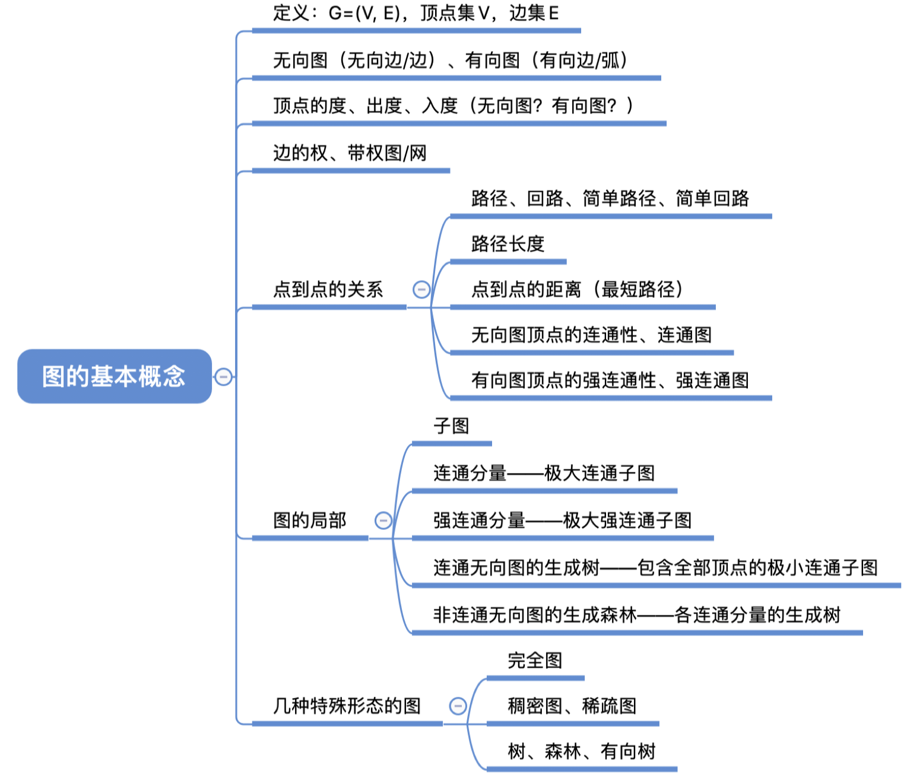
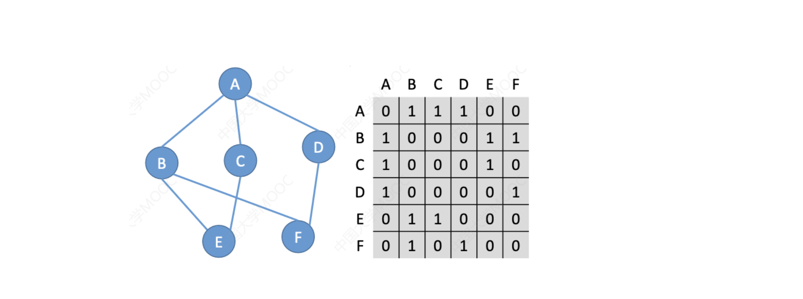
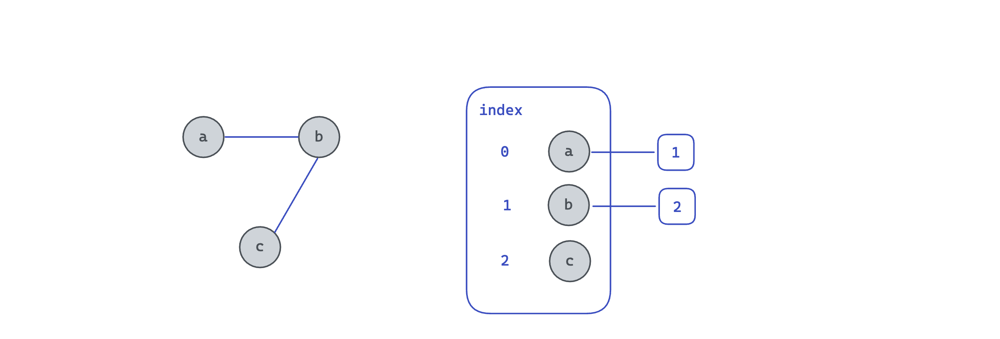

# 图


### 1.图的定义

图G由定点集V和边集E组成，记G(V,E)

对于无向图，顶点V的度是指依附于该顶点的边的条数，记TD(V)

入度( ID(v) )，出度( OD(V) )

TD(V) = ID(v) + OD(V)





### 2.邻接矩阵存储图



```cpp
#include <stdio.h>
#include <stdlib.h>

#define MaxVertexNum 100
//#define INFINITY
typedef char ElemType;
typedef struct {
    ElemType Vex[MaxVertexNum];
    int Edge[MaxVertexNum][MaxVertexNum];
    int vexnum, arcnum;
} MGraph, *Graph;

void InitGraph(Graph G) {
    int arr[6][6] ={{0, 1, 1, 1, 0, 0},{1, 0, 0, 0, 1, 1}, {1, 0, 0, 0, 1, 0},
                    {1, 0, 0, 0, 0, 1}, {0, 1, 1, 0, 0, 0},{ 0, 1, 0, 1, 0, 0}};

    for (int i = 0; i < G->vexnum; i++) {
        for (int j = 0; j < G->vexnum; j++) {
            G->Edge[i][j] = arr[i][j];
        }
    }

    for (int i = 0; i < G->vexnum; i++) {
        for (int j = 0; j < G->vexnum; j++) {
            printf("%3d", G->Edge[i][j]);
        }
        printf("\n");
    }
}

int main() {
    Graph G;
    G = (Graph) calloc(1, sizeof(MGraph));
    G->arcnum = 7;
    G->vexnum = 6;
    InitGraph(G);
}

```

```
  0  1  1  1  0  0
  1  0  0  0  1  1
  1  0  0  0  1  0
  1  0  0  0  0  1
  0  1  1  0  0  0
  0  1  0  1  0  0

Process finished with exit code 0
```

### 3.邻接表存储图



采用邻接表表示如图所示的有向图


```cpp
#include <stdio.h>
#include <stdlib.h>

#define MaxVertexNum 50
typedef char VertexType; //顶点类型
typedef int ArcType;

typedef struct ArcNode {
    int adjvex; // 指向的顶点
    ArcType weight; //存储权值
    struct ArcNode *next;
} ArcNode;

typedef struct VNode {
    VertexType data;
    ArcNode *first;
} VNode, AdjList[MaxVertexNum];

typedef struct {
    AdjList Li; //邻接表表示图
    int vexnum, arcnum; //顶点数和边数
} ALGraph, *Graph;

void InitALGraph(Graph G) {
    int vexnum, arcnum;
    printf("请输入顶点数\n");
    scanf("%d", &vexnum);
    printf("请输入边数\n");
    scanf("%d", &arcnum);
    G->vexnum = vexnum;
    G->arcnum = arcnum;
    printf("G->vexnum=%d\n", G->vexnum);
    printf("G->arcnum=%d\n", G->arcnum);
    // 初始化顶点信息
    for (int i = 0; i < G->vexnum; i++) {
        printf("请输入顶点信息\n");
        VertexType tmp_data; // 暂时存储顶点数据
        fflush(stdin);
        scanf("%c", &tmp_data);
        G->Li[i].data = tmp_data;
        G->Li[i].first = NULL;
    }

    ArcNode *Arc;
    // 初始化边信息,头插法
    for (int j = 0; j < G->arcnum; j++) {
        int index_i, index_j;
        printf("请输入边(vi,vj)顶点序号i,j\n");
        fflush(stdin);
        scanf("%d", &index_i);
        fflush(stdin);
        scanf("%d", &index_j);
        Arc = (ArcNode *) calloc(1, sizeof(ArcNode));
        Arc->adjvex = index_j;
        Arc->next = G->Li[index_i].first;
        G->Li[index_i].first = Arc;

//        Arc = (ArcNode *) calloc(1, sizeof(ArcNode));
//        Arc->adjvex = index_i;
//        Arc->next = G->Li[index_j].first;
//        G->Li[j].first = Arc;
    }
    int a = 0;
}

int main() {
    Graph G;
    G = (Graph) calloc(1,sizeof (ALGraph));
    InitALGraph(G);

    int a = 0;
}
```


### 4.图的深度优先遍历

采用邻接表存储的方式

邻接表的下标表示源，每次用头插法扩展

```cpp
#include <iostream>
#include <cstring>
#include <algorithm>

using namespace std;

const int N = 100010,M = 100010;

int n,m;
struct Node{
    int id;
    Node* next;
    Node(int _id): id(_id),next(NULL) {}
} *head[N];

bool st[N];

void add(int a,int b)
{
    auto p = new Node(b);
    p->next = head[a];
    head[a] = p;
}


void dfs(int u)
{
    st[u] = true;
    printf("%d ",u);
    for(auto p = head[u];p;p = p->next)
    {
        int j = p->id;
        if(!st[j]) dfs(j);
    }
}
int main()
{
    scanf("%d%d",&n,&m);
    while (m -- )
    {
        int a,b;
        scanf("%d%d",&a,&b);
        add(a, b);
    }
    for(int i =1;i<=n;i++)
    {
        if(!st[i]) dfs(i);
    }
    return 0;
}
```


### 5.图的宽度优先遍历

```cpp
#include <iostream>
#include <cstring>
#include <algorithm>
#include <queue>


using namespace std;

const int N = 100010,M = 100010;

int n,m;
struct Node{
    int id;
    Node* next;
    Node(int _id): id(_id),next(NULL) {}
} *head[N];

bool st[N];

void add(int a,int b)
{
    auto p = new Node(b);
    p->next = head[a];
    head[a] = p;
}


void bfs()
{
    queue<int> q;
    q.push(1);
    st[1] = true;
    // 队列不空
    while(q.size())
    {
        // 取队列第一个元素，出队
        auto t = q.front();
        q.pop();
        printf("%d ",t);
        // p->next链入队
        for(auto p = head[t];p;p = p->next)
        {
            int j = p->id;
            // 如果未被访问过，入队，以及标记访问过
            if(!st[j])
            {
                st[j] = true;
                q.push(j);
            }
        }
    }
}

int main()
{
    scanf("%d%d",&n,&m);
    while (m -- )
    {
        int a,b;
        scanf("%d%d",&a,&b);
        add(a, b);
    }
    bfs();
    
    return 0;
}
```


### 6.拓扑排序

有向图中存在拓扑排序 <===> 有向图中不存在环（回路） 

#### 6.1基于宽度优先遍历

>背过+理解

使用邻接表存储图

```cpp
#include <iostream>
#include <cstring>
#include <algorithm>


using namespace std;

const int N = 100010,M = 100010;

int n,m;
struct Node{
    int id;
    Node* next;
    Node(int _id): id(_id),next(NULL) {}
} *head[N];

// d[i] 存储点i的入度
int d[N],q[N];

void add(int a,int b)
{
    auto p = new Node(b);
    p->next = head[a];
    head[a] = p;
}

bool topsort()
{
    int hh=0,tt = -1;
    // 所有入度为0的点入队
    for(int i = 1;i<=n;i++)
    {
        if(!d[i])
        {
            q[++ tt] = i;
        }
    }
    // 队列不空
    while (hh<=tt)
    {
        // 每次抛出一个点
        int t = q[hh++];
        for (auto p = head[t];p;p = p->next)
        {
            // 这个点能到的点的入度--，减到0时入队
            if(-- d[p->id] == 0)
            {
                q[++tt] = p->id;
            }
        }
    }
    
    return tt == n-1;
}

int main()
{
    scanf("%d%d",&n,&m);
    while (m -- )
    {
        int a,b;
        scanf("%d%d",&a,&b);
        d[b]++;
        add(a, b);
    }
    if(!topsort()) cout<< "-1" << endl;
    else
    {
        for(int i =0;i<n;i++)
        {
            printf("%d ",q[i]);
        }
        
    }
    return 0;
}
```

#### Acwing模板

```cpp
bool topsort()
{
    int hh = 0, tt = -1;

    // d[i] 存储点i的入度
    for (int i = 1; i <= n; i ++ )
        if (!d[i])
            q[ ++ tt] = i;

    while (hh <= tt)
    {
        int t = q[hh ++ ];

        for (int i = h[t]; i != -1; i = ne[i])
        {
            int j = e[i];
            if (-- d[j] == 0)
                q[ ++ tt] = j;
        }
    }

    // 如果所有点都入队了，说明存在拓扑序列；否则不存在拓扑序列。
    return tt == n - 1;
}
```


#### 6.2基于深度优先遍历

dfs实现的拓扑排序原本输出的是拓扑排序结果的逆序**[2020.6]**

```cpp
#include <iostream>
#include <cstring>
#include <algorithm>


using namespace std;

const int N = 100010,M = 100010;

int n,m;
struct Node{
    int id;
    Node* next;
    Node(int _id): id(_id),next(NULL) {}
} *head[N];

int st[N],q[N],top;

void add(int a,int b)
{
    auto p = new Node(b);
    p->next = head[a];
    head[a] = p;
}

bool dfs(int u)
{
    st[u] = 1;
    
    for(auto p = head[u];p;p = p->next)
    {
        int j = p->id;
        if(!st[j]) 
        {
            if(!dfs(j))
                return false;
        }
        else if(st[j] == 1) return false;
    }
    
    q[top++] = u;
    st[u] = 2;
    return true;
 
}

bool topsort()
{
    for(int i =1;i<=n;i++)
    {
        if(!st[i] && !dfs(i))
            return false;
    }
    return true;
}


int main()
{
    scanf("%d%d",&n,&m);
    while (m -- )
    {
        int a,b;
        scanf("%d%d",&a,&b);
        
        add(a, b);
    }
    if(!topsort()) cout<< "-1" <<endl;
    else
    {
        for(int i = n-1;i>=0;i--)
        {
            printf("%d ",q[i]);
        }
    }
    return 0;
}
```


### 7.最小生成树（MST）

对于一个无向图，选出n-1条边遍历整个图，使得总边权和最小

最小生成树不一定唯一

#### 7.1Prim算法（稠密图）

时间复杂度O(n^2)

```cpp
#include <iostream>
#include <cstring>
#include <algorithm>

using namespace std;

const int N = 510,M = 100010,INF = 0x3f3f3f3f;
int n,m;
int g[N][N],dist[N];

bool st[N];


int prim()
{
    memset(dist,0x3f,sizeof dist);
    dist[1] = 0;
    int res = 0;
    for(int i = 0;i<n;i++)
    {
        int t = -1;
        for (int j =1;j<=n;j++)
        {
            if(!st[j] && (t==-1 || dist[t]>dist[j]))
                t = j;
        }
        if(dist[t] == INF) return INF;
        st[t] = true;
        res += dist[t];
        for(int j=1;j<=n;j++)
        {
            dist[j] = min(dist[j],g[t][j]);
        }
    }
    return res;
}

int main()
{
    scanf("%d%d",&n,&m);
    memset(g,0x3f,sizeof g);
    while(m--)
    {
        int a,b,c;
        scanf("%d%d%d",&a,&b,&c);
        g[a][b] = g[b][a] = min(g[a][b],c);
    }
    
    int res = prim();
    
    if (res == INF) cout<<"impossible"<< endl;
    else cout << res << endl;
    return 0;
    
}
```


#### 7.2kruskal算法（稀疏图）

时间复杂度为O(mlogm)

```cpp
#include <iostream>
#include <cstring>
#include <algorithm>

using namespace std;

const int N = 510, M = 100010;

int n, m;
struct Edge
{
    int a, b, c;
    bool operator< (const Edge& t) const
    {
        return c < t.c;
    }
}e[M];
int p[N];

int find(int x)
{
    if (p[x] != x) p[x] = find(p[x]);
    return p[x];
}

int main()
{
    scanf("%d%d", &n, &m);
    for (int i = 0; i < m; i ++ )
        scanf("%d%d%d", &e[i].a, &e[i].b, &e[i].c);
    sort(e, e + m);

    for (int i = 1; i <= n; i ++ ) p[i] = i;

    int res = 0, cnt = n;
    for (int i = 0; i < m; i ++ )
    {
        int a = e[i].a, b = e[i].b, c = e[i].c;
        if (find(a) != find(b))
        {
            res += c;
            cnt -- ;
            p[find(a)] = find(b);
        }
    }

    if (cnt > 1) puts("impossible");
    else printf("%d\n", res);

    return 0;
}

// 作者：yxc
// 链接：https://www.acwing.com/activity/content/code/content/1525988/
// 来源：AcWing
```


### 8.最短路径问题

#### 8.1单源最短路径-dijkstra算法


```cpp
#include <iostream>
#include <cstring>
#include <algorithm>

using namespace std;

const int N = 510, M = 100010, INF = 0x3f3f3f3f;

int n,m;
int g[N][N],dist[N];
bool st[N];


int dijkstra()
{
    // 初始化dist数组距离为INF，同时初始化第一个结点的距离为0
    memset(dist,0x3f,sizeof dist);
    dist[1] = 0;
    // 遍历每一个结点，加入集合
    for(int i = 0;i<n;i++)
    {
        // 记录当前距离最小的点
        int t = -1;
        for(int j =1;j<=n;j++)
        {
            // 如果这个点未加入集合且 未标记过 或优于t
            if(!st[j] && (t == -1 || dist[t]>dist[j]))
                t = j;
        }
        st[t] = true;
        // 更新剩下的结点，t结点到剩余未并入集合中的点
        for (int j = 1;j<=n;j++)
            dist[j] = min(dist[j],dist[t] + g[t][j]);
    }
    return dist[n];
}

int main()
{
    scanf("%d%d",&n,&m);
    memset(g,0x3f,sizeof g);
    while(m--)
    {
        int a,b,c;
        scanf("%d%d%d",&a,&b,&c);
        g[a][b] = min(g[a][b],c);
    }
    int res = dijkstra();
    if(res == INF) puts("-1");
    else cout<< res << endl;
    return 0;
}

// 作者：Kento_1
// 链接：https://www.acwing.com/activity/content/code/content/6656595/
// 来源：AcWing
```


#### 8.2Floyd算法

求出每个顶点对之间的最短路径

```cpp
#include <iostream>
#include <cstring>
#include <algorithm>

using namespace std;

const int N = 210,INF = 0x3f3f3f3f;
int n,m,Q;
int d[N][N];


int main()
{
    scanf("%d%d%d", &n,&m,&Q);
    memset(d,0x3f,sizeof d);
    for(int i =1;i<=n;i++) d[i][i] = 0;
    
    while(m--)
    {
        int a,b,c;
        scanf("%d%d%d",&a,&b,&c);
        d[a][b] = min(d[a][b],c);
    }
    for(int k =1;k<=n;k++)
        for(int i = 1;i<=n;i++)
            for(int j =1;j<=n;j++)
                d[i][j] = min(d[i][j],d[i][k]+d[k][j]);
                
    while(Q--)
    {
        int a,b;
        scanf("%d%d",&a,&b);
        int c = d[a][b];
        if(c> INF/2) cout << "impossible"<<endl;
        else printf("%d\n",c);
    }
}
```


