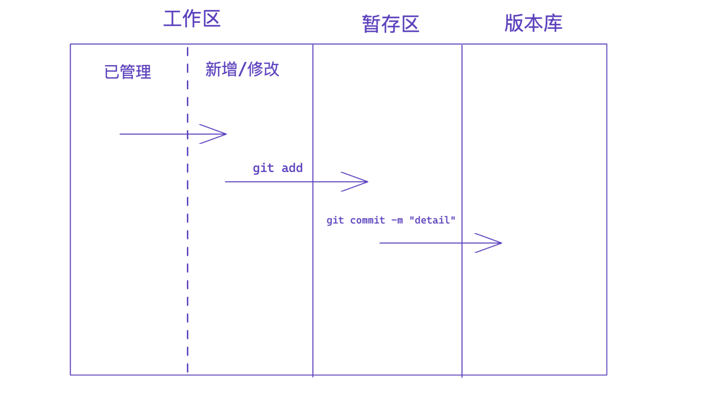
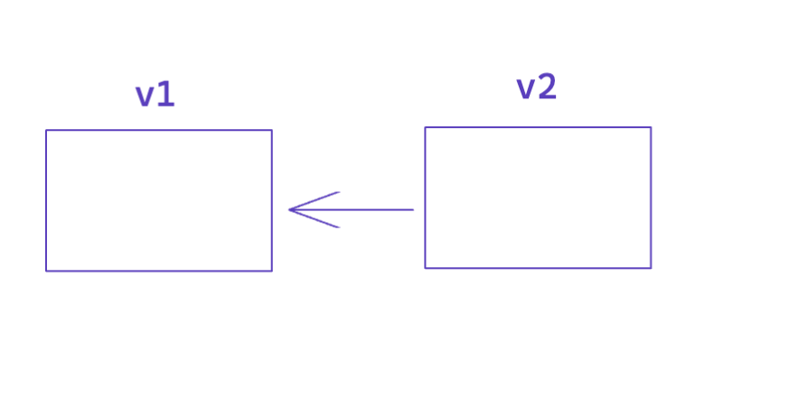

# 1.关于Git

分布式版本控制软件

### 1.前戏

个人信息配置

```
git config --global user.email "you@example.com"
git config --global user.name "Your Name"
```


#### 1.1 进入文件夹初始化

```
cd folder
git init
```

执行两步命令后，git会在folder文件夹中创建一个隐藏文件夹`.git`

```
(base) uichuan@wangyichuansMBP learn_git % git init

hint: Using 'master' as the name for the initial branch. This default branch name
hint: is subject to change. To configure the initial branch name to use in all
hint: of your new repositories, which will suppress this warning, call:
hint:
hint: 	git config --global init.defaultBranch <name>
hint:
hint: Names commonly chosen instead of 'master' are 'main', 'trunk' and
hint: 'development'. The just-created branch can be renamed via this command:
hint:
hint: 	git branch -m <name>
```


#### 1.2 文件的状态检查

```
git status
```

```
(base) uichuan@wangyichuansMBP learn_git % git status
On branch master

No commits yet

Untracked files:
  (use "git add <file>..." to include in what will be committed)
	index.txt

nothing added to commit but untracked files present (use "git add" to track)
```


#### 1.3 将文件由git管理

```
git add .
```

`.`代表当前文件夹下的所有文件

```
(base) uichuan@wangyichuansMBP learn_git % git add .
(base) uichuan@wangyichuansMBP learn_git % git status
On branch master

No commits yet

Changes to be committed:
  (use "git rm --cached <file>..." to unstage)
	new file:   index.txt
```


#### 1.4 提交

```
git commmit -m "v1"
```

其中`-m`后跟随的字符串代表提交是的注释，可以是对当前版本的描述

```
(base) uichuan@wangyichuansMBP learn_git % git commit -m "v1"
[master (root-commit) 08e6f5f] v1
 1 file changed, 2 insertions(+)
 create mode 100644 index.txt
```


#### 总结



#### 1.5 查看提交记录

```
git log
```

```
(base) uichuan@wangyichuansMBP learn_git % git log
commit a7654edb461c503d777b6db0297c8bf9061731e6 (HEAD -> master)
Author: uichuan <uichuan_47@163.com>
Date:   Sun Sep 4 18:17:42 2022 +0800

    v2

commit 08e6f5f3d62c92692718554251cc53519c00d939
Author: uichuan <uichuan_47@163.com>
Date:   Sun Sep 4 18:15:38 2022 +0800

    v1
```


#### 1.6 回滚

```
git reset --hard version_id
```

```
(base) uichuan@wangyichuansMBP learn_git % git reset --hard a7654edb461c503d777b6db0297c8bf9061731e6

HEAD is now at a7654ed v2
```


#### 1.7 git reflog

查看包括回滚之前的提交记录

```
(base) uichuan@wangyichuansMBP learn_git % git reflog
a7654ed (HEAD -> master) HEAD@{0}: reset: moving to a7654edb461c503d777b6db0297c8bf9061731e6
12a8a0c HEAD@{1}: commit: 新增约饭功能
a7654ed (HEAD -> master) HEAD@{2}: commit: v2
08e6f5f HEAD@{3}: commit (initial): v1
(base) uichuan@wangyichuansMBP learn_git %
```


#### 1.8 git checkout 

已经修改的文件，但是尚未add到暂存区，希望取消对文件的修改

```
git checkout -- 文件名
```


#### 1.9 git reset HEAD

针对已经提交到暂存区的版本

通过

```
git reset HEAD 文件名
```

返回到工作区的 **新文件/文件变动** 状态


### 2.分支

**背景**

如果生成的第二个版本相对于第一个版本变化不大

例如：第二个版本在第一个版本的基础上新增了10个文件


那么在生成的第二个版本中，只会存储有变化的部分

其余部分通过一个指针指向之前的版本




#### 2.1 生成新的分支

例如：生成新的分支dev

```
git branch dev
```

```
(base) uichuan@wangyichuansMBP learn_git % git branch
  dev
* master
(base) uichuan@wangyichuansMBP learn_git %
```


**切换到dev分支**

```
(base) uichuan@wangyichuansMBP learn_git % git checkout dev
Switched to branch 'dev'
```

在dev分支写代码，不会影响master分支

dev分支是一个独立的环境


```
(base) uichuan@wangyichuansMBP learn_git % git status
On branch dev
Changes not staged for commit:
  (use "git add <file>..." to update what will be committed)
  (use "git restore <file>..." to discard changes in working directory)
	modified:   index.txt

no changes added to commit (use "git add" and/or "git commit -a")
```

On branch dev


进行提交

```
(base) uichuan@wangyichuansMBP learn_git % git add .
(base) uichuan@wangyichuansMBP learn_git % git commit -m "C4"
[dev ea90a75] C4
 1 file changed, 2 insertions(+), 1 deletion(-)
```


查看新分支的提交记录

```
(base) uichuan@wangyichuansMBP learn_git % git log
commit ea90a751d5d68640e7495c0c2f9ca0a8b1d062ac (HEAD -> dev)
Author: uichuan <uichuan_47@163.com>
Date:   Sun Sep 4 23:32:58 2022 +0800

    C4

commit 12a8a0ce41b4f9b5ae9112e861f57202d74d2a77 (master)
Author: uichuan <uichuan_47@163.com>
Date:   Sun Sep 4 18:52:14 2022 +0800

    新增约饭功能

commit a7654edb461c503d777b6db0297c8bf9061731e6
Author: uichuan <uichuan_47@163.com>
Date:   Sun Sep 4 18:17:42 2022 +0800

    v2

commit 08e6f5f3d62c92692718554251cc53519c00d939
Author: uichuan <uichuan_47@163.com>
Date:   Sun Sep 4 18:15:38 2022 +0800

    v1
```


#### 2.2 切换回原来分支

```
git checkout master
```

切换回原来分支后，在dev分支中做的修改在master分支中不会出现

分支和分支之间做了代码的隔离


#### 2.3 在另一个分支紧急修复bug

新建分支bug，用于修复

```
git branch bug
```

```
(base) uichuan@wangyichuansMBP learn_git % git branch bug
(base) uichuan@wangyichuansMBP learn_git % git branch
  bug
  dev
* master
(base) uichuan@wangyichuansMBP learn_git %
```


#### 2.4 链接修复完的bug分支到master

```
git merge bug
```

```
(base) uichuan@wangyichuansMBP learn_git % git merge bug
Updating 12a8a0c..c17091e
Fast-forward
 index.txt | 2 +-
 1 file changed, 1 insertion(+), 1 deletion(-)
```

```
(base) uichuan@wangyichuansMBP learn_git % git log
commit c17091e02171ae5549e0047754145c9b181daeab (HEAD -> master, bug)
Author: uichuan <uichuan_47@163.com>
Date:   Sun Sep 4 23:39:57 2022 +0800

    fix bug
```


链接到master之后，bug分支失去作用

#### 2.5删除bug分支

```
git branch -d bug
```

```
(base) uichuan@wangyichuansMBP learn_git % git branch -d bug
Deleted branch bug (was c17091e).
```

```
(base) uichuan@wangyichuansMBP learn_git % git branch
  dev
* master
```

删除之后bug分支消失


#### 2.6 出现冲突的标志

```
(base) uichuan@wangyichuansMBP learn_git % git merge dev
Auto-merging index.txt
CONFLICT (content): Merge conflict in index.txt
Automatic merge failed; fix conflicts and then commit the result.
```


#### 2.7 命令总结

- 查看分支

    ```
    git branch
    ```

- 创建分支 

    ```
    git branch 分支名称
    ```

- 切换分支

    ```
    git checkout 分支名称
    ```

- 分支合并

    ```
    git merge 要合并的分支
    ```

    在分支合并时，当前需要处在master分支

- 删除分支

    ```
    git branch -d 分支名称
    ```

    类似于bug修复的分支，在merge到master分支之后

    可以选择删除改分支


#### 2.8 工作流

默认分支master （保留正式版本，稳定）

在dev（develop）分支上进行开发


