# 6.CSS 基础语法

CSS 规则集（rule-set）由选择器和声明块组成：

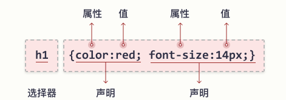

选择器指向您需要设置样式的 HTML 元素。

声明块包含一条或多条用分号分隔的声明。

每条声明都包含一个 CSS 属性名称和一个值，以冒号分隔。

多条 CSS 声明用分号分隔，声明块用花括号括起来。


### 1.1 CSS 选择器

- 元素选择器

    **元素选择器根据元素名称来选择 HTML 元素。**

    在这里，页面上的所有p元素都将居中对齐，并带有红色文本颜色：

     ```css
    p {
      text-align: center;
      color: red;
    }
     ```

- id选择器

    元素的 id 在页面中是唯一的，因此 id 选择器用于选择一个唯一的元素！

    要选择具有特定 id 的元素，**请写一个井号（＃）**，后跟该元素的 id。

    这条 CSS 规则将应用于 id="para1" 的 HTML 元素：

    

- 类选择器

    类选择器选择有特定 class 属性的 HTML 元素。

    如需选择拥有特定 class 的元素，请**写一个句点（.）字符**，后面跟类名。

    在此例中，所有带有 class="center" 的 HTML 元素将为红色且居中对齐：

    ```css
    .center {
      text-align: center;
      color: red;
    }
    ```

- 通用选择器

    通用选择器（*）选择页面上的所有的 HTML 元素。

    下面的 CSS 规则会影响页面上的每个 HTML 元素：

    ```css
    * {
      text-align: center;
      color: blue;
    }
    ```

- 分组选择器

    选取所有具有相同样式定义的 HTML 元素。

    ```css
    h1 {
      text-align: center;
      color: red;
    }
    
    h2 {
      text-align: center;
      color: red;
    }
    
    p {
      text-align: center;
      color: red;
    }
    ```

    

    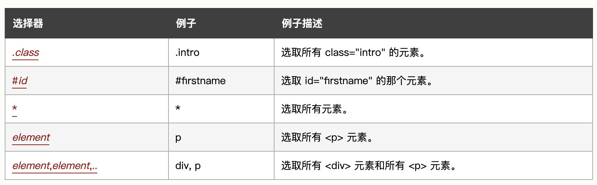

## 1.CSS 基础语法

CSS 规则集（rule-set）由选择器和声明块组成：


选择器指向您需要设置样式的 HTML 元素。

声明块包含一条或多条用分号分隔的声明。

每条声明都包含一个 CSS 属性名称和一个值，以冒号分隔。

多条 CSS 声明用分号分隔，声明块用花括号括起来。


### 1.1 CSS 选择器

- 元素选择器

    **元素选择器根据元素名称来选择 HTML 元素。**

    在这里，页面上的所有p元素都将居中对齐，并带有红色文本颜色：

     ```css
    p {
      text-align: center;
      color: red;
    }
     ```

- id选择器

    元素的 id 在页面中是唯一的，因此 id 选择器用于选择一个唯一的元素！

    要选择具有特定 id 的元素，**请写一个井号（＃）**，后跟该元素的 id。

    这条 CSS 规则将应用于 id="para1" 的 HTML 元素：

    

- 类选择器

    类选择器选择有特定 class 属性的 HTML 元素。

    如需选择拥有特定 class 的元素，请**写一个句点（.）字符**，后面跟类名。

    在此例中，所有带有 class="center" 的 HTML 元素将为红色且居中对齐：

    ```css
    .center {
      text-align: center;
      color: red;
    }
    ```

- 通用选择器

    通用选择器（*）选择页面上的所有的 HTML 元素。

    下面的 CSS 规则会影响页面上的每个 HTML 元素：

    ```css
    * {
      text-align: center;
      color: blue;
    }
    ```

- 分组选择器

    选取所有具有相同样式定义的 HTML 元素。

    ```css
    h1 {
      text-align: center;
      color: red;
    }
    
    h2 {
      text-align: center;
      color: red;
    }
    
    p {
      text-align: center;
      color: red;
    }
    ```

    

    

### 1.2 css的引入

- 外部CSS
- 内部CSS
- 行内CSS


**外部CSS**

```
<link rel="stylesheet" type="text/css" href="mystyle.css">
```

```
<!DOCTYPE html>
<html>
<head>
<link rel="stylesheet" type="text/css" href="mystyle.css">
</head>
<body>

<h1>This is a heading</h1>
<p>This is a paragraph.</p>

</body>
</html>
```


**内部CSS**

内部样式在html页面中head部分内的style元素内进行定义

```html
<!DOCTYPE html>
<html>
<head>
<style>
body {
  background-color: linen;
}

h1 {
  color: maroon;
  margin-left: 40px;
} 
</style>
</head>
<body>

<h1>This is a heading</h1>
<p>This is a paragraph.</p>

</body>
</html>
```


**行内CSS**

使用行内样式，为单个元素应用唯一样式

将style属性添加到相关元素

```html
<!DOCTYPE html>
<html>
<body>

<h1 style="color:blue;text-align:center;">This is a heading</h1>
<p style="color:red;">This is a paragraph.</p>

</body>
</html>
```
### 1.3 颜色

**CSS中可以使用颜色名来制定颜色**


- 背景色 background-color

    ```
    <h1 style="background-color:DodgerBlue;">China</h1>
    <p style="background-color:Tomato;">China is a great country!</p>
    ```

- 文本颜色

    ```html
    <h1 style="color:Tomato;">China</h1>
    <p style="color:DodgerBlue;">China is a great country!</p>
    <p style="color:MediumSeaGreen;">China, officially the People's Republic of China...</p>
    ```

    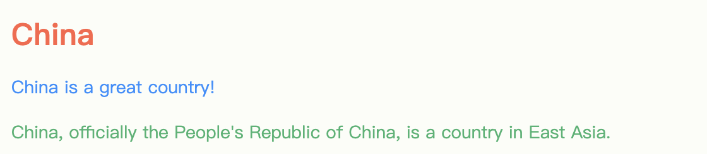

- 边框颜色

    ```
    <h1 style="border:2px solid Tomato;">Hello World</h1>
    <h1 style="border:2px solid DodgerBlue;">Hello World</h1>
    <h1 style="border:2px solid Violet;">Hello World</h1>
    ```

    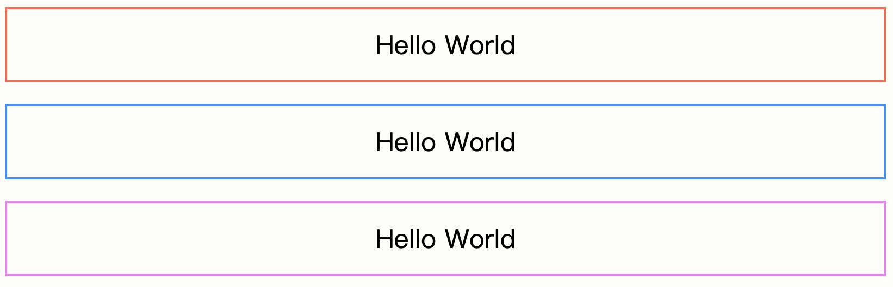


### 1.4 背景

- background-color
- background-image
- background-repeat
- background-attachment
- background-position

#### **1.4.1 background-color**

该属性指定元素的背景色

```css
body {
  background-color: lightblue;
}
```

- opacity属性，调整不透明度

    ```css
    div {
      background-color: green;
      opacity: 0.3;
    }
    ```

    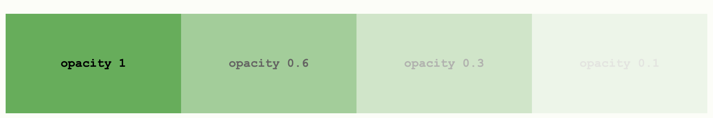

#### **1.4.2 background-image**

该属性指定元素背景的图像

```css
body {
  background-image: url("paper.gif");
}
```

使用背景图像时，请使用不会干扰文本的图像。

还可以为特定元素设置背景图像，例如 p 元素：


#### **1.4.3background-repeat**

该属性在水平和垂直方向上都重复图像

分别在x，y方向上重复

```css
body {
  background-image: url("gradient_bg.png");
  background-repeat: repeat-x;
}

```

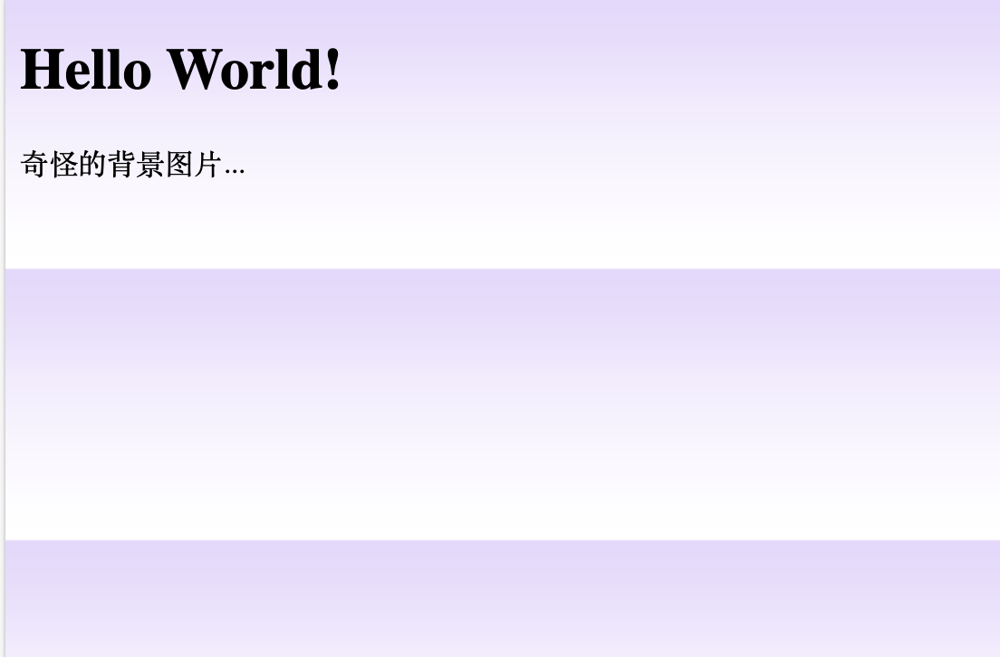


```css
body {
  background-image: url("gradient_bg.png");
}
```

#### 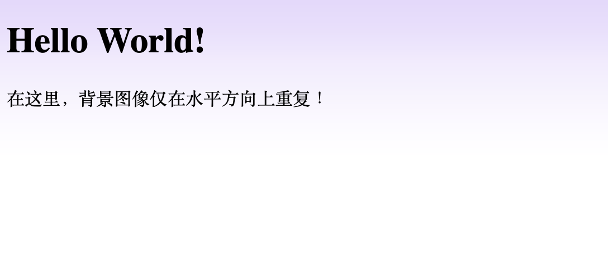**1.4.4background-position**

设置图像的位置属性

```css
body {
  background-image: url("tree.png");
  background-repeat: no-repeat;
  background-position: right top;
}
```


#### **1.4.5 background-attachment**

属性指定背景图像是应该滚动还是固定的（不会随页面的其余部分一起滚动）

```css
body {
  background-image: url("tree.png");
  background-repeat: no-repeat;
  background-position: right top;
  background-attachment: fixed;
}
```

指定背景图像应随页面的其余部分一起滚动：

```css
body {
  background-image: url("tree.png");
  background-repeat: no-repeat;
  background-position: right top;
  background-attachment: scroll;
}
```

### 1.5 边框

边框属性允许指定

- 样式
- 宽度
- 颜色


#### 1.5.1 边框样式

- dotted - 定义点线边框
- dashed 虚线边框
- solid 实线
- double 双边框
- groove 3d边框 坡口
- ridge 3d边框 脊线
- inset 3d inset边框
- outset 3d outset
- none 无边框
- hidden 隐藏边框

`border-style`属性可以设置1-4个值（用于上下左右）

```css
p.dotted {border-style: dotted;}
p.dashed {border-style: dashed;}
p.solid {border-style: solid;}
p.double {border-style: double;}
p.groove {border-style: groove;}
p.ridge {border-style: ridge;}
p.inset {border-style: inset;}
p.outset {border-style: outset;}
p.none {border-style: none;}
p.hidden {border-style: hidden;}
p.mix {border-style: dotted dashed solid double;}
```


#### 1.5.2 边框宽度

`border-width`属性指定四个边框的宽度

```css
p.one {
  border-style: solid;
  border-width: 5px;
}

p.two {
  border-style: solid;
  border-width: medium;
}

p.three {
  border-style: dotted;
  border-width: 2px;
} 

p.four {
  border-style: dotted;
  border-width: thick;
}
```

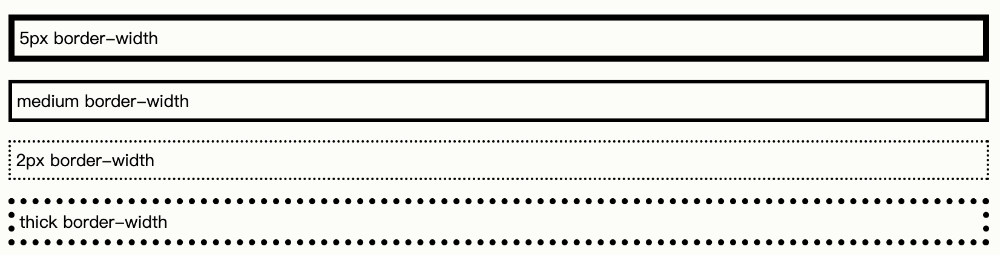


#### 1.5.3 边框颜色

`border-color`属性用于设置四个边框的颜色

如果未设置`border-color`，它将继承元素的颜色

```css
p.one {
  border-style: solid;
  border-color: red;
}

p.two {
  border-style: solid;
  border-color: green;
}

p.three {
  border-style: dotted;
  border-color: blue;
}
```


颜色的设置也可以用以下标准

- HEX
- RGB
- HSL


#### 1.5.4 圆角边框

`border-dadius`属性用于向元素添加圆角边框

#### 更多

- 边框各边

    <https://www.w3school.com.cn/css/css_border_sides.asp>

- 简写边框属性

    <https://www.w3school.com.cn/css/css_border_shorthand.asp>

### 1.6 外边距

`margin`属性用来在任何定义的边框之外，为元素周围创造空间

用`margin`为每一侧指定外边距的属性

- margin-top
- margin-right
- margin-bottom
- margin-left

**所有外边距属性都可以设置以下值**

- auto

    浏览器来自动计算外边距，元素在其容器中水平居中

- length

    以px，pt，cm等单位指定外边距

- %

    包含元素宽度的百分比计算的外边距

- inherit

    从父元素继承外边距


### 1.7 外边距合并

当两个垂直外边距相遇时，他们将形成一个外边距，**合并后的外边距的高度等于发生两个合并的外边距的高度中的较大者**

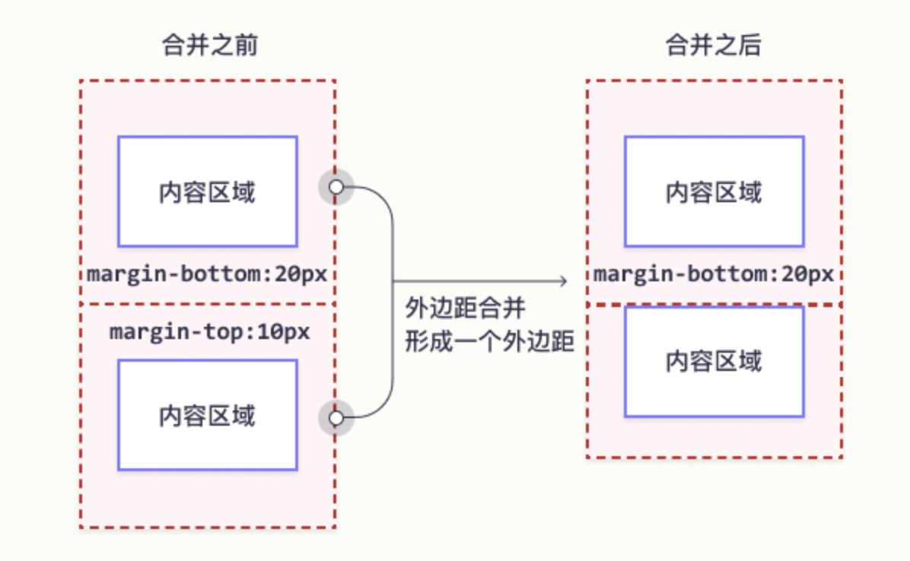


当一个元素包涵在另一个元素中时，他们的上或下外边距也会发生合并

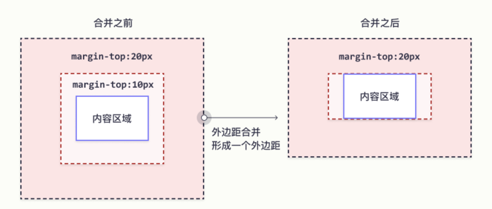


[**更多关于边距合并**](https://www.w3school.com.cn/css/css_margin_collapse.asp)


### 1.8 内边距

`padding`属性用于定义边界内的元素周围生成空间

css拥有用于为元素的每一侧指定内边距的属性

- padding-top
- padding-right
- padding-bottom
- padding-left


简写

```css
div {
  padding: 25px 50px 75px 100px;
}
```


**内边距和元素宽度**

`width`属性指定元素内容区域的宽度，内容区域是元素（盒模型）的内边距、边框和外边距内的部分。


### 1.9 宽度和高度

`height`和`width`属性用来设置元素的高度和宽度

height 和 width 属性不包括内边距、边框或外边距。它设置的是元素内边距、边框以及外边距内的区域的高度或宽度。


height 和 width 属性可以设置以下的值

- auto
- length
- %
- initial
- inherit


### 1.10 框模层

所有 HTML 元素都可以视为方框。在 CSS 中，在谈论设计和布局时，会使用术语“盒模型”或“框模型”。


CSS 框模型实质上是一个包围每个 HTML 元素的框。它包括：外边距、边框、内边距以及实际的内容。

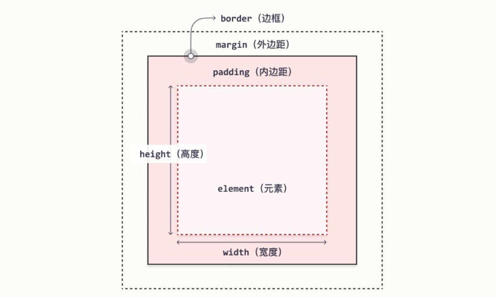

- 内容 
- 内边距
- 边框
- 外边距


### 1.11 CSS轮廓

轮廓是在元素周围绘制的一条线，在边框之外，以凸显元素。

⚠️注意：

- 轮廓与边框不同
- 轮廓是在元素边框之外绘制的，可能与其他内容重叠，
- 轮廓也不是元素尺寸的一部分
- 元素的总宽度和高度不受轮廓线宽度的影响


使用`outline-style`属性指定轮廓的样子

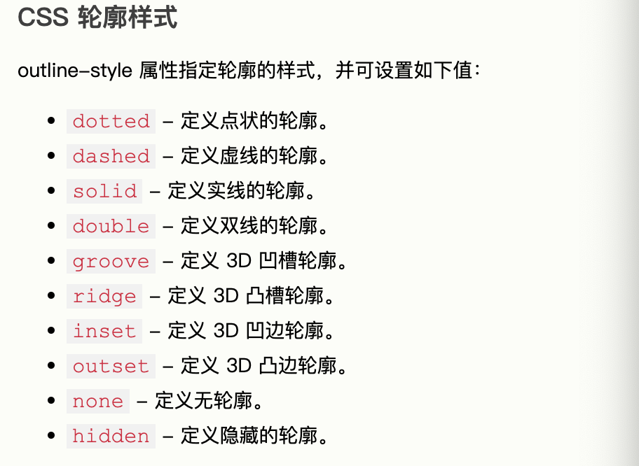


### 1.12 CSS轮廓偏移

`outline-offset`属性在元素的轮廓与边框之间添加空间

元素以及轮廓之间的空间是透明的


### 1.13 CSS文本

**文本颜色**

`color`属性用于设置文本的颜色

- 颜色名
- 十六进制
- RGB


**文本颜色和背景色**

`background-color`和`color`属性


### 1.14 CSS 文本对齐

`text-align`属性用于设置文本的水平对齐方式

文本可以左对齐或右对齐，或居中对齐。

```css
h1 {
  text-align: center;
}

h2 {
  text-align: left;
}

h3 {
  text-align: right;
}
```


**justify**

当`text-align`属性的值设置为`justfy`后，

将拉伸每一行，使每一行具有相等的宽度

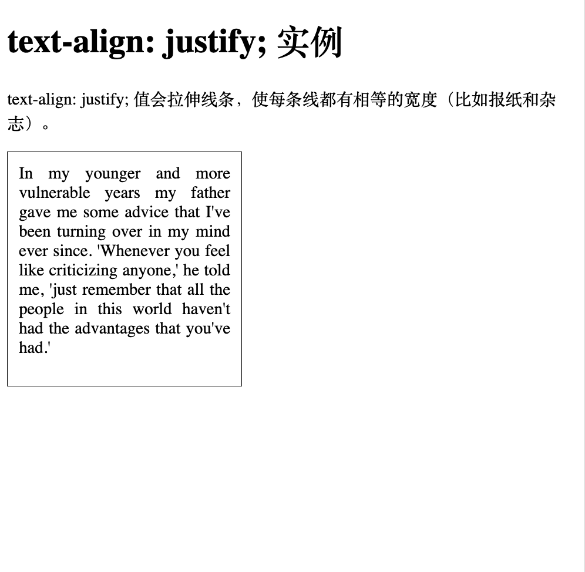


**文本方向**

`direction`和`unicode-bidi`属性可以用于更改元素的文本方向


**垂直对齐**

`vertical-align`属性设置元素的垂直对齐方式


### 1.15 CSS文字装饰

`text-decoration`属性用于设置或删除文本装饰

`text-decoration:none;`通常用于从链接上删除下划线

```css
a {
  text-decoration: none;
}
```


一些`text-decoration`属性的值

```css
h1 {
  text-decoration: overline;
}

h2 {
  text-decoration: line-through;
}

h3 {
  text-decoration: underline;
}
```


### 1.16 CSS 文本转换

`text-transform`属性用来指定文本中的大小写转换·

```css
p.uppercase {
  text-transform: uppercase;
}

p.lowercase {
  text-transform: lowercase;
}

p.capitalize {
  text-transform: capitalize;
}
```

### 1.17 文字间距


`text-indent`属性用于指定文本第一行的缩进

```css
p {
  text-indent: 50px;
}
```


`letter-spacing`属性用于指定文本中字符的间距

```
h1 {
  letter-spacing: 3px;
}

h2 {
  letter-spacing: -3px;
}
```


`line-height`属性用于指定行之间的间距

```css
p.small {
  line-height: 0.8;
}

p.big {
  line-height: 1.8;
}
```


`word-spacing`属性用于指定文本中单词之间的间距

```css
h1 {
  word-spacing: 10px;
}

h2 {
  word-spacing: -5px;
}
```


`white-space`属性指定元素内部空白的处理方式

```css
p {
  white-space: nowrap;
}
```

### 1.18 字体

`font-family`属性

```css
.p1 {
  font-family: "Times New Roman", Times, serif;
}

.p2 {
  font-family: Arial, Helvetica, sans-serif;
}

.p3 {
  font-family: "Lucida Console", "Courier New", monospace;
}
```

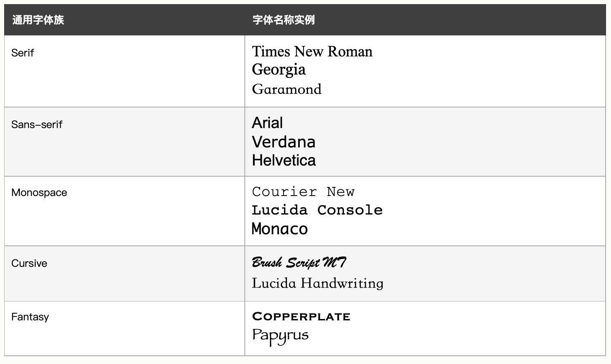


#### 1.18.1 字体样式

`font-style`

- nomal
- italic 斜体
- oblique 倾斜
- - 

```css
p.normal {
  font-style: normal;
}

p.italic {
  font-style: italic;
}

p.oblique {
  font-style: oblique;
}
```


`font-weight`字体粗细

```css
p.normal {
  font-weight: normal;
}

p.thick {
  font-weight: bold;
}
```


`font-size`字体大小

- 绝对尺寸
    - 设置为指定大小
    - 不允许更改（在浏览器端）
- 相对尺寸
    - 设置相对于周围元素的大小
    - 允许用户在浏览器中修改大小

```css
h1 {
  font-size: 40px;
}

h2 {
  font-size: 30px;
}

p {
  font-size: 14px;
}
```

#### 1.18.2 Google字体
#### 

```html
<!DOCTYPE html>
<html>
<head>
<link rel="stylesheet" href="https://fonts.googleapis.com/css?family=Sofia">
<style>
body {
  font-family: "Sofia";
  font-size: 22px;
}
</style>
</head>
<body>

<h1>Sofia Font</h1>
<p>Lorem ipsum dolor sit amet, consectetuer adipiscing elit.</p>

</body>
</html>
```


#### 1.18.3 字体属性

`font`属性是以下属性的简写

- font-style
- font-variant
- font-weight
- font-size
- font-family

### 1.19 CSS 图标

- Font Awesome

    如需使用 Font Awesome 图标，请访问 fontawesome.com，登录并获取代码添加到 HTML 页面的 head部分

### 1.20 CSS 链接样式

链接可以使用任何 CSS 属性（例如 `color`、`font-family`、`background` 等）来设置样式。

```css
a {
  color: hotpink;
}
```

几种链接状态

```css
/* 未被访问的链接 */
a:link {
  color: red;
}

/* 已被访问的链接 */
a:visited {
  color: green;
}

/* 将鼠标悬停在链接上 */
a:hover {
  color: hotpink;
}

/* 被选择的链接 */
a:active {
  color: blue;
}
```


### 1.21 CSS 列表

HTML中有两种列表

- 无序列表ul
- 有序列表ol

[详情猛戳这里🎈](https://www.w3school.com.cn/css/css_list.asp)


### 1.22 CSS表格

使用CSS可以极大的改善HTML表格的外观


`border`属性

```css
table, th, td {
  border: 1px solid black;
}
```


`boder-collapse`合并表格边框，设置是否将表格边框折叠为单一边框

```css
table {
  border-collapse: collapse;
}

table, th, td {
  border: 1px solid black;
}
```


`width`和`height`设置表格的宽度和高度

```css
table {
  width: 100%;
}

th {
  height: 50px;
}
```

```css
table {
  width: 50%;
}

th {
  height: 70px;
}
```


`text-align`设置表格内容的水平对齐方式

```css
th {
  text-align: center;
}
```


`vertical-align`设置垂直对齐方式

```css
td {
  height: 50px;
  vertical-align: bottom;
}
```


`padding`属性用来控制边框和表格内容之间的内边距

```css
th, td {
  padding: 15px;
  text-align: left;
}
```


`border-bottom`水平分割线

```css
th, td {
  border-bottom: 1px solid #ddd;
}
```

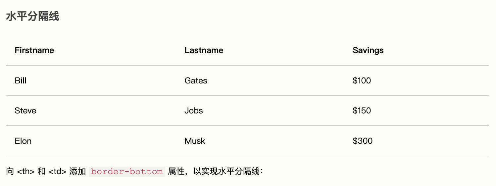


`:hover`悬停效果

```css
tr:hover {background-color: #f5f5f5;}
```


**表格颜色**

```css
th {
  background-color: #4CAF50;
  color: white;
}
```


`overflow-x:auto`响应式表格

如果屏幕太小而无法显示全部内容，则响应式表格会显示水平滚动条：

```css
<div style="overflow-x:auto;">

<table>
... table content ...
</table>

</div>
```


[更多细节猛戳这里🎈](https://www.w3school.com.cn/css/css_table.asp)

