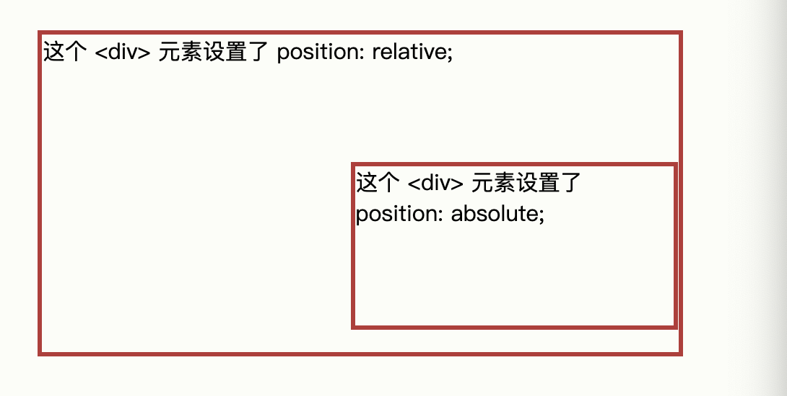

# 7. CSS 更多


## 1.CSS 布局 

### 1.1 display属性

`display`属性是控制布局的最重要的属性

display属性规定是否/如何显示元素

大多数元素的默认display值为`block`或`inline`


**块级别元素**

块级元素总是从新行开始，并占据可用的全部宽度（尽可能向左和向右伸展）。

- div
- h1-h6
- p
- form
- header
- footer
- section


**行内元素**

内联元素不从新行开始，仅占用所需的宽度

- span
- a
- img


**display:none**

该属性值通常搭配js使用，用来控制元素的显示和隐藏

默认情况下，script元素使用`display:none`


**覆盖默认的display值**

如前所述，每个元素都有一个默认 display 值。但是，您可以覆盖它。

将行内元素更改为块元素，反之亦然，对于使页面以特定方式显示同时仍遵循 Web 标准很有用。


隐藏元素

选择`display:none`还是`visibility:hidden`

- display:none

    隐藏元素，并且页面布局会因为元素的消失而发生改变

- visibility:hidden

    元素被隐藏，但是它仍然会占据空间


### 1.2 width 宽属性

**使用 width、max-width 和 margin: auto**

块级元素始终占用可用的全部宽度（尽可能向左和向右伸展）

设置块级元素的width属性，防止它延伸到容器的边缘，可以将外边距设置为auto，这样可以使元素在容器中水平居中

```css
div.ex1 {
  width: 500px;
  margin: auto;
  border: 3px solid #73AD21;
}

div.ex2 {
  max-width: 500px;
  margin: auto;
  border: 3px solid #73AD21;
}
```


### 1.3 position属性

`position`属性规定应用元素的定位方法的类型

有五个不同的位置值

- static
- relative
- fixed
- absoulue
- sticky

元素其实是使用 top、bottom、left 和 right 属性定位的。

但是，除非首先设置了 position 属性，否则这些属性将不起作用。根据不同的 position 值，它们的工作方式也不同。


**position：static**

HTML元素默认情况下的定位方式为static静态

静态定位的元素不受top、bottom、left 和 right 属性的影响。

```css
div.static {
  position: static;
  border: 3px solid #73AD21;
}
```


**position:relative**

相对性，设置改属性的元素相对于其正常位置进行定位

设置相对定位的元素的 top、right、bottom 和 left 属性将导致其偏离其正常位置进行调整。

不会对其余内容进行调整来适应元素留下的任何空间。

```css
div.relative {
  position: relative;
  left: 30px;
  border: 3px solid #73AD21;
}
```


**position:fixed**

设置该属性的元素是相对于视口定位的，滚动页面，位置不变

top、right、bottom 和 left 属性用于定位此元素。

```css
div.fixed {
  position: fixed;
  bottom: 0;
  right: 0;
  width: 300px;
  border: 3px solid #73AD21;
}
```


**position：absolute**

`position：absolute`的元素相对于最近的定位祖先元素进行定位（而不是相对于视口定位，如 fixed）。

然而，如果绝对定位的元素没有祖先，它将使用文档主体（body），并随页面滚动一起移动。

“被定位的”元素是其位置除 `static` 以外的任何元素。



```css
div.relative {
  position: relative;
  width: 400px;
  height: 200px;
  border: 3px solid #73AD21;
} 

div.absolute {
  position: absolute;
  top: 80px;
  right: 0;
  width: 200px;
  height: 100px;
  border: 3px solid #73AD21;
}
```


**重叠元素**

在对元素进行定位时，它们可以与其他元素重叠。

`z-index` 属性指定元素的堆栈顺序（哪个元素应放置在其他元素的前面或后面）。

元素可以设置正或负的堆叠顺序：

```css
img {
  position: absolute;
  left: 0px;
  top: 0px;
  z-index: -1;
}
```


[更多关于CSS定位🎈](https://www.w3school.com.cn/css/pro_css_positioning.asp)


### 1.4 溢出

CSS overflow属性控制对与太大而无法完全显示的内容进行处理

**该属性可以设置以下的值**

- visible 

    默认，溢出不进行裁剪，内容在元素框外渲染

- hidden

    溢出被裁剪，其余内容将不可见

- scroll

    溢出裁剪，可以通过滚动条查看其余内容

- auto

    与scroll类似，仅在必要时添加滚动条

```css
div {
  overflow: hidden;
}
```


### 1.5 浮动

**CSS float 属性规定元素如何浮动**

**CSS clear属性规定哪些元素可以在清除的元素旁边以及哪一侧浮动**


**`float` 属性可以设置以下值之一：**

- left - 元素浮动到其容器的左侧
- right - 元素浮动在其容器的右侧
- none - 元素不会浮动（将显示在文本中刚出现的位置）。默认值。
- inherit - 元素继承其父级的 float 值

最简单的用法是，`float` 属性可实现（报纸上）文字包围图片的效果。


`clear` 属性指定哪些元素可以浮动于被清除元素的旁边以及哪一侧。

**`clear` 属性可设置以下值之一：**

- none - 允许两侧都有浮动元素。默认值
- left - 左侧不允许浮动元素
- right- 右侧不允许浮动元素
- both - 左侧或右侧均不允许浮动元素
- inherit - 元素继承其父级的 clear 值


**clearfix Hack**

如果一个元素比包含它的元素高，并且它是浮动的，它将“溢出”到其容器之外：

然后我们可以向包含元素添加 overflow: auto;

```css
.clearfix {
  overflow: auto;
}
```


### 1.6 display:inline-block

与 `display: inline` 相比，主要区别在于 `display: inline-block` 允许在元素上设置宽度和高度。


同样，如果设置了 display: inline-block，将保留上下外边距/内边距，而 display: inline 则不会。


与 display: block 相比，主要区别在于 display：inline-block 在元素之后不添加换行符，因此该元素可以位于其他元素旁边。


### 1.7 水平&垂直布局

- 居中对齐

    要使块元素（例如 div ）水平居中，请使用 `margin: auto;`

```css
.center {
  margin: auto;
  width: 50%;
  border: 3px solid green;
  padding: 20px;
}
```

- 居中对齐文本

    如果仅需在元素内居中文本，请使用 `text-align: center;`

```css
.center {
  text-align: center;
  border: 3px solid green;
}
```

- 左右对齐 - position

    对齐元素的一种方法是使用 `position: absolute;`

```css
.right {
  position: absolute;
  right: 0px;
  width: 300px;
  border: 3px solid #73AD21;
  padding: 20px;
}
```

- 左右对齐 - float

```css
.right {
  float: right;
  width: 300px;
  border: 3px solid #73AD21;
  padding: 10px;
}
```

- 垂直对齐 - padding

    有很多方法可以在 CSS 中垂直对齐元素。一个简单的解决方案是使用上下内边距：

```css
.center {
  padding: 70px 0;
  border: 3px solid green;
}
```


## 2. CSS 组合器

组合器是解释选择器之间关系的某种机制。

CSS 选择器可以包含多个简单选择器。在简单选择器之间，我们可以包含一个组合器。

CSS 中有四种不同的组合器：

- 后代选择器 (空格)
- 子选择器 (`>`)
- 相邻兄弟选择器 (`+`)
- 通用兄弟选择器 (`~`)


### 2.1 后代选择器

后代选择器匹配属于指定元素后代的所有元素。

```css
div p {
  background-color: yellow;
}
```

下面的例子选择 div 元素内的所有 p 元素


### 2.2 子选择器

子选择器匹配属于指定元素子元素的所有元素。

下面的例子选择属于 div 元素子元素的所有 p 元素：

```css
div > p {
  background-color: yellow;
}
```


