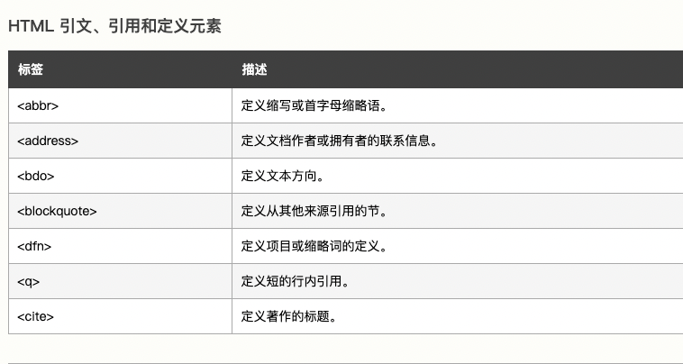
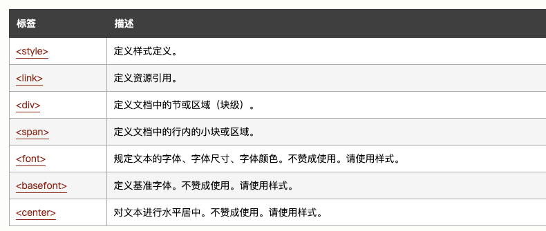
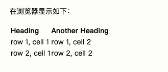
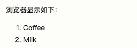
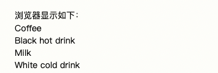
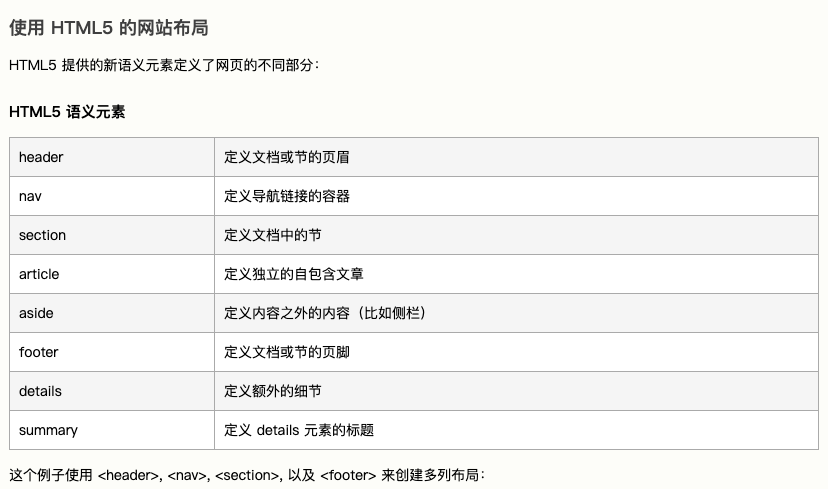
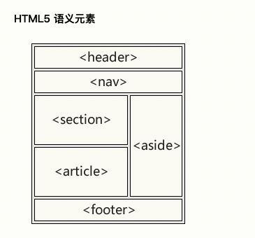
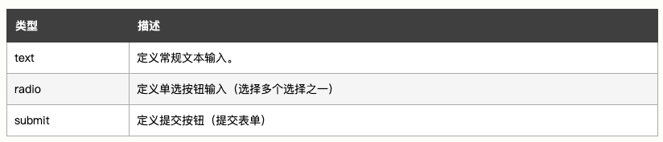
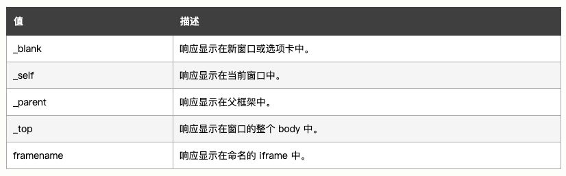

# 5. 常用HTML标签


### 1.1 HTML 标题

HTML 标题（Heading)

```html
<h1>This is a heading</h1>
<h2>This is a heading</h2>
<h3>This is a heading</h3>
```


### 1.2 HTML 段落

HTML 段落是通过p标签进行定义的。

```html
<p>This is a paragraph.</p>
<p>This is another paragraph.</p>
```


**段落的分行**

```html
<p>This is<br />a para<br />graph with line breaks</p>
```


### 1.3 HTML 链接

HTML 链接是通过a标签进行定义的。

```html
<a href="http://www.w3school.com.cn">This is a link</a>
```


- target 属性

    使用 Target 属性，你可以定义被链接的文档在何处显示。

    **下面的这行会在新窗口打开文档：**

    ```html
    <a href="http://www.w3school.com.cn/" target="_blank">Visit W3School!</a>
    ```

    `target="_blank`

### 1.4 图像

```html

```


### 1.5 水平线

hr 元素可用于分隔内容。

```html
<p>This is a paragraph</p>
<hr />
<p>This is a paragraph</p>
<hr />
<p>This is a paragraph</p>
```


### 1.6 引用

- 短引用

    浏览器通常会为 q 元素包围*引号*。

    ```html
    <p>WWF 的目标是：<q>构建人与自然和谐共存的世界。</q></p>
    ```
    
- 长引用

    ```html
    <p>以下内容引用自 WWF 的网站：</p>
    <blockquote cite="http://www.worldwildlife.org/who/index.html">
    五十年来，WWF 一直致力于保护自然界的未来。
    世界领先的环保组织，WWF 工作于 100 个国家，
    并得到美国一百二十万会员及全球近五百万会员的支持。
    </blockquote>
    ```





## 2. HTML 属性


HTML 标签可以拥有属性。属性提供了有关 HTML 元素的*更多的信息*。

属性总是以名称/值对的形式出现，比如：*name="value"*。

属性总是在 HTML 元素的*开始标签*中规定。


**链接的地址在 href 属性中指定**

```html
<a href="http://www.w3school.com.cn">This is a link</a>
```


**适用于大多数 HTML 元素的属性:**

| 属性  | 值               | detail                   |
| ----- | ---------------- | ------------------------ |
| class | Classname        | 类名                     |
| id    | id               | 元素的唯一id             |
| style | Style_definition | 行内样式（inline style） |
| title | Text             | 元素的额外信息           |


## 3. HTML 样式

在css中，使用更多的样式来美化网站

**HTML中引用的样式标签：**




## 4. HTML 图像

在 HTML 中，图像由 ``标签定义。

`` 是空标签，意思是说，它只包含属性，并且没有闭合标签。

要在页面上显示图像，你需要使用源属性（src）。src 指 "source"。源属性的值是图像的 URL 地址。

定义图像的语法是：

```html

```


- 替换文本属性（Alt）

    alt 属性用来为图像定义一串预备的可替换的文本。替换文本属性的值是用户定义的。

    ```html
    
    ```

    当浏览器无法载入图像时，替换文本属性可告诉读者他们失去的信息。

    

    此时，浏览器将显示这个替代性的文本而不是图像。

    

    为页面上的图像都加上替换文本属性是个好习惯，这样有助于更好的显示信息，并且对于那些使用纯文本浏览器的人来说是非常有用的。


## 5. HTML 表格


- 表格由 `<table> `标签来定义。

- 每个表格均有若干行（由 `<tr> `标签定义），每行被分割为若干单元格（由 `<td> `标签定义）。

- 字母 td 指表格数据（table data），即数据单元格的内容。

- 数据单元格可以包含文本、图片、列表、段落、表单、水平线、表格等等。

```html
<table border="1">
<tr>
<td>row 1, cell 1</td>
<td>row 1, cell 2</td>
</tr>
<tr>
<td>row 2, cell 1</td>
<td>row 2, cell 2</td>
</tr>
</table>
```


- 表格和边框属性

    ```html
    <table border="1">
    <tr>
    <td>Row 1, cell 1</td>
    <td>Row 1, cell 2</td>
    </tr>
    </table>
    ```

- 表格的表头

    表格的表头使用 `<th>` 标签进行定义。

    ```html
    <table border="1">
    <tr>
    <th>Heading</th>
    <th>Another Heading</th>
    </tr>
    <tr>
    <td>row 1, cell 1</td>
    <td>row 1, cell 2</td>
    </tr>
    <tr>
    <td>row 2, cell 1</td>
    <td>row 2, cell 2</td>
    </tr>
    </table>
    ```

    


## 6. HTML 列表


**HTML 支持有序、无序和定义列表**

- 无序列表

    无序列表是一个项目的列表，此列项目使用粗体圆点（典型的小黑圆圈）进行标记。

    无序列表始于` <ul> `标签。每个列表项始于` <li>`。

    ```html
    <ul>
    <li>Coffee</li>
    <li>Milk</li>
    </ul>
    ```


- 有序列表

    有序列表也是一列项目，列表项目使用数字进行标记。

    有序列表始于 `<ol>` 标签。每个列表项始于` <li>` 标签。

    ```html
    <ol>
    <li>Coffee</li>
    <li>Milk</li>
    </ol>
    ```

    



- 定义列表

    ```html
    <dl>
    <dt>Coffee</dt>
    <dd>Black hot drink</dd>
    <dt>Milk</dt>
    <dd>White cold drink</dd>
    </dl>
    ```

    


## 7. HTML  div  &  span 

**可以通过 `<div>` 和 `<span>` 将 HTML 元素组合起来。**


### 7.1 HTML 块元素

大多数 HTML 元素被定义为块级元素或内联元素。

块级元素在浏览器显示时，通常会以新行来开始（和结束）。

```
<h1>, <p>, <ul>, <table> 属于块级元素
```


### 7.2 HTML 内联元素

内联元素在显示时通常不会以新行开始。

```
<b>, <td>, <a>, 
```


### 7.3  HTML	div

HTML div元素是**块级元素**，它是可用于组合其他 HTML 元素的容器。

Div 元素没有特定的含义。除此之外，由于它属于块级元素，浏览器会在其前后显示折行。

**如果与 CSS 一同使用，div 元素可用于对大的内容块设置样式属性。**


### 7.4 HTML 	span

HTML span 元素是内联元素，可用作文本的容器。

span 元素也没有特定的含义。

当与 CSS 一同使用时，span 元素可用于为部分文本设置样式属性。


## 8. HTML class

对 HTML 进行分类（设置类），使我们能够为**元素的类定义 CSS 样式**。

```html
<!DOCTYPE html>
<html>
<head>
<style>
.cities {
    background-color:black;
    color:white;
    margin:20px;
    padding:20px;
} 
</style>
</head>

<body>

<div class="cities">
<h2>London</h2>
<p>
London is the capital city of England. 
It is the most populous city in the United Kingdom, 
with a metropolitan area of over 13 million inhabitants.
</p>
</div> 

</body>
</html>
```

```html
<!DOCTYPE html>
<html>
<head>
<style>
.cities {
    background-color:black;
    color:white;
    margin:20px;
    padding:20px;
} 
</style>
</head>

<body>

<div class="cities">
<h2>London</h2>
<p>London is the capital city of England. 
It is the most populous city in the United Kingdom, 
with a metropolitan area of over 13 million inhabitants.</p>
</div>

<div class="cities">
<h2>Paris</h2>
<p>Paris is the capital and most populous city of France.</p>
</div>

<div class="cities">
<h2>Tokyo</h2>
<p>Tokyo is the capital of Japan, the center of the Greater Tokyo Area,
and the most populous metropolitan area in the world.</p>
</div>

</body>
</html>
```

```html
<!DOCTYPE html>
<html>
<head>
<style>
  span.red {color:red;}
</style>
</head>
<body>

<h1>My <span class="red">Important</span> Heading</h1>

</body>
</html>
```


## 9. HTML id

HTML `id`属性为HTML中的元素指定唯一id

一个HTML文档中不能存在多个具有相同id的元素


- id属性用于指向样式表中的特定样式声明
- **JavaScript 也可使用它来访问和操作拥有特定 ID 的元素。**


### 9.1 id选择器的语法

写一个井号 (#)，后跟一个 id 名称。然后，在花括号 {} 中定义 CSS 属性。

```html
<!DOCTYPE html>
<html>
<head>
<style>
#myHeader {
  background-color: lightblue;
  color: black;
  padding: 40px;
  text-align: center;
}
</style>
</head>
<body>

<h1 id="myHeader">My Header</h1>

</body>
</html>
```


## 10. HTML  iframe 内联框架


**iframe 用来在网页中嵌套显示网页**

- 语法

    ```html
    <iframe src="URL"></iframe>
    ```

- 设置高度，宽度

    ```html
    <iframe src="demo_iframe.htm" width="200" height="200"></iframe>
    ```

- 删除边框

    ```html
    <iframe src="demo_iframe.htm" frameborder="0"></iframe>
    ```

- 使用iframe作为链接的目标

    iframe 可用作链接的目标（target）

    链接的 target 属性必须引用 iframe 的 name 属性：

    ```html
    <iframe src="demo_iframe.htm" name="iframe_a"></iframe>
    <p><a href="http://www.w3school.com.cn" target="iframe_a">W3School.com.cn</a></p>
    ```

    

## 11. 嵌套 Javascript

script标签用于定义客户端 脚本


JavaScript 的常见用途是图像处理、表单验证和内容的动态更改。

- js更改内容
- js更改样式
- js更改属性


## 12. HTML 网页布局






```html
<body>

<div id="header">
<h1>City Gallery</h1>
</div>

<div id="nav">
London<br>
Paris<br>
Tokyo<br>
</div>

<div id="section">
<h1>London</h1>
<p>
London is the capital city of England. It is the most populous city in the United Kingdom,
with a metropolitan area of over 13 million inhabitants.
</p>
<p>
Standing on the River Thames, London has been a major settlement for two millennia,
its history going back to its founding by the Romans, who named it Londinium.
</p>
</div>

<div id="footer">
Copyright W3School.com.cn
</div>

</body>
```


## 13. HTML 表单

**HTML 表单用于搜集不同类型的用户输入。**


### 13.1 表单格式

- form表单

    ```html
    <form>
     .
    form elements
     .
    </form>
    ```

- Input 元素 文本输入

    input 元素有很多形态，根据不同的 type 属性。

    

- input type="text"定义用于文本输入的单行输入字段

    ```html
    <form>
     First name:<br>
    <input type="text" name="firstname">
    <br>
     Last name:<br>
    <input type="text" name="lastname">
    </form> 
    ```

- input type="radio"定义单选按钮

    ```html
    <form>
    <input type="radio" name="sex" value="male" checked>Male
    <br>
    <input type="radio" name="sex" value="female">Female
    </form> 
    ```


### 13.2 表单提交

- 提交按钮

    input type="submit"定义用于向表单处理程序（form-handler）提交表单的按钮

- action属性

    action属性定义在表单被提交时执行的动作，

    **如果action属性省略，action默认为当前页面的URL**

- method属性

    method属性规定表单在提交时所使用的HTTP方法（GET/POST）

    ```html
    <form action="action_page.php" method="GET">
    <form action="action_page.php" method="POST">
    ```

- name属性

    如果要正确的被提交，每个字段必须设置一个name属性


## 14. HTML form属性


### 14.1 action属性

action属性定义提交表单时要执行的操作

当用户单击“提交”按钮时，表单数据将发送到服务器上的文件中

**如果省略 action 属性，则将 action 设置为当前页面。**


### 14.2 target属性

- Target属性规定提交表单后在何处显示响应。

- target属性可设置以下值之一

    

### 14.3 method属性

method 属性指定提交表单数据时要使用的 HTTP 方法。

- 表单数据可以作为 URL 变量（使用 `method="get"`）

- 或作为 HTTP post 事务（使用 `method="post"`）发送。


**关于GET请求**

- 以名称/值对的形式将表单数据追加到 URL
- 永远不要使用 GET 发送敏感数据！
- URL 的长度受到限制（2048 个字符）
- 对于用户希望将结果添加为书签的表单提交很有用

- GET 适用于非安全数据

**关于POST请求**

- 将表单数据附加在 HTTP 请求的正文中
- POST 没有大小限制，可用于发送大量数据。


### 14.4 autocompelete 属性

autocompelete属性规定表单是否应打开自动完成功能。

启用自动完成功能后，浏览器会根据用户之前输入的值自动填写值。


### 14.5 Novalidate 属性

Novalidate属性是一个布尔属性。

**如果已设置，它规定提交时不应验证表单数据。**


