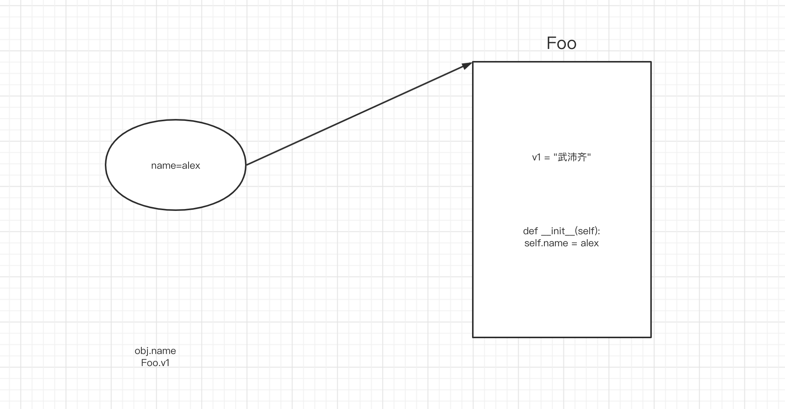

# 10.Java

### 1.基础语法

- 主函数，程序入口

```java
public class Hello {
    public static void main(String[] args) {
        System.out.println("你好呀");
    }
}
```

- 文件名

```java
一个文件中最多只能有一个public类 且 文件名必须和public类名一致。
如果文件中有多个类，文件名与public类名一致。
如果文件中有多个类 且 无public类，文件名可以是任意类名。
```

- 类名

```java
首字母大写且驼峰式命名，例如：Hello、UserInfo、PersonApplication
```

- 类修饰符

```java
public、default（不写）
```

- 静态成员,无需实例化就可以调用

```java
class MyTest{

    public void f1(){
        System.out.println("f1");
    }

    public static void f2(){
        System.out.println("f2");
    }
}

public class Hello {

    public static void main(String[] args) {
        MyTest.f2();
        
        //1.实例化
        MyTest obj = new MyTest();
        // 2.对象调用
        obj.f1();

    }
}
```

```java
class Person{
    public static void f1(){
        // 静态方法
        System.out.println("我是F1函数");
    }
}

public class Hello {
    public static void main(String[] args) {
        Person.f1();
    }
}
```

```java
class Person {
    public void f2() {
        // 实例方法
        System.out.println("我是F1函数");
    }
}

public class Hello {
    public static void main(String[] args) {
        // 实例化对象  obj = Person();
        Person obj = new Person();

        // 对象调用f2
        obj.f2();
    }
}
```

- void，无返回值

```java
class MyTest{

    public int f1(){
        System.out.println("f1");

        return 123;
    }

    public static String f2(){
        System.out.println("f2");
        return "哈哈哈";
    }
}

public class Hello {

    public static void main(String[] args) {

        MyTest obj = new MyTest();
        int v1 = obj.f1();

        String v2 = MyTest.f2();
    }
}
```

- 蚕食

```java
class MyTest {

    public int f1(int a1, int a2) {
        int result = a1 + a2;
        return result;
    }

}

public class Hello {

    public static void main(String[] args) {
        MyTest obj = new MyTest();
        int v1 = obj.f1(1, 2);
    }
}
```


#### 2.3.1 注释

```java
/**
 * 对这个类进行注释
 */
public class Hello {

    /**
     * 这个方法是干嘛....
     * @param v1 大小
     * @param v2 尺寸
     * @return 返回一个xxx
     */
    public static String getSign(int v1, String v2) {
        return "哈哈哈";
    }

    public static void main(String[] args) {
        // 单行注释
        // int age = 18;

        /* 多行注释
        String name = "武沛齐";
        int size = 18;
         */
    }
}
```

注意：JavaScript


#### 2.3.2 变量和常量

```java
public class Hello {

    public static void main(String[] args) {
        String name = "武沛齐";
        name = "alex";

        int age = 19;
        age = 20;

        final int size = 18;
    }
}
```

```python
v1 = [111,22]
v2 = 345
```


#### 2.3.3 输入和输出

```java
import java.util.Scanner;

public class Hello {

    public static void main(String[] args) {
        // 输入
        Scanner input = new Scanner(System.in);
        String text = input.nextLine();

        // 输出
        System.out.println(text);
        // System.out.print(text);
    }
}
```


```java
import java.util.Scanner;

public class Hello {

    public static void main(String[] args) {
        // 输出
        System.out.print("请输入：");

        // 输入
        Scanner input = new Scanner(System.in);
        String text = input.nextLine();

        // 输出
        System.out.println(text);
    }
}
```


#### 2.3.4 条件语句

```java
import java.util.Scanner;

public class Hello {

    public static void main(String[] args) {
        int age = 19;

        if (age < 18) {
            System.out.println("少年");
        } else if (age < 40) {
            System.out.println("大叔");
        } else {
            System.out.println("老汉");
        }

    }
}
```

```java
public class Hello {

    public static void main(String[] args) {
        int score = 19;

        switch (score) {
            case 10:
                System.out.println("xxx");
                System.out.println("xxx");
                System.out.println("xxx");
                break;
            case 20:
                System.out.println("xxx");
                System.out.println("xxx");
                System.out.println("xxx");
                break;
            default:
                System.out.println("xxx");
                break;
        }

    }
}
```


#### 2.3.5 循环语句

**while循环**

```java
public class Hello {

    public static void main(String[] args) {
        
        int count = 0;
        while (count < 3) {
            System.out.println("执行中...");
            count += 1;
        }
    }
}
```


**do while循环（至少执行1次）**

```java
public class Hello {
    public static void main(String[] args) {
        
        int count = 0;
        do {
            System.out.println("执行中...");
            count += 1;
        } while (count < 3);
        
    }
}
```


**for循环**

```java
public class Hello {

    public static void main(String[] args) {
        
        for (int i = 0; i < 10; i++) {
            System.out.println("哈哈哈");
        }
        
    }
}
```

```java
public class Hello {

    public static void main(String[] args) {        
        String[] nameList = {"修仙", "肖峰", "麻子", "十分"};
        // nameList.length   4
        // nameList[0]

        for (int idx = 0; idx < nameList.length; idx++) {
            String ele = nameList[idx];
            System.out.println(ele);
        }
    }
}
```

注意：也支持break/continue。


### 2. 数据类型

#### 2.1 整数类型

- byte，字节		  【1字节】表示范围：-128 ~ 127 即：`-2^7 ~ 2^7 -1  `  
- short，短整型    【2字节】表示范围：-32768 ~ 32767
- int，整型             【4字节】表示范围：-2147483648 ~ 2147483647
- long，长整型      【8字节】表示范围：-9223372036854775808 ~ 9223372036854775807


#### 2.2 数组

存放固定长度的元素。

- 容器
- 固定长度
- 特定类型

```java
import java.util.Arrays;

public class Hello {

    public static void main(String[] args) {
        // [123,1,999]
        int[] numArray = new int[3];
        numArray[0] = 123;
        numArray[1] = 1;
        numArray[2] = 99;
        
        System.out.println(Arrays.toString(numArray));

        String[] names = new String[]{"武沛齐", "alex", "eric"};
        System.out.println(Arrays.toString(names));
        

        String[] nameArray = {"武沛齐", "alex", "eric"};
        System.out.println(Arrays.toString(nameArray));

        // nameArray[0]
        // nameArray.length
        for (int idx = 0; idx < nameArray.length; idx++) {
            String item = nameArray[idx];
        }

    }
}
```

注意：数组一旦创建个数就不可调整。


#### 2.3 关于Object

在Java所有的类都是默认继承Object类。

用基类可以泛指他的子类的类型。

```java
import sun.lwawt.macosx.CSystemTray;

import java.util.Arrays;

public class Hello {

    public static void main(String[] args) {
        // String v1 = "wupeiqi";
        Object v1 = new String("wupeiqi");
        System.out.println(v1);
        System.out.println(v1.getClass());

        Object v2 = 123;
        System.out.println(v2);
        System.out.println(v2.getClass());
    }
}
```


```java
import sun.lwawt.macosx.CSystemTray;

import java.util.Arrays;

public class Hello {

    public static void main(String[] args) {
        // 声明数组，数组中元素必须int类型;
        int[] v1 = new int[3];

        // 声明数组，数组中元素必须String类型;
        String[] v2 = new String[3];

        // 声明数组，数组中可以是必须int/String类型;
        Object[] v3 = new Object[3];
        v3[0] = 123;
        v3[1] = "wupeiqi";

    }
}
```

所以，如果以后想要声明的数组中想要是混合类型，就可以用Object来实现。


```java
import java.util.Arrays;

public class Hello {

    public static void main(String[] args) {
        // v1是指上字符串对象；String
        String v1 = new String("wupeiqi");
        String res = v1.toUpperCase();
        System.out.println(res);

        // v2本质是字符串对象；Object
        Object v2 = new String("wupeiqi");
        String data = (String)v2;
    }
}
```


```java
import java.util.Arrays;

public class Hello {

    public static void func(Object v1) {
        // System.out.println(v1);
        // System.out.println(v1.getClass());
        if (v1 instanceof Integer) {
            System.out.println("整型");
        } else if (v1 instanceof String) {
            System.out.println("字符串类型");
        } else {
            System.out.println("未知类型");
        }
    }

    public static void main(String[] args) {
        func(123);
        func("123");
    }
}
```


- Java中所有的类都继承Object，Object代指所有的类型。
- 自己创建关系
    

```java
ArrayList v1 = new ArrayList();
LinkedList v2 = new LinkedList();
```

```java
List v1 = new ArrayList();
List v2 = new LinkedList();
```

```java
Object v1 = new ArrayList();
Object v2 = new LinkedList();
```


```java
import java.util.Arrays;

public class Hello {

    public static void main(String[] args) {
        // 声明数组，数组中元素必须int类型;
        int[] v1 = new int[3];

        // 声明数组，数组中元素必须String类型;
        String[] v2 = new String[3];

        // 声明数组，数组中可以是必须int/String类型;
        Object[] v3 = new Object[3];
        v3[0] = 123;
        v3[1] = "wupeiqi";

    }
}
```

所以，如果以后想要声明的数组中想要是混合类型，就可以用Object来实现。


### 3.常见数据类型

#### 3.1 List系列

> 类似于Python中的列表。

List是一个接口，接口下面有两个常见的类型（目的是可以存放动态的多个数据）

- ArrayList，连续的内存地址的存储（内部自动扩容）。 -> Python列表的特点
- LinkedList，底层基于链表实现（自行车链条）。          -> Python列表的特点

```java
ArrayList v1 = new ArrayList();
v1.add("武沛齐");
v1.add("麻子");
```

```java
LinkedList v1 = new LinkedList();
v1.add("武沛齐");
v1.add("麻子");
```


Java中接口，是用来约束实现他的类，约束他里面的成员必须有xx。

```java
interface List{
    public void add(Object data);   // 接口中的方法，不写具体的实现，只用于约束。
}

// 类ArrayList实现了接口List，此时这个类就必须有一个add方法。
class ArrayList implements List{
    public void add(Object data){
     	// 将数据data按照连续存储的方法放在内存。
        // ..
    }
}

// 类LinkedList实现了接口List，此时这个类就必须有一个add方法。
class LinkedList implements List{
    public void add(Object data){
     	// 将数据data按照链表的形式存储
        // ..
    }
}
```

```java
List v1 = new ArrayList();
v1.add("武沛齐");
v1.add("麻子");
```

```java
List v1 = new LinkedList();
v1.add("武沛齐");
v1.add("麻子");
```


**ArrayList示例：**

```java
import java.util.ArrayList;
import java.util.Arrays;

public class Hello {

    public static void main(String[] args) {
		
        // ArrayList，默认内部存放的是混合数据类型。
        
        // ArrayList<String> data = new ArrayList<String>();
        // ArrayList<Object> data = new ArrayList<Object>();
        
        ArrayList data = new ArrayList();
        data.add("武沛齐");
        data.add("alex");
        data.add(666);
        data.add("tony");
        
        
        String value = data.get(1);
        // String value = (String) data.get(1);
        
        
        Object temp = data.get(1);
        String value = (String) temp; // 转化可转换的数据
            
        System.out.println(value);

        int xo = (int) data.get(2);
        System.out.println(xo);

        data.set(0, "哈哈哈哈");
        System.out.println(data);

        data.remove("eric");
        data.remove(0);
        System.out.println(data);

        int size = data.size();
        System.out.println(size);

        boolean exists = data.contains("武沛齐");
        System.out.println(exists);


        for (Object item : data) {
            System.out.println(item);
        }

        for (int i = 0; i < data.size(); i++) {
            Object item = data.get(i);
            System.out.println(item);
        }
    }
}
```


**LinkedList示例：**

```java
import java.util.LinkedList;

public class Hello {

    public static void main(String[] args) {
        LinkedList<Integer> v1 = new LinkedList<Integer>();
        v1.add(11);
        v1.add(22);

        LinkedList<Object> v2 = new LinkedList<Object>();
        v2.add("有阪深雪");
        v2.add("大桥未久");
        v2.add(666);
        v2.add(123);

        //v2.remove(1);
        //v2.remove("路飞");

        v2.set(2, "苍老师");
        v2.push("哈哈哈");
        // v2.addFirst(11);


        for (int i = 0; i < v2.size(); i++) {
            Object item = v2.get(i);
            System.out.println(item);
        }

        for (Object item : v2) {
            System.out.println(item);
        }
    }
}
```


**关于迭代器：**

```java
import java.util.*;

public class Hello {

    public static void main(String[] args) {

        ArrayList s1 = new ArrayList();
        s1.add("P站");
        s1.add("B站");
        s1.add("A站");


        Iterator it = s1.iterator(); // 迭代器
        while (it.hasNext()) {
            String item = (String) it.next();
            System.out.println(item);
        }
    }
}
```


#### 3.2 Set系列

Set是一个**接口**，常见实现这个接口的有两个类，用于实现不重复的多元素集合。

- HashSet，去重，无序。
- TreeSet，去重，内部默认排序（ascii、unicode）【不同的数据类型，无法进行比较】。

```java
import java.util.*;

public class Hello {

    public static void main(String[] args) {
        // HashSet s1 = new HashSet();
        // Set s1 = new HashSet();
        // HashSet<String> s1 = new HashSet<String>();
        HashSet s1 = new HashSet();
        s1.add("P站");
        s1.add("B站");
        s1.add("A站");
        s1.add("P站");
        s1.add(666);
        System.out.println(s1); // [B站, A站, P站,666]
		
        // s2 = {"东京热","东北热","南京热"}
        HashSet s2 = new HashSet(){
            {
                add("东京热");
                add("东北热");
                add("南京热");
            }
        };
        System.out.println(s2);


        // Set s2 = new TreeSet();
        // TreeSet<String> s2 = new TreeSet<String>();
        TreeSet s3 = new TreeSet();
        s3.add("P站");
        s3.add("B站");
        s3.add("A站");
        s3.add("P站");
        // s3.add(666); //不可以

        System.out.println(s3); // [B站, A站, P站]

        TreeSet s4 = new TreeSet(){
            {
                add("P站");
                add("B站");
                add("A站");
                add("P站");
            }
        };
        System.out.println(s4); // [B站, A站, P站]

    }
}
```


关于交并差：

```java
import java.util.*;

public class Hello {

    public static void main(String[] args) {
        // Set s1 = new HashSet();
        HashSet s1 = new HashSet();
        s1.add("P站");
        s1.add("B站");
        s1.add("A站");
        s1.remove("P站");
        System.out.println(s1); // [B站, A站, P站]

        boolean exists = s1.contains("B站");
        System.out.println(exists);

        HashSet s2 = new HashSet();
        s2.add(123);
        s2.add(456);

        HashSet v1 = new HashSet(); // 空  -> [B站, A站, P站]
        v1.addAll(s1);
        v1.retainAll(s2); // 交集 & 
        System.out.println(v1);


        HashSet v2 = new HashSet();
        v2.addAll(s1);
        v2.addAll(s2); // 并集 |
        System.out.println(v2);

        HashSet v3 = new HashSet();
        v3.addAll(s1);
        v3.removeAll(s2); // 差集 s1 - s2
        System.out.println(v3);


        HashSet v4 = new HashSet();
        v4.addAll(s2);
        v4.removeAll(s1); // 差集 s2 - s1
        System.out.println(v4);
    }
}
```


关于循环获取：

```java
import java.util.*;

public class Hello {

    public static void main(String[] args) {

        TreeSet s1 = new TreeSet();
        s1.add("P站");
        s1.add("B站");
        s1.add("A站");

        for (Object item : s1) {
            System.out.println(item);
        }
    }
}
```


关于迭代器：

```java
import java.util.*;

public class Hello {

    public static void main(String[] args) {

        TreeSet s1 = new TreeSet();
        s1.add("P站");
        s1.add("B站");
        s1.add("A站");


        Iterator it = s1.iterator();
        while (it.hasNext()) {
            String item = (String) it.next();
            System.out.println(item);
        }

    }
}
```


#### 3.3 Map系列

Map是一个接口，常见实现这个接口的有两个类，用于存储键值对。

- HashMap，无序。

- TreeMap，默认根据key排序。（常用）

```python
    在Python中需要自己处理key排序的问题。
    v4 = {
    	"aid":123,
    	"xx":999,
    	"wid":888
    }
    
    # 1.根据key进行排序
    # data = ["{}={}".format(key,v4[key])  for key in sorted(v4.keys())]
    # 2.再进行拼接
    # result = "&".join(data)
    
    result = "&".join(["{}={}".format(key,v4[key])  for key in sorted(v4.keys())])
```

    

```java
import java.util.*;

public class Hello {

    public static void main(String[] args) {
        HashMap h1 = new HashMap();
        h1.put("name","alex");
        h1.put("age",18);
        h1.put("hobby","男");
        System.out.println(h1); // {gender=男, name=alex, age=18}

        HashMap<String,String> h2 = new HashMap<String,String>();
        h2.put("name","alex");
        h2.put("age","18");
        h2.put("hobby","男");
        System.out.println(h2); // {gender=男, name=alex, age=18}


        HashMap<String,String> h3 = new HashMap<String,String>(){
            {
                put("name","alex");
                put("age","18");
                put("hobby","男");
            }
        };
        System.out.println(h3); // {gender=男, name=alex, age=18}
    }
}
```

```java
import java.util.*;

public class Hello {

    public static void main(String[] args) {
        TreeMap h1 = new TreeMap(); // 改为了TreeMap
        h1.put("name","alex");
        h1.put("age",18);
        h1.put("hobby","男");
        System.out.println(h1); // {age=18, hobby=男, name=alex}

        TreeMap<String,String> h2 = new TreeMap<String,String>();
        h2.put("name","alex");
        h2.put("age","18");
        h2.put("hobby","男");
        System.out.println(h2); // {age=18, hobby=男, name=alex}


        TreeMap<String,String> h3 = new TreeMap<String,String>(){
            {
                put("name","alex");
                put("age","18");
                put("hobby","男");
            }
        };
        System.out.println(h3); // {age=18, hobby=男, name=alex}


        Map h4 = new TreeMap();
        h4.put("name","alex");
        h4.put("age",18);
        h4.put("hobby","男");
        System.out.println(h4); // {age=18, hobby=男, name=alex}
    }
}
```


常见操作：

```java
import java.util.*;

public class Hello {

    public static void main(String[] args) {
        TreeMap h1 = new TreeMap(); // 改为了TreeMap
        h1.put("name", "alex");
        h1.put("age", "18");
        h1.put("hobby", "男");
        h1.put("hobby", "女人");

        h1.remove("age");
        int size = h1.size();

        Object value = h1.get("name"); // 不存在，返回null
        System.out.println(value);

        boolean existsKey = h1.containsKey("age");
        boolean existsValue = h1.containsValue("alex");

        h1.replace("name", "李杰");
        System.out.println(h1);


        // 循环: 示例1
        // {  ("name", "alex")，("age", "18"),  }
        Set<Map.Entry<String, String>> s1 = h1.entrySet();
        Iterator it1 = s1.iterator();
        while (it1.hasNext()) {
            // ("name", "alex")
            Map.Entry<String, String> entry = (Map.Entry<String, String>) it1.next();
            String k = (String) entry.getKey();
            String v = (String) entry.getValue();
        }

        // 循环: 示例2
        Set s2 = h1.entrySet();
        Iterator it2 = s2.iterator();
        while (it2.hasNext()) {
            Map.Entry entry = (Map.Entry) it2.next();
            String k = (String) entry.getKey();
            String v = (String) entry.getValue();
        }

        // 循环: 示例3
        TreeMap<String, String> h2 = new TreeMap<String, String>(); // 改为了TreeMap
        h2.put("name", "alex");
        h2.put("age", "18");
        for (Map.Entry<String, String> entry : h2.entrySet()) {
            String k = entry.getKey();
            String v = entry.getValue();
        }

        // 循环: 示例4
        TreeMap h3 = new TreeMap(); // 改为了TreeMap
        h3.put("name", "alex");
        h3.put("age", 18);
        
        for (Object entry : h3.entrySet()) {
            Map.Entry<String, Object> entryMap = (Map.Entry<String, Object>) entry;
            String k = entryMap.getKey();
            Object v = entryMap.getValue(); // 18   "alex"
            
            if (v instanceof Integer) {
                System.out.println("数字：" + Integer.toString((Integer) v));
            } else if (v instanceof String) {
                System.out.println("字符串：" + (String) v);
            } else {
                System.out.println("未知类型：" + v.toString());
            }
        }
    }
}
```


### 4.面向对象相关

- Python，函数式+面向对象。
- Java，面向对象。

#### 4.1 类和对象

```java
class Person {
    // 实例变量
    public String name;
    public Integer age;

    // 构造方法1
    public Person() {
        this.name = "Eric";
        this.age = 99999;
    }
}

Person obj = new Person();
```

```python
class Person:
    
    # 初始化方法，  1. __new__方法，构造方法创建空对象 2.__init___方法
    def __init__(self):
        self.name = "eric"
        self.age = 999999
        
obj = Person()
```

```java
class Person {

    // 实例变量
    public String name;
    public Integer age;
    public String email;

    // 构造方法1
    public Person() {
        this.name = "Eric";
        this.age = 99999;
    }

    // 构造方法2
    public Person(String name, Integer age) {
        this.name = name;
        this.age = age;
        this.email = "xxx@live.com";
    }

    // 构造方法3
    public Person(String name, String email) {
        this.name = name;
        this.age = 83;
        this.email = email;
    }
}

Person obj1 = new Person("wupeiqi",11);
Person obj2 = new Person();
```


```java
class Person {

    // 实例变量
    public String name;
    public Integer age;
    public String email;

    // 构造方法1
    public Person() {
        this.name = "Eric";
        this.age = 99999;
    }

    // 构造方法2
    public Person(String name, Integer age) {
        this.name = name;
        this.age = age;
        this.email = "xxx@live.com";
    }

    // 构造方法3
    public Person(String name, String email) {
        this.name = name;
        this.age = 83;
        this.email = email;
    }
	
    // 定义方法（重载）
    public void doSomething() {
        System.out.println(this.name);
    }

	// 定义方法（重载）
    public void doSomething(String prev) {
        String text = String.format("%s-%s", prev, this.name);
        System.out.println(text);
    }
    
}

public class Hello {

    public static void main(String[] args) {
		
        // 实例化对象时，体现的主要是封装。
        Person p1 = new Person();
        Person p2 = new Person("alex", 73);
        Person p3 = new Person("tony", "alex@sb.com");

        p1.doSomething();
        p1.doSomething("你好呀，");

        p2.doSomething();
        p2.doSomething("你好呀，");
        
        p3.doSomething();
        p3.doSomething("你好呀，");
    }
}
```


#### 4.2 静态成员

```python
class Foo:
    v1 = "武沛齐"             # 静态变量（属于类，与对象无关）
    
    def __init__(self):
        self.name = "alex"   # 实例变量，属于对象
        
print(Foo.v1)

# 1.创建空的区域
# 2.自动执行构造方法 __init__
obj = Foo()
print(obj.name)
print(obj.v1)
```




```java
class Person {
    // 静态变量
    public static String city = "北京";
    
    // 实例变量
    public String name;
    public Integer age;

    // 构造方法1
    public Person() {
        this.name = "Eric";
        this.age = 99999;
    }
    
    // 绑定方法
    public void showInfo(){
        System.out.println("哈哈哈哈");
    }
    
    // 静态方法
    public static void showData(){
        System.out.println("哈哈哈哈");
    }
}

Person.city;
Person.showData();

Person obj = new Person();
obj.name;
obj.age;
obj.showInfo();
```

本质：静态属于类；非静态属于对象。


#### 4.3 继承

Java中的继承，只支持单**继承**，不支持多继承，但支持**实现**多个接口。

```java
class Base{
    ...
}

class Foo{
    ...
}

class Son(Base){
    
}
```

```java
interface Base{
    public void add();
}

interface Foo{
	public void plus();
}

class Son implements Base,Foo {
    public void add(){
        
    }
    public void plus(){
        
    }
}
```


Python中之和多继承。

```python
class Foo(Base,Bar):
    pass

class Foo(IBase,IBar):
    pass
```


```java
class Base {
    public String email;

    public Base(String email) {
        this.email = email;
    }

    public String getSubInfo() {
        return String.format("%s", this.email);
    }
}


// Base obj1 = new Base("xx");
// obj1.email; // "xx"
// obj1.getSubInfo();

class Person extends Base {

    public String name;
    public Integer age;

    public Person(String name, Integer age, String email) {
        super(email);// 执行父类的构造方法
        
        this.name = name;
        this.age = age;
    }

    public String getInfo(String v1) {
        return String.format("%s-%d-%s", this.name, this.age, this.email);
    }
}

// obj2 ==> email="xxx@live.com"  name="wupeiqi"  age=19
Person obj2 = new Person("wupeiqi",19,"xxx@live.com");

// obj2.name;
// obj2.age;
// obj2.email;

// obj2.getInfo("xxx");
// obj2.getSubInfo();
```


**用父类泛指所有的子类。**

```java
class Base {
    
}

class Person extends Base {

}

Person v1 = new Person(); // v1是Person类型的对象
Base v2 = new Person();  //  v2是Person类型的对象
```

```java
class Base {
    public void show() {
		System.out.println("111");
    }
}

class Person extends Base {
	public void show() {
		System.out.println("222");
    }
}

Person v1 = new Person();
v1.show(); // 222

Base v2 = new Base();
v2.show(); // 111

Base v3 = new Person();
v3.show(); // 222
```


```java
class Base {
    public String email;

    public Base(String email) {
        this.email = email;
    }

    public void getSubInfo() {
		System.out.println("111");
    }
}

// Person类继承Base类
class Person extends Base {

    public String name;

    public Person(String name, Integer age, String email) {
        super(email);// 执行父类的构造方法
        this.name = name;
    }
	
     public void getSubInfo() {
		System.out.println("222");
    }
}

public class Hello {
	
    public static void handler(Base v1){
        v1.getSubInfo();
    }
    
    // 主函数
    public static void main(String[] args) {
        Person obj1 = new Person("wupeiqi",19,"xxx@live.com");
		handler(obj1); // 222

        Base obj2 = new Base("xxx@live.com");
        handler(obj2); // 111

        Base obj3 = new Person("wupeiqi",19,"xxx@live.com");
        handler(obj3); // 222
    }
    
}
```


#### 4.4 接口

接口：

- 约束，实现他的类。
- 泛指 `实现` 他了类。

```java
interface IMessage {
    public void send();
}

// Wechat类"实现"了Imessage接口
class Wechat implements IMessage {
    public void send() {
        System.out.println("发送微信");
    }
}

class DingDing implements IMessage {
    public void send() {
        System.out.println("发送钉钉");
    }
}

class Sms implements IMessage {
    public void send() {
        System.out.println("发送短信");
    }
}

Wechat v1 = new Wechat();
IMessage v2 = new Wechat();
```

```java
public class Hello {
    
    // 多态 -> 多种形态 IMessage
	public static void handler(IMessage v1){
        v1.send();
    }
    
    // 主函数
    public static void main(String[] args) {
       Sms v1 = new Sms();
       handler(v1);
    }
}
```


在Java中：不支持同时继承多个类；支持实现多个接口。

```java
interface IPerson {
    public void f1();

    public void f1(int age);

    public void f2(String info);
}

interface IUser {
    public String f3(int num);
}

class Base {
    public String name;
    public Integer age;
    public String email;

    public Base(String name, Integer age, String email) {
        this.name = name;
        this.age = age;
        this.email = email;
    }

    public String getSubInfo() {
        return String.format("%s", this.email);
    }
}

class Person extends Base implements IUser, IPerson {

    public Person(String name, Integer age, String email) {
        super(name, age, email);
    }

    public String getInfo() {
        return String.format("%s-%d-%s", this.name, this.age, this.email);
    }


    public void f1() {
        System.out.println("F1,无参数");
    }

    public void f1(int age) {
        System.out.println("F1,age参数");
    }

    public void f2(String info) {
        System.out.println("F2");
    }

    public String f3(int num) {
        return "哈哈哈";
    }
}

public class Hello {

    public static void main(String[] args) {
        Person p = new Person("日天", 83, "ritian@live.com");
        p.f1();
    }
}
```


假设我现在在进行逆向，拿到apk，关于关键字去搜索：f2 ，定位到一个接口了。

```java
interface IPerson {
    public void f1();

    public void f1(int age);

    public void f2(String info);
}
```

接下来，你就应该去看都有哪些类 实现了 IPerson 接口。

- 只有1个类实现 IPerson。 
- 多类类实现 IPerson 接口，筛选到底是那个类？


#### 4.5 抽象

```java
// 抽象类
abstract class Base {

    // 抽象方法（约束子类中必须有这个方法）
    public abstract void play(String name);

    // 普通方法
    public void stop() {
        System.out.println("Stop");
    }
}

class Son extends Base{
    public void play(String name){
        // ...
    }
}

Son obj = new Son();
obj.stop();
obj.play();

Base obj1 = new Son();
```

注意：也可以泛指他的子类。


### 5.包概念

```
src
├── Hello.java
└── utils
    └── Helper.java
```

```java
// hello.java
import utils.Helper;

public class Hello {

    public static void main(String[] args) {
        String data = Helper.getInfo();
        System.out.println(data);
    }
}

```

```java
// helper.java
package utils;

public class Helper {
    public static String getInfo() {
        return "哈哈哈";
    }
}
```


**类的修饰符：**

- public，公共（任何人都能调用包中的类）。
- default，只能在当前包中被调用。


**类成员修饰符：**

- public，公共，所有的只要有权限访问类，类中的成员都可以访问到。
- private，私有，只允许自己类调用。
- protected，同一个包 或 子类可以访问（即使没有在同一个包内，也可以访问父类中的受保护成员）。
- default，只能在同一个包内访问。


目的：通过关键字让调用关系更加清晰（不过，很多项目不会用的那么专业）。


