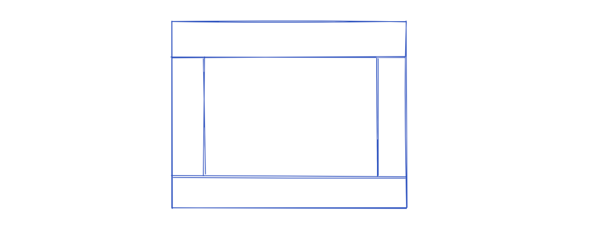
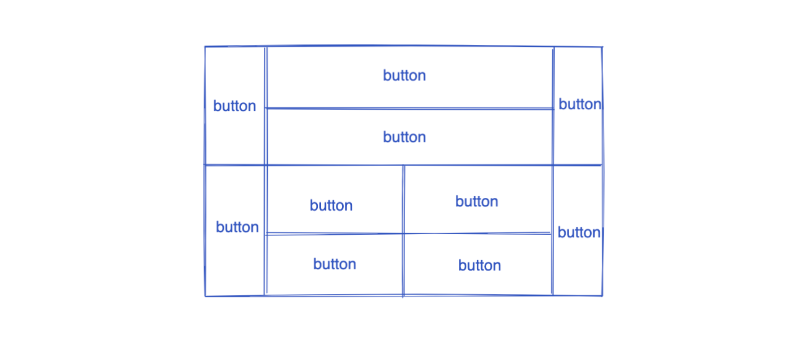

# 11.Java GUI

## AWT

### 1.组件和容器

**Frame**

- 弹出一个窗口。

```java
package uichuan;

import java.awt.*;
import java.awt.event.WindowAdapter;
import java.awt.event.WindowEvent;

public class TestFrame {
    public static void main(String[] args) {
        Frame frame = new Frame("First_windows");
        //看得见
        frame.setVisible(true);
        //尺寸
        frame.setSize(400,400);
        //背景色
        frame.setBackground(Color.BLACK);
        //弹出初始位置
        frame.setLocation(200,200);
        //设置大小固定
        frame.setResizable(false);

        // 简听窗口关闭事件
        frame.addWindowListener(new WindowAdapter() {
            //窗口关闭时做的事情
            @Override
            public void windowClosing(WindowEvent e) {
                System.exit(0);
            }
        });
    }
}

```

- 弹出多个窗口（封装）

```java
package uichuan;

import java.awt.*;

public class TestFrame_2 {
    public static void main(String[] args) {
        //展示多个窗口
        MyFrame myFrame1 = new MyFrame(100,100,200,200);
        MyFrame myFrame2 = new MyFrame(300,100,200,200);
        MyFrame myFrame3 = new MyFrame(100,300,200,200);
        MyFrame myFrame4 = new MyFrame(300,300,200,200);
    }
}

class MyFrame extends Frame{
    // 多个窗口，计数器
    static int id = 0;
    public MyFrame(int x,int y,int w,int h){
        super("MyFrame"+(++id));
        setVisible(true);
        setBounds(x,y,w,h);
        setBackground(Color.BLACK);
    }
}
```

- 关闭窗口（点击关闭按钮->程序结束）

**适用于AWT**

> 重写了windowClosing方法

```java
// 简听窗口关闭事件
frame.addWindowListener(new WindowAdapter() {
    //窗口关闭时做的事情
    @Override
    public void windowClosing(WindowEvent e) {
        System.exit(0);
    }
});
```


### 2.面板Panel

Panel面板需要frame中

使用`frame.add(panel);`将面板添加到frame中去

同样的，panel也能设置相应的参数

- 坐标
- 背景颜色
- 尺寸
- ......

```java
package uichuan;

import java.awt.*;
import java.awt.event.WindowAdapter;
import java.awt.event.WindowEvent;
import java.awt.event.WindowListener;

//panel看作一个空间，不能单独存在
public class TestPanel {
    public static void main(String[] args) {
        Frame frame = new Frame("xx");
        frame.setVisible(true);
        // 布局
        Panel panel = new Panel();
        // 设置布局
        frame.setLayout(null);
        frame.setSize(400,400);
        //坐标
        frame.setBounds(300,300,500,500);
        frame.setBackground(Color.BLACK);

        //panel设置坐标，panel相对与frame
        panel.setBounds(50,50,400,400);
        panel.setBackground(Color.WHITE);
        frame.add(panel);
        // 简听窗口关闭事件
        frame.addWindowListener(new WindowAdapter() {
            //窗口关闭时做的事情
            @Override
            public void windowClosing(WindowEvent e) {
                System.exit(0);
            }
        });
    }
}
```


### 3.布局

#### - 流式布局

```
frame.setLayout(new FlowLayout());
```

用于设置流式布局的是`FlowLayout()`对象，其中的参数用来设置流式布局的细节

```java
frame.setLayout(new FlowLayout(FlowLayout.LEFT));
frame.setLayout(new FlowLayout(FlowLayout.RIGHT));
```

```java
package uichuan;

import java.awt.*;
import java.awt.event.WindowAdapter;
import java.awt.event.WindowEvent;

public class TestFlowLayout {
    public static void main(String[] args) {
        Frame frame = new Frame();
        frame.setSize(500, 500);
        frame.setVisible(true);

        frame.addWindowListener(new WindowAdapter() {
            //窗口关闭时做的事情
            @Override
            public void windowClosing(WindowEvent e) {
                System.exit(0);
            }
        });

        //按钮组件
        Button button1 = new Button("点我");
        Button button2 = new Button("点我");
        Button button3 = new Button("点我");

        frame.add(button1);
        frame.add(button2);
        frame.add(button3);
        // 设置为流式布局
        frame.setLayout(new FlowLayout());
//        frame.setLayout(new FlowLayout(FlowLayout.LEFT));
//        frame.setLayout(new FlowLayout(FlowLayout.RIGHT));

    }
}
```

#### - 东西南北中



```
frame.add(button1,BorderLayout.EAST);
```

add()中传入一个`Component`对象，也可以传入布局`BorderLayout.EAST`

> 源码

```java
public void add(Component comp, Object constraints) {
    addImpl(comp, constraints, -1);
}
```

>实现东西南北中布局

```java
package uichuan;

import java.awt.*;
import java.awt.event.WindowAdapter;
import java.awt.event.WindowEvent;

public class TestBoderLayout {
    public static void main(String[] args) {
        Frame frame = new Frame("TestBoderLayout");
        frame.setVisible(true);
        frame.setSize(400,400);
        frame.addWindowListener(new WindowAdapter() {
            //窗口关闭时做的事情
            @Override
            public void windowClosing(WindowEvent e) {
                System.exit(0);
            }
        });


        Button button1 = new Button("East");
        Button button2 = new Button("West");
        Button button3 = new Button("South");
        Button button4 = new Button("North");
        Button button5 = new Button("center");

        frame.add(button1,BorderLayout.EAST);
        frame.add(button2,BorderLayout.WEST);
        frame.add(button3,BorderLayout.SOUTH);
        frame.add(button4,BorderLayout.NORTH);
        frame.add(button5,BorderLayout.CENTER);
    }
}
```


#### - 表格布局

```java
frame.setLayout(new GridLayout(3,2));
```

传入`GridLayout`对象

```java
package uichuan;

import java.awt.*;
import java.awt.event.WindowAdapter;
import java.awt.event.WindowEvent;

public class TestGridLayout {
    public static void main(String[] args) {
        Frame frame = new Frame("TestGridLayout");
        frame.setVisible(true);
        frame.setSize(400, 400);
        frame.addWindowListener(new WindowAdapter() {
            //窗口关闭时做的事情
            @Override
            public void windowClosing(WindowEvent e) {
                System.exit(0);
            }
        });

        Button button1 = new Button("点我");
        Button button2 = new Button("点我");
        Button button3 = new Button("点我");
        Button button4 = new Button("点我");
        Button button5 = new Button("点我");
        Button button6 = new Button("点我");

        frame.setLayout(new GridLayout(3,2));
        frame.add(button1);
        frame.add(button2);
        frame.add(button3);
        frame.add(button4);
        frame.add(button5);
        frame.add(button6);
    }
}
```


#### - 练习

实现如下布局：



思路：

```
- frame
	- 上半部分
		- Grid东西 + Center布局
			- 东，西button
			- Center中嵌套表格布局Grid
				- Grid分成两行一列的上下布局
					- Button1
                    - Button2
	- 下半部分与上半部分相同
		- Center部分略微不同
			Center放置了一个2*2的表格布局
			- 在表格Grid中填充button即可
```

**核心布局代码：**

```java
// Frame采用表格布局
        frame.setLayout(new GridLayout(2, 1));
        // 四个面板
        Panel panel1 = new Panel(new BorderLayout());
        Panel panel2 = new Panel(new GridLayout(2, 1));
        Panel panel3 = new Panel(new BorderLayout());
        Panel panel4 = new Panel(new GridLayout(2, 2));

        //添加按钮,上半部分
        panel1.add(new Button("East-1"), BorderLayout.EAST);
        panel1.add(new Button("West-1"), BorderLayout.WEST);

        panel2.add(new Button("p2-btn-1"));
        panel2.add(new Button("p2-btn-2"));

        panel1.add(panel2, BorderLayout.CENTER);

        //添加按钮,下半部分
        panel3.add(new Button("East-2"), BorderLayout.EAST);
        panel3.add(new Button("West-2"), BorderLayout.WEST);

        //中间四个,循环实现
        for (int i = 0; i < 4; i++) {
            panel4.add(new Button("for-" + i));
        }

        panel3.add(panel4, BorderLayout.CENTER);

        //Frame添加Panel
        frame.add(panel1);
        frame.add(panel3);
```

**所有代码：**

```java
package uichuan;

import javafx.scene.layout.Pane;

import java.awt.*;
import java.awt.event.WindowAdapter;
import java.awt.event.WindowEvent;

public class TestPractice {
    public static void main(String[] args) {

        Frame frame = new Frame("practice");
        frame.setVisible(true);
        frame.setSize(400, 400);
        frame.addWindowListener(new WindowAdapter() {
            //窗口关闭时做的事情
            @Override
            public void windowClosing(WindowEvent e) {
                System.exit(0);
            }
        });

        // Frame采用表格布局
        frame.setLayout(new GridLayout(2, 1));
        // 四个面板
        Panel panel1 = new Panel(new BorderLayout());
        Panel panel2 = new Panel(new GridLayout(2, 1));
        Panel panel3 = new Panel(new BorderLayout());
        Panel panel4 = new Panel(new GridLayout(2, 2));

        //添加按钮,上半部分
        panel1.add(new Button("East-1"), BorderLayout.EAST);
        panel1.add(new Button("West-1"), BorderLayout.WEST);

        panel2.add(new Button("p2-btn-1"));
        panel2.add(new Button("p2-btn-2"));

        panel1.add(panel2, BorderLayout.CENTER);

        //添加按钮,下半部分
        panel3.add(new Button("East-2"), BorderLayout.EAST);
        panel3.add(new Button("West-2"), BorderLayout.WEST);

        //中间四个,循环实现
        for (int i = 0; i < 4; i++) {
            panel4.add(new Button("for-" + i));
        }

        panel3.add(panel4, BorderLayout.CENTER);

        //Frame添加Panel
        frame.add(panel1);
        frame.add(panel3);

    }
}
```


### 4.事件监听Button

**addActionListener**

**以按钮举例**

- 首先实现`ActionListener`

```java
class MyActionListener implements ActionListener {
    @Override
    public void actionPerformed(ActionEvent e) {
        System.out.println("aaa");
    }
}
```

- 在主函数中实例化`MyActionListener`类的对象，并且传入给`button.addActionListener(myActionListener);`

```java
MyActionListener myActionListener = new MyActionListener();
button.addActionListener(myActionListener);
```


**全部代码：**

```java
package part2;

import java.awt.*;
import java.awt.event.ActionEvent;
import java.awt.event.ActionListener;
import java.awt.event.WindowAdapter;
import java.awt.event.WindowEvent;

public class TestActionEvent {
    public static void main(String[] args) {
        Frame frame = new Frame();
        frame.setSize(500, 500);
        frame.setVisible(true);

        windowClose(frame);
        Button button = new Button("点我");
        // 实例化事件监听类的对象，传入
        MyActionListener myActionListener = new MyActionListener();
        button.addActionListener(myActionListener);
        frame.add(button, BorderLayout.CENTER);
    }

    // 简化一些，封装个私有成员，用于方便的关闭窗口
    private static void windowClose(Frame frame){
        frame.addWindowListener(new WindowAdapter() {
            @Override
            public void windowClosing(WindowEvent e) {
                System.exit(0);
            }
        });
    }
}

// 事件监听
class MyActionListener implements ActionListener {
    @Override
    public void actionPerformed(ActionEvent e) {
        System.out.println("aaa");
    }
}
```

**拓展：封装一个私有成员来方便的关闭窗口**

- 私有成员:

```java
private static void windowClose(Frame frame){
        frame.addWindowListener(new WindowAdapter() {
            @Override
            public void windowClosing(WindowEvent e) {
                System.exit(0);
            }
        });
    }
```

- main

```java
windowClose(frame);
```


### 5.事件监听TextField

```java
MyActionListener2 myActionListener2 = new MyActionListener2();
textField.addActionListener(myActionListener2);
```

```java
package part2;

import java.awt.*;
import java.awt.event.ActionEvent;
import java.awt.event.ActionListener;
import java.awt.event.WindowAdapter;
import java.awt.event.WindowEvent;

public class TestText01 {
    public static void main(String[] args) {
        new MyFrame();
    }
}

// 写一个Myframe类直接继承Frame类，拥有Frame类中的所有功能
class MyFrame extends Frame {
    public MyFrame() {
        TextField textField = new TextField();
        setSize(400, 400);
        setVisible(true);
        add(textField);

        // 监听这个文本框输入的文字
        MyActionListener2 myActionListener2 = new MyActionListener2();
        textField.addActionListener(myActionListener2);
    }
}

class MyActionListener2 implements ActionListener {
    @Override
    public void actionPerformed(ActionEvent e) {
        // 获得一些资源-->返回一个对象
        TextField field = (TextField) e.getSource();
        field.getText(); //获得输入框中的文本
        System.out.println(field.getText());
    }
}
```


