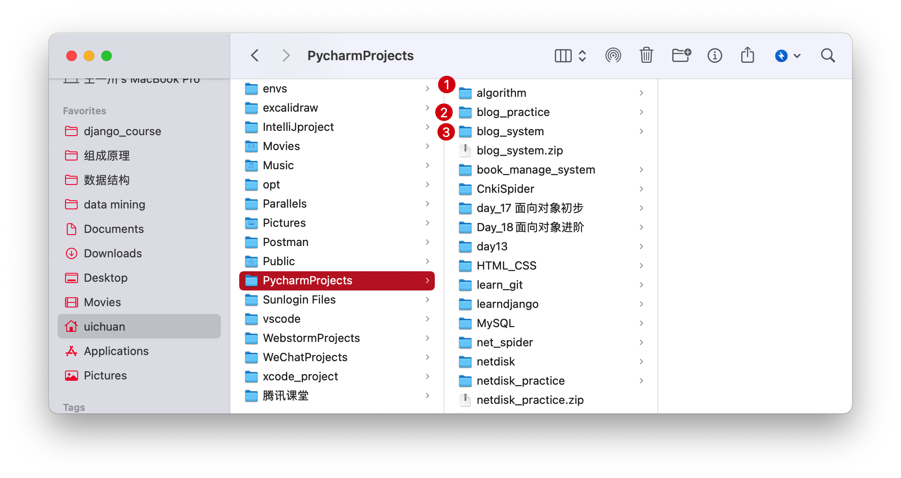
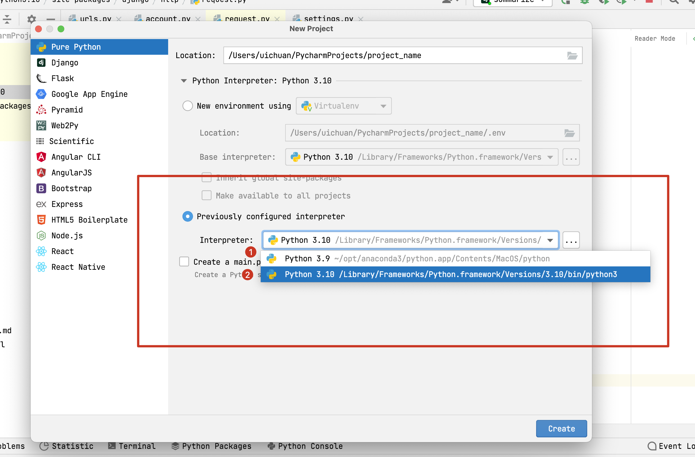
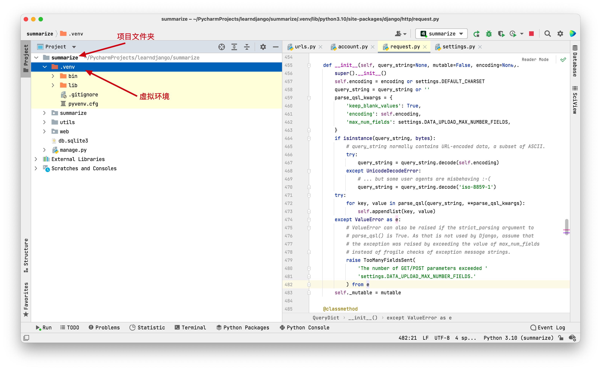
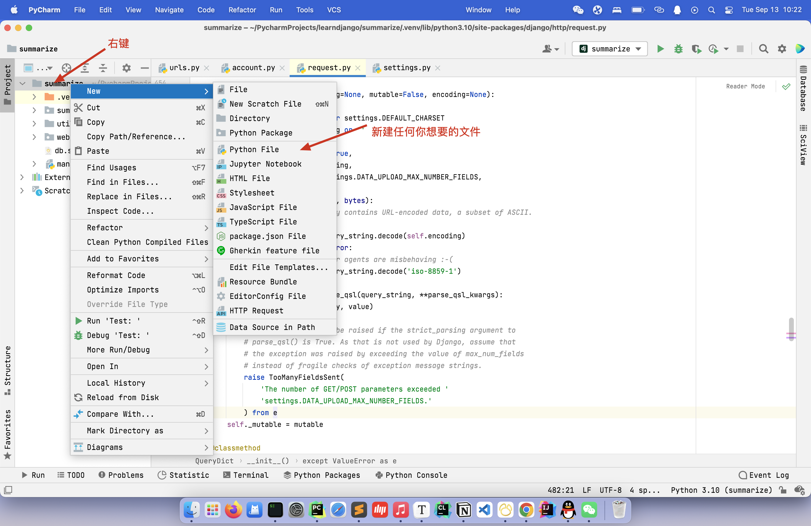
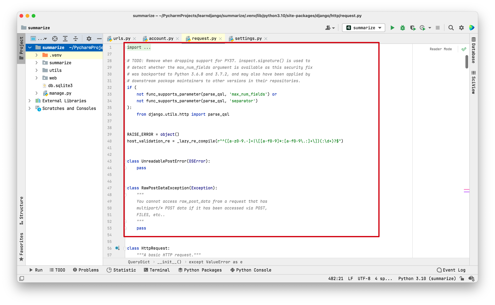
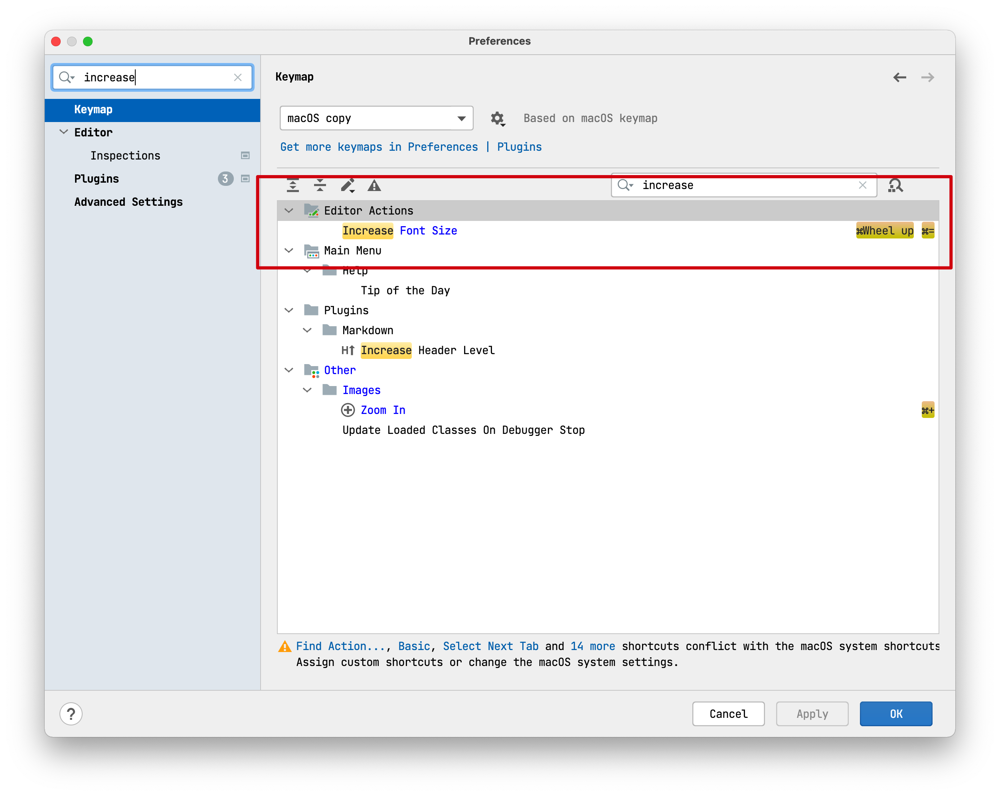

# 8.Pycharm 帮助

### 前戏

关于你的项目应该存储在什么地方

这是我的习惯：

所有的项目都存储在PycharmProjects文件夹下

（你可以在一个自己常用的位置新建一个名为`PycharmProjects`的文件夹）	


这是我电脑中的PycharmProjects文件夹



里面有很多项目


### 1.新建项目

选择新建纯净的Python项目，放在PycharmProjects文件夹下


### 2.Python解释器的配置

#### 2.1 基于系统解释器创建


**系统解释器** 是电脑上安装的python解释器，可以通过找到python解释器的路径进行配置



我的电脑上有两个系统解释器

分别是python3.9和python3.10


#### 基于系统解释器创建项目的缺点

python十分依赖外部的模块（site-packeges）

这些模块会存储在系统解释器文件夹中的`site-packages`中


如果所有的项目（在进行一些复杂项目时）都用同一个系统解释器，会有各种各样的模块，可能会导致一些混乱

**同时，不同的项目可能需要不同的python解释器版本**

所以，更加推荐**虚拟环境**


#### 2.2 虚拟环境

虚拟环境是**基于系统解释器**生成的一个独立的虚拟环境解释器，

对于公共的功能，虚拟环境解释器会继承系统解释器的功能，拓展出的功能和安装的模块，会独立存储在虚拟环境所在的文件夹中

一般虚拟环境的位置会选择在项目目录下创建一个隐藏文件夹（.env）来存放虚拟环境





**ok，做完这些就完事大吉了，恭喜🎈**


### 3.新建文件夹与文件




### 4.一些快捷键的配置

- 缩放代码区域的大小

    

​	进入设置，搜索increase，设置增大字体的快捷键



我一般设置为按住contrl 然后滚动鼠标滚轮来增大字体


之后同理搜索decrease，设置减小字体的快捷键


- 如何让代码更工整？

    找到顶部栏

    ```
    refactor -> reformat code
    ```


### 5.more

还有一些操作，不太好用语言描述，如果哪次开会或者交流可以再聊