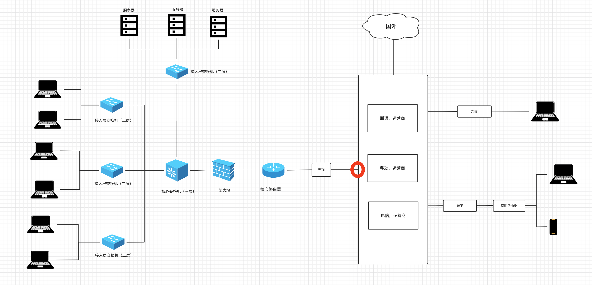

# 2.网络请求流程

### 1.前戏

**IPV4 地址**

接入互联网的设备，需要一个IP来代指次电脑

**内网IP & 公网IP**



之前我们自己在一个局域网内为电脑分配的IP都称为`内网IP`，基于内网IP可以在一个局域网内进行相互通信（也需要相关的配置）。

如果想要通过互联网进行通信，就必须借助公网IP。


**云服务器**

可以通过一个外网IP地址访问 链接云服务器


**端口**

假设，你在腾讯租了一台云服务器（外网IP:123.206.15.88），然后又开发了 2 个网站运行在服务器上。

- 网站A：使用8001端口，那么用户在自己电脑上或手机上访问时指定 IP和端口 即可，如： `123.206.15.88:8001` 
- 网站B：使用8002端口，那么用户在自己电脑上或手机上访问时指定 IP和端口 即可，如： `123.206.15.88:8002` 

每个端口代表一个进程


**域名**

让域名和IP创建对应关系，用户只需要记住域名就可以了

```
www.baidu.com   -->  110.242.68.3
www.taobao.com  --> 121.18.239.232
...
```


**UDP & TCP 链接**


- TCP

（Transmission Control Protocol，传输控制协议）是面向连接的协议，也就是说，在收发数据前，必须和对方建立可靠的连接，然后再进行收发数据。

- UDP

​	是⼀个⽆连接的简单的⾯向数据报的传输层协议。

UDP不提供可靠性， 它只是把应⽤程序传给IP层的数据报发送出去， 但是并不能保证它们能到达⽬的地。 由于UDP在传输数据报前不⽤在客户和服务器之间建⽴⼀个连接， 且没有超时重发等机制， 故⽽传输速度很快。


### 2.网络编程

- bs架构

    Browser / server

- CS架构

    Client / server


**http**

http协议特点：无状态的短连接。


**一次请求和一次响应后，断开连接**

- cookie
- session


**GET/POST**

在浏览器中提交数据

主要的区别就是他们存放参数的位置

- GET


- POST

    form表单，

    你看不到


**请求头**

```
浏览器本质上发送请求时，包含请求头和请求体。
- GET请求
	- 只有请求头 + 没有请求体
	- 请求头之间用 \r\n
	- 请求头和请求体之间用 \r\n\r\n
	
- POST请求
	- 只有请求头 + 有请求体
	- 请求头之间用 \r\n
	- 请求头和请求体之间用 \r\n\r\n
```


### 3.web框架


