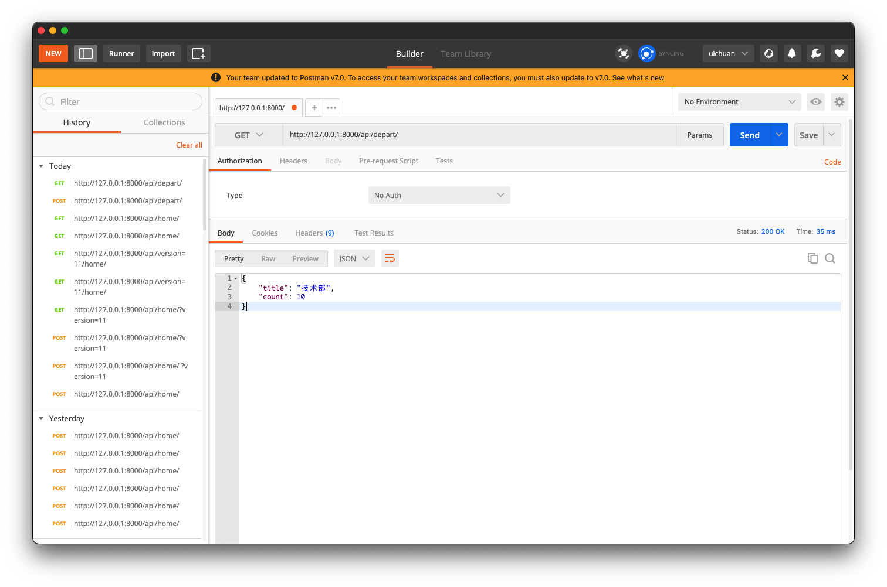
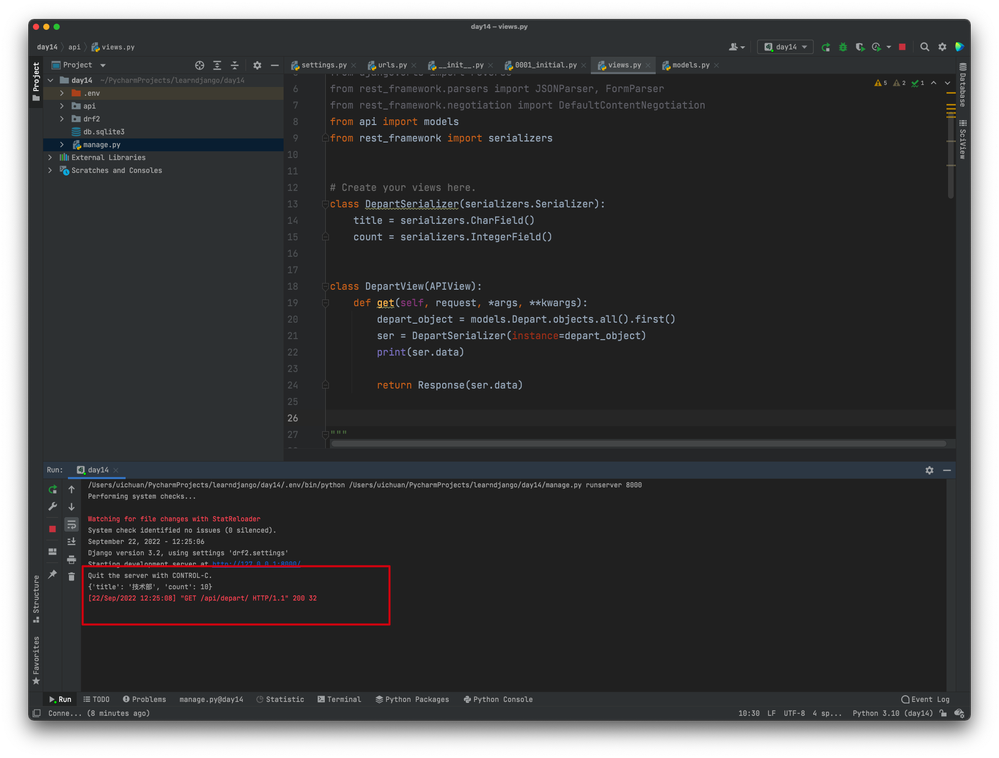
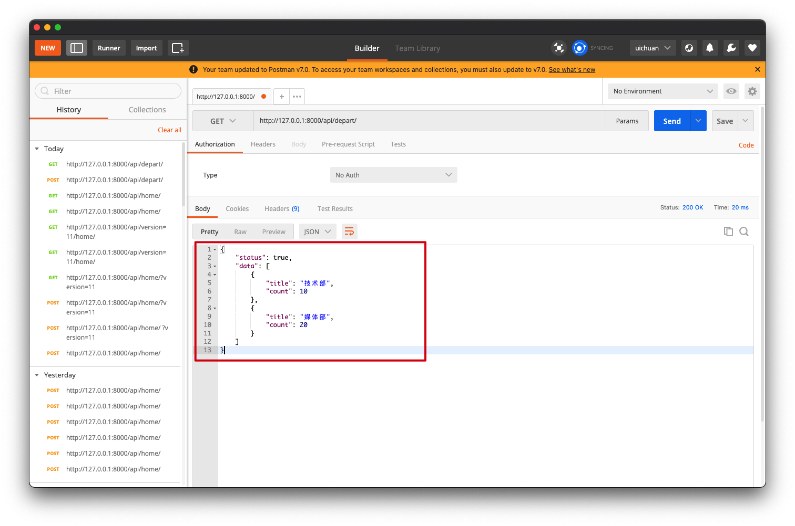
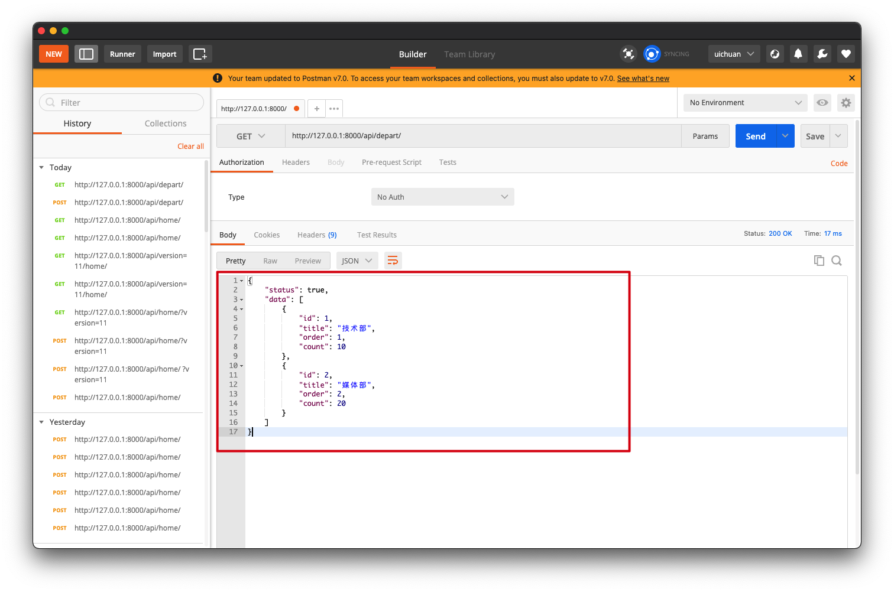
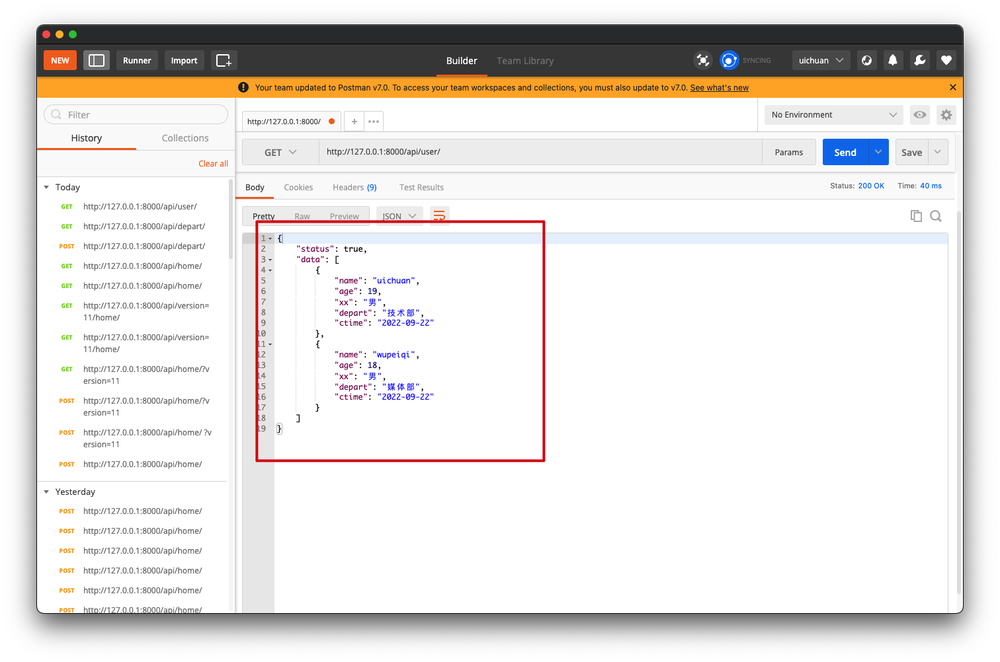

# 7.restframework序列化

序列化器有两个功能

- 数据校验
- 序列化


  

### 1.序列化器的简单实用

序列化器将django通过orm操作从数据库中取得的数据做序列化操作转换为Json数据

**需要编写序列化类**

```python
from api import models
from rest_framework import serializers


class DepartSerializer(serializers.Serializer):
    title = serializers.CharField()
    count = serializers.IntegerField()
```

并且在**视图函数中应用**，实例化`DepartSerializer`对象并且传入通过ORM查询得到的对象`QueryDict`

```python
class DepartView(APIView):
    def get(self, request, *args, **kwargs):
        depart_object = models.Depart.objects.all().first()
        ser = DepartSerializer(instance=depart_object)
        print(ser.data)

        return Response(ser.data)
```

**在postman中测试**



序列化器成功得到数据，并且返回给接口Json数据



注意⚠️：

- 在序列化器类中的字段名应该与ORM中的字段名保持一致
- 同时数据类型`field`也要保持一致


### 2. 对多个对象的序列化

视图函数中的序列化器的对象在生成时需要添加一个参数`many=True`

此时，models接收的对象应该是多个，放在一个列表中

```
[obj1,obj2,obj3,....]
```

用单个对象接收就不太合适了，这里用`queryset`来接收

```python
# queryset = [obj1,obj2,obj3,....]
queryset = models.Depart.objects.all()
```

```python
from rest_framework.views import APIView
from rest_framework.response import Response
from api import models
from rest_framework import serializers


class DepartSerializer(serializers.Serializer):
    title = serializers.CharField()
    count = serializers.IntegerField()


class DepartView(APIView):
    def get(self, request, *args, **kwargs):
        queryset = models.Depart.objects.all()
        ser = DepartSerializer(instance=queryset, many=True)
        print(ser.data)
        context = {"status": True, "data": ser.data}
        return Response(context)
```

Postman中的测试结果：



 


### 3.ModelSerializer

```python
class DepartSerializer(serializers.ModelSerializer):
    class Meta:
        model = models.Depart
        fields = "__all__"
```

更加轻松的方式，类似`ModelForm`的原理

在postman中的测试结果：

所有数据字段都可以被序列化




### 4.source & 时间格式化

```python
class UserSerializer(serializers.ModelSerializer):
    xx = serializers.CharField(source='get_gender_display')
    depart = serializers.CharField(source='depart.title')
    ctime = serializers.DateTimeField(format="%Y-%m-%d")

    class Meta:
        model = models.UserInfo
        # fields = "__all__"
        fields = ['name', 'age', 'xx', 'depart', 'ctime']
```

source去数据库中寻找到对应字段，`new_name`作为返回的Json中的数据的键名 

```python
class UserView(APIView):
    def get(self, request, *args, **kwargs):
        models.UserInfo.objects.all().update(ctime=datetime.datetime.now())
        queryset = models.UserInfo.objects.all()

        ser = UserSerializer(instance=queryset, many=True)

        context = {"status": True, "data": ser.data}
        return Response(context)
```

在postman中的测试结果：




### 5. 序列化自定义方法

在`serializers`字段中自定义`SerializerMethodField()`

并且定义函数（类似与钩子）

```python
def get_xxx(self, obj):
    return '这里是自定义方法'
```

```python
class UserSerializer(serializers.ModelSerializer):
    xx = serializers.CharField(source='get_gender_display')
    depart = serializers.CharField(source='depart.title')
    ctime = serializers.DateTimeField(format="%Y-%m-%d")
    xxx = serializers.SerializerMethodField()

    class Meta:
        model = models.UserInfo
        # fields = "__all__"
        fields = ['name', 'age', 'xx', 'depart', 'ctime', 'xxx']

    def get_xxx(self, obj):
        return '这里是自定义方法'
```


### 6.序列化类嵌套

主要是ORM类中对应的`ForeignKey`和`ManagToManyField`字段进行序列化

- 基于`SerializerMethodField`自定义方法对关联数据进行序列化
- 基于嵌套类的序列化

```python
from django.db import models


class Role(models.Model):
    title = models.CharField(verbose_name="标题", max_length=32)
    order = models.IntegerField(verbose_name="顺序")


class Tag(models.Model):
    caption = models.CharField(verbose_name="名称", max_length=32)


class UserInfo(models.Model):
    name = models.CharField(verbose_name="姓名", max_length=32)
    gender = models.SmallIntegerField(verbose_name="性别", choices=((1, "男"), (2, "女")))
    role = models.ForeignKey(verbose_name="角色", to="Role", on_delete=models.CASCADE)
    ctime = models.DateTimeField(verbose_name="创建时间", auto_now_add=True)

    tags = models.ManyToManyField(verbose_name="标签", to="Tag")
```


```python
from rest_framework.views import APIView
from rest_framework.response import Response
from rest_framework import serializers
from api import models


class RoleSerializer(serializers.ModelSerializer):
    class Meta:
        model = models.Role
        # fields = "__all__"
        fields = ["id", 'title']


class TagSerializer(serializers.ModelSerializer):
    class Meta:
        model = models.Tag
        fields = "__all__"


class InfoSerializer(serializers.ModelSerializer):
    role = RoleSerializer()
    tags = TagSerializer(many=True)

    class Meta:
        model = models.UserInfo
        fields = ['id', 'name', "role", "tags"]


class InfoView(APIView):
    def get(self, request):
        queryset = models.UserInfo.objects.all()
        ser = InfoSerializer(instance=queryset, many=True)
        print(type(ser.data), ser.data)
        return Response(ser.data)
```

### 7.序列化类继承

```python
from rest_framework.views import APIView
from rest_framework.response import Response
from rest_framework import serializers
from api import models


class MySerializer(serializers.Serializer):
    more = serializers.SerializerMethodField()

    def get_more(self, obj):
        return "123"


class InfoSerializer(serializers.ModelSerializer, MySerializer):
    class Meta:
        model = models.UserInfo
        fields = ["id", "name", 'more']


class InfoView(APIView):
    def get(self, request):
        instance = models.UserInfo.objects.all().first()
        ser = InfoSerializer(instance=instance, many=False)

        print(type(ser.data), ser.data)
        return Response(ser.data)
```


