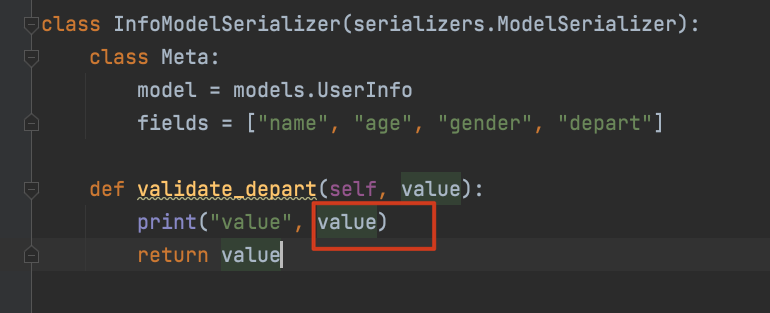
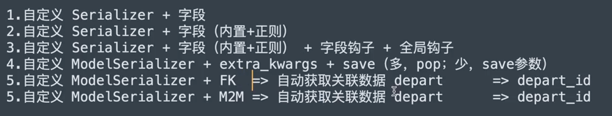
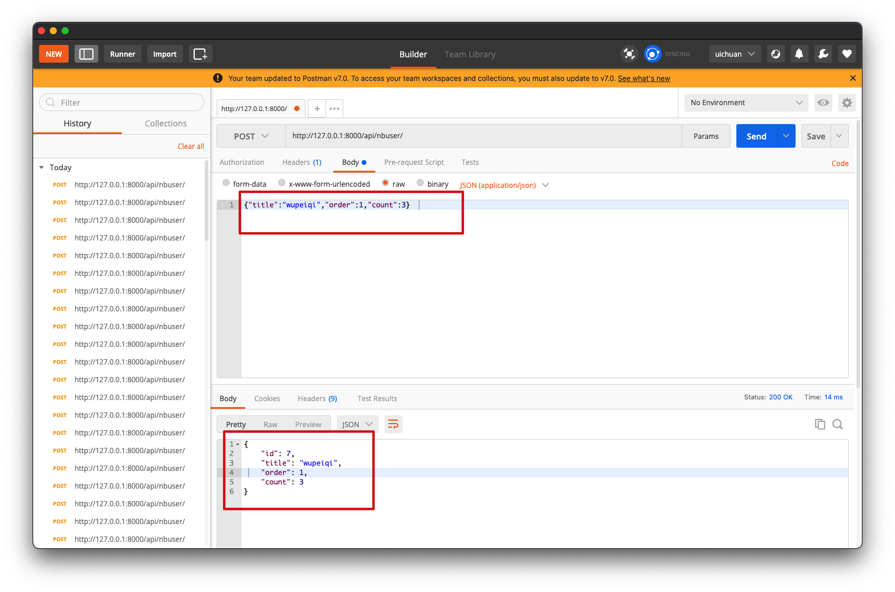

# 8.restframework数据校验

这篇随笔针对于应用，将会有很多实例代码片段，源码肝不动了，需要缓缓🎈


### 1.内置校验（基于Serializer）

```python
from rest_framework.views import APIView
from rest_framework.response import Response
from rest_framework import serializers

class InfoSerializer(serializers.Serializer):
    title = serializers.CharField(required=True, max_length=20, min_length=6)
    order = serializers.IntegerField(required=False, max_value=100, min_value=10)
    level = serializers.ChoiceField(choices=[("1", "高级"), (2, "中级")])


class InfoView(APIView):
    def post(self, request):
        ser = InfoSerializer(data=request.data)
        if ser.is_valid():
            return Response(ser.validated_data)
        else:
            return Response(ser.errors)
```

**对于内置校验**

基于serializer类的serializer字段后添加参数

```
- required
- max_length
- min_length
- choices=[("1", "xx"), (2, "xxx")]
- validators=[xxvalidator(message="xxx校验错误")]
	- validators=[EmailValidator(message="邮箱格式错误")]
```


### 2.正则校验

使用正则表达式校验

```
from django.core.validators import RegexValidator
```

**使用django内置的正则表达式校验类来实现**

```python
class InfoSerializer(serializers.Serializer):
    more = serializers.CharField(validators=[RegexValidator(r"\d+", message="格式错误")])
```


### 3.钩子校验

**基于serializer的钩子方法进行校验**

例如：对code字段进行校验

```python
from rest_framework.views import APIView
from rest_framework.response import Response
from rest_framework import serializers
from rest_framework import exceptions


class InfoSerializer(serializers.Serializer):
    title = serializers.CharField(required=True, max_length=20, min_length=6)
    order = serializers.IntegerField(required=False, max_value=100, min_value=10)
    code = serializers.CharField()

    def validate_code(self, value):
        print(value)
        if len(value) > 6:
            raise exceptions.ValidationError("字段钩子校验失败")
        return value

    def validate(self, attrs):
        print("validate=", attrs)
        # api_settings.NON_FIELD_ERRORS_KEY
        # raise exceptions.ValidationError("全局钩子校验失败")
        return attrs
```

钩子方法`validate_code`传入两个固定参数，第二个参数固定名称为`value`,就是请求中该字段的值

如果校验不通过，通过`raise exceptions.ValidationError("字段钩子校验失败")抛出异常`

抛出的异常信息可以自定义，支持Json格式返回异常`{"status":False,"detail":"this field is invalid"}`

```python
def validate_code(self, value):
        print(value)
        if len(value) > 6:
            context = {
                "status":False,
                "detail":"this field is invalid"
            }
            raise exceptions.ValidationError(context)
        return value
```

全局钩子方法`validate`会在所有钩子方法校验之外执行，进行全局校验

如果校验不通过，主动抛出异常`raise exceptions.ValidationError("全局钩子校验失败")`


### 4.Model校验（基于ModelSerializer）

```python
from rest_framework.views import APIView
from rest_framework.response import Response
from rest_framework import serializers
from rest_framework import exceptions
from api import models
from django.core.validators import RegexValidator

class RoleSerializer(serializer.ModelSerializer):
    more = serializers.CharField(required=True)
    
    class Meta:
        model = models.Role
        fields = ["title", "order", "more"]
        extra_kwargs = {
            "title": {"validators": [RegexValidator(r"\d+", message="格式错误")]},
            "order": {"min_value": 5},
        }
    def validate_more(self, value):
        return value

  	def validate(self, attrs):
        return attrs
```


在ModelSerializer中的校验条件，写在`Meta`类的`extra_kwargs`中,以**键值对**的方式对每个字段添加校验的条件

**字典的嵌套**

```python
extra_kwargs = {
            "title": {"validators": [RegexValidator(r"\d+", message="格式错误")]},
            "order": {"min_value": 5},
        }
```


### 5.基于ModelSerializer校验和保存 （FK） 

```python
class InfoModelSerializer(serializers.ModelSerializer):
    class Meta:
        model = models.UserInfo
        fields = ["name", "age", "gender", "depart"]

    def validate_depart(self, value):
        print("value",value)
        return value


class InfoView(APIView):
    def post(self, request):
        print(request.data)
        ser = InfoModelSerializer(data=request.data)
        if ser.is_valid():
            ser.save()
            print(ser.data)
            # return Response(ser.data)
        else:
            print(ser.errors)
        return Response("suucess")
```


对于字段中有外键的情况，在前端发送post请求时，应该传入外键的那张表`id`

但是如果用钩子方法对字段进行校验，钩子方法所拿到的外键，则是外键对应表的对象



得到的是`Depart object`对象


拿到对象的话就可以取到对象中的所有成员，做更多的判断和校验了，甚好🎈 

 例如：

```python
class InfoModelSerializer(serializers.ModelSerializer):
    class Meta:
        model = models.UserInfo
        fields = ["name", "age", "gender", "depart"]

    def validate_depart(self, value):
        print("value", value)
        if value.id > 1:
            return value
        raise exceptions.ValidationError({"status":False,"detail":"部门id错误"})
```


### 6. 序列化总结




###  7.同时校验和序列化

 `ser.save()` 的返回值，在执行序列化器的save之后，会得到该方法的返回值 ，

返回值是当前创建的对象`xxObject`

可以这样理解

```python
instance = ser.save()
```

**在此，希望再进行一次序列化的操作，将准备写入数据库的新数据再次返回给前端API** 

#### 7.1 使用两个序列化器类

使用两个序列化器类，一个用作数据校验，一个用作数据序列化

```python
class InfoModelSerializer(serializers.ModelSerializer):
    class Meta:
        model = models.Depart
        fields = "__all__"


class InfoModelSerializer2(serializers.ModelSerializer):
    class Meta:
        model = models.Depart
        fields = ["id", "title"]


class InfoView(APIView):
    def post(self, request, *args, **kwargs):
        ser = InfoModelSerializer(data=request.data)
        if ser.is_valid():
            instance = ser.save()
            print(instance)
            ser2 = InfoModelSerializer2(instance=instance)
            return Response(ser2.data)
        else:
            print(ser.errors)
            return Response("fail")
```

其中`InfoModelSerializer`用来做数据校验，校验所有的字段`__all__`，

`InfoModelSerializer2`用来做序列化，`fields = ["id", "title"]`用来控制输出哪些字段

个人认为这是一种清晰的方式


#### 7.2 一个序列化器同时完成校验和序列化

`serializers`字段的`read_only`和`write_only`参数

- read_only只有在序列化的时候才会使用
- write_only只有在数据校验的时候才会使用

例子：

对于`id`字段，用户（前端API）在传入的时候并不会传入这个字段，

这个字段是数据填入数据库之后，数据库自动生成的

但是我们通常希望在序列化返回数据的时候携带`id`这个参数

```python
class InfoModelSerializer(serializers.ModelSerializer):
    class Meta:
        model = models.Depart
        fields = ["id", "title", "order", "count"]
        extra_kwargs = {
            "id": {"read_only": True}
        }
class InfoView(APIView):
    def post(self, request, *args, **kwargs):
        ser = InfoModelSerializer(data=request.data)
        if ser.is_valid():
            instance = ser.save()
            print(instance)
            ser2 = InfoModelSerializer(instance=instance)
            return Response(ser2.data)
        else:
            print(ser.errors)
            return Response("fail")
```

在这里添加了`"id": {"read_only": True}`在`extra_kwargs`中

在postman中的测试，传入3个数据，得到的数据中包括id




**另一个控制的例子**

```python
class UsModelSerializer(serializer.ModelSerializer):
    gender_info = serializer.Charfield(source="get_gender_display",read_only=True)
    
    class Meta:
        model=models.UserInfo
        fields = ["id","name","age","gender","depart","gender_info"]
        extra_kwargs={
            "id":{"read_only":True},
            "gender":{"write_only":True}
        }
```


#### 7.3 基于钩子进行控制

```python
class UsModelSerializer(serializer.ModelSerializer):
    v1 = seriaizer.SerializerMethodField()
    
    class Meta:
        model=models.UserInfo
        fields = ["id","name","age","gender","depart","gender_info","v1"]
        extra_kwargs={
            "id":{"read_only":True},
            "gender":{"write_only":True}
        }
    def get_v1(self,obj):
        return {"id":obj.gender,"text":obj.get_gender_display}
```


### 8.通过一个字段做一些神奇的事儿

**重写钩子方法的加载流程（精髓）**

视图函数中

```python
from api.ext.hook import NbHookSerializer


class SbModelSerializer(NbHookSerializer, serializers.ModelSerializer):
    class Meta:
        model = models.NbUserInfo
        fields = ["id", "name", "age", "gender"]
        extra_kwargs = {
            "id": {"read_only": True}
        }

    def nb_gender(self, obj):
        return obj.get_gender_display()

    def nb_name(self, obj):
        return obj.get_gender_display()


class SbView(APIView):
    def post(self, request, *args, **kwargs):
        print(request.data)
        ser = SbModelSerializer(data=request.data)
        if ser.is_valid():
            ser.save()
            return Response(ser.data)
        else:
            return Response(ser.errors)
```


新建一个工具`hook.py`

```
.
├── __pycache__
│   └── hook.cpython-310.pyc
└── hook.py
```

```python
from collections import OrderedDict
from rest_framework.fields import SkipField
from rest_framework.relations import PKOnlyObject


class NbHookSerializer(object):

    def to_representation(self, instance):
        ret = OrderedDict()
        fields = self._readable_fields

        for field in fields:
            if hasattr(self, 'nb_%s' % field.field_name):
                value = getattr(self, 'nb_%s' % field.field_name)(instance)
                ret[field.field_name] = value
            else:
                try:
                    attribute = field.get_attribute(instance)
                except SkipField:
                    continue

                check_for_none = attribute.pk if isinstance(attribute, PKOnlyObject) else attribute
                if check_for_none is None:
                    ret[field.field_name] = None
                else:
                    ret[field.field_name] = field.to_representation(attribute)

        return ret
```

`models.py`

```python
class NbUserInfo(models.Model):
    name = models.CharField(verbose_name="姓名", max_length=32)
    age = models.IntegerField(verbose_name="年龄")

    gender_choices = ((1, "男"), (2, "女"))
    gender = models.SmallIntegerField(verbose_name="性别", choices=gender_choices)
```

