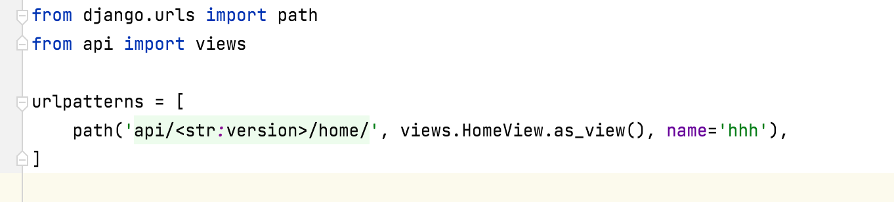
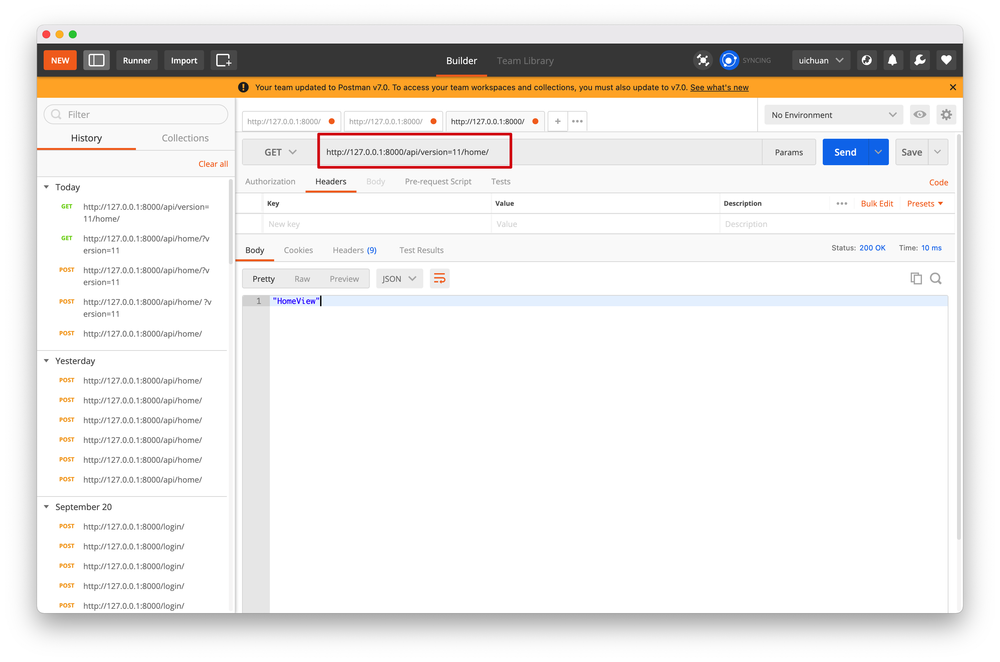
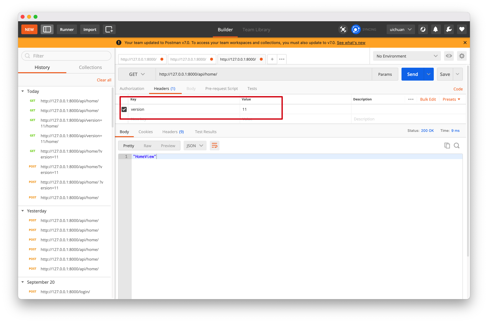
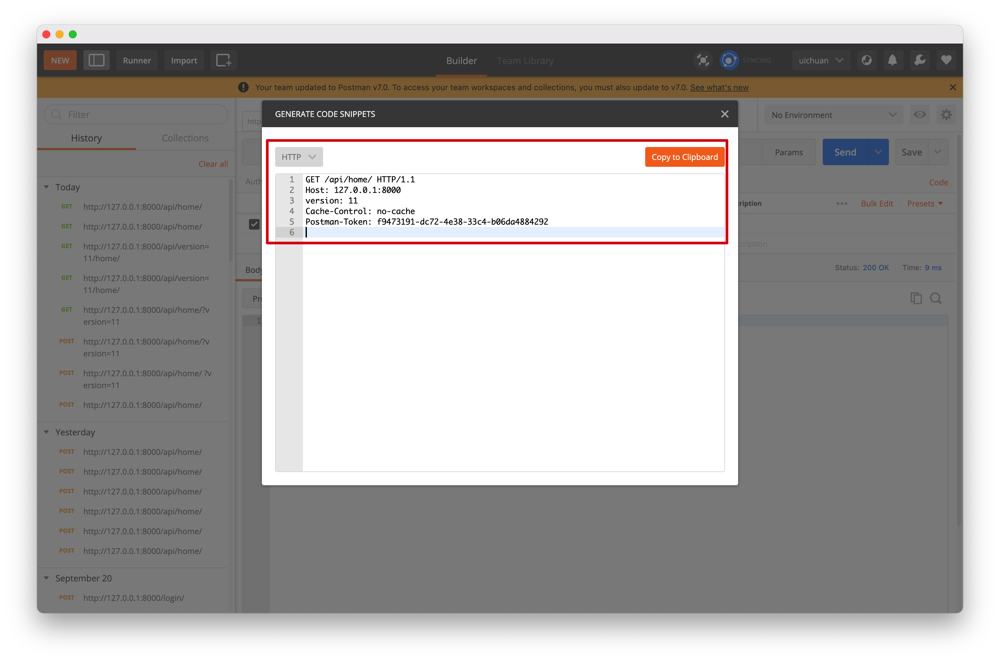
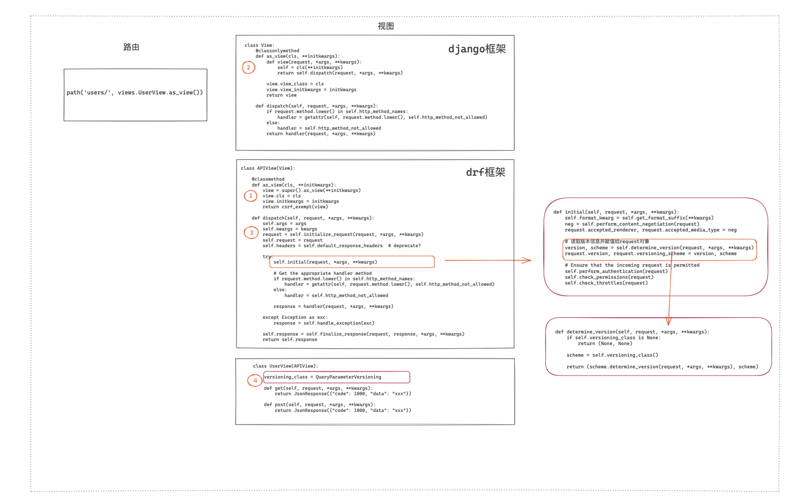

# 9.restframework版本控制

在请求中携带API的版本号，便于后续API的更新迭代

```
http://www.pythonav.com/api/v1.2/xx
http://www.pythonav.com/api/v1.5/xx
```


### 1.GET参数传递

**在`QueryParams`中传递参数**

```python
# settings.py

REST_FRAMEWORK = {
    "VERSION_PARAM": "v",
    "DEFAULT_VERSION": "v1",
    "ALLOWED_VERSIONS": ["v1", "v2", "v3"],
    "DEFAULT_VERSIONING_CLASS":"rest_framework.versioning.QueryParameterVersioning"
}
```

在**视图函数**中

```python
from rest_framework.views import APIView
from rest_framework.response import Response
from rest_framework.versioning import QueryParameterVersioning


class HomeView(APIView):
    # 基于url中拼接参数的方式传递参数
    versioning_class = QueryParameterVersioning

    def get(self, request):
        print(request.version)
        # restframework中的反向生成本质上是django中的反向生成，可以添加版本参数
        # 反向生成url http://127.0.0.1:8000/home/?version=111
        # 携带:version=111
        url = request.versioning_scheme.reverse('hhh', request=request)
        print('反向生成url', url)
        return Response("HomeView")
```

传入的数据被封装在`request`对象中

通过`request.version`读取


### **2. URL路径传递**

在`url.py`中定义url时传入形参



```python
from django.urls import path
from api import views

urlpatterns = [
    path('api/<str:version>/home/', views.HomeView.as_view(), name='hhh'),
]
```

**视图函数中**

在`versioning_class` 中使用`URLPathVersioning`

```python
class HomeView(APIView):
    # 基于url中拼接参数的方式传递参数
    versioning_class = URLPathVersioning

    def get(self, request, *args, **kwargs):
        # print(kwargs)
        print('版本', kwargs['version'])
        # request对象中包括了version信息
        print(request.version)
        url = request.versioning_scheme.reverse('hhh', request=request)
        print('反向生成url', url)
        return Response("HomeView")
```

在postman中测试时参数的位置要与`urlpatterns`中定义的格式保持一致



### 3. 请求头传递

在`url.py`中

```python
from django.urls import path
from api import views

urlpatterns = [
    path('api/home/', views.HomeView.as_view(), name='hhh'),
]
```

视图函数中`versioning_class` 设置为`AcceptHeaderVersioning`

```python
from rest_framework.views import APIView
from rest_framework.response import Response
from rest_framework.versioning import AcceptHeaderVersioning


class HomeView(APIView):
    # 在请求头中传递参数
    versioning_class = AcceptHeaderVersioning

    def get(self, request, *args, **kwargs):

        print(request.version)
        url = request.versioning_scheme.reverse('hhh', request=request)
        print('反向生成url', url)
        return Response("HomeView")
```

**在postman中测试时参数写在请求头中**





```
GET /api/home/ HTTP/1.1
Host: 127.0.0.1:8000
version: 11
Cache-Control: no-cache
Postman-Token: f9473191-dc72-4e38-33c4-b06da4884292
```


### 4. 反向生成url

```python
url = request.versioning_scheme.reverse('hhh', request=request)
print('反向生成url', url)
```

这里的反向生成底层调用了`django`的`reverse`反向生成，

携带了版本信息的参数添加到反向生成的url中


