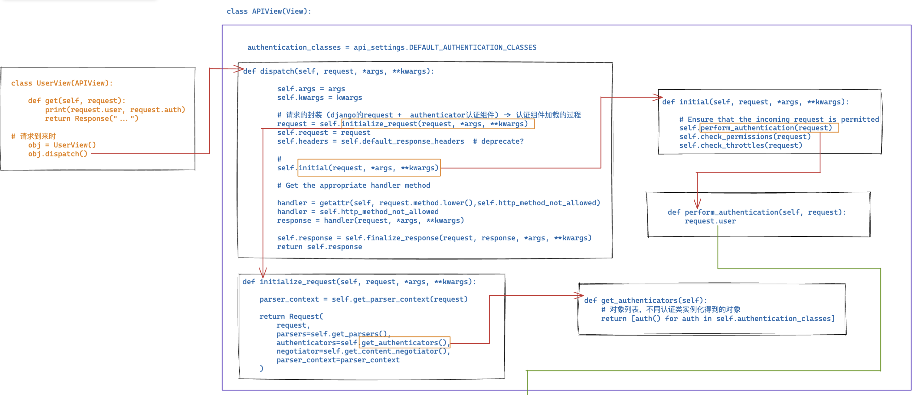
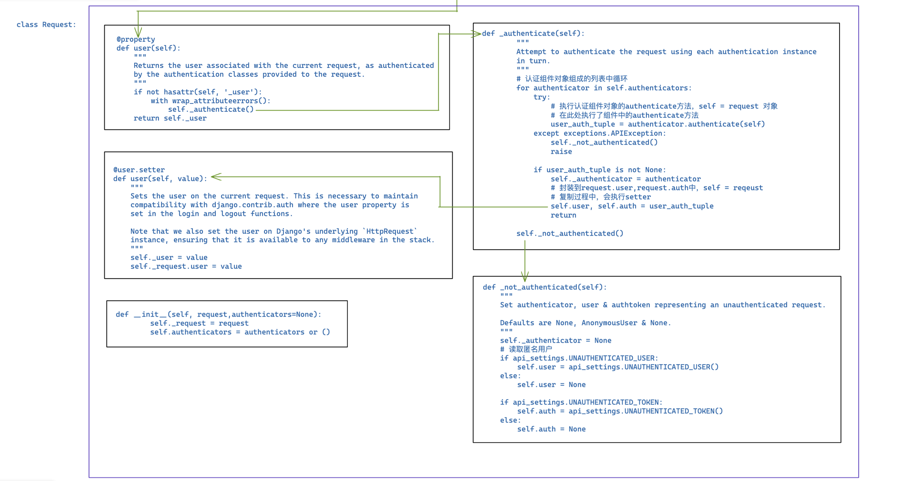

# 3.restframework认证组件


### 1.前戏

restframework的认证authenticate组件帮助接口（API）进行**身份认证**

前戏不多，马上开始🎈


### 2. 认证组件的应用

- 编写一个模块存储认证类

```python
from rest_framework.authentication import BaseAuthentication

class MyAuthentication(BaseAuthentication):
    def authenticate(self,request):
        # 进行用户认证
        	# - 读取token
            # - 检验token合法性
            # - 返回
            	# - 返回元祖 （xx,oo） 元组中的两个值分别赋值给request.user 和 request.auth
                # - 抛出异常  认证失败 -> 返回错误信息
                # - return None  多个认证类中[c1,c2,c3...] 去之后的类中
                # - 如果所有的类都没有认证成功 -> 匿名用户
                
		pass         	
```

获取token

```python
token = request._request.GET.get("token")
token = request.query_params.get("token")
```

**认证类的模版** (不能卸载view视图中，循环引用报错)

```python
from rest_framework.authentication import BaseAuthentication
from rest_framework.exceptions import AuthenticationFailed


class MyAuthentication(BaseAuthentication):
    def authenticate(self,request):
        token = request.query_params.get("token")
        if token:
            return ("wupeiqi",token)
        
        raise Authentication Failed("认证失败")
```


- 在视图函数中

```python
from ext.auth import MyAuthentication

class OrderView(APIView):
    authentication_classes = [MyAuthentication,...]
    
    def get(self,request):
        ...
        pass
```


- 配置文件中配置全局认证组件

```
REST_FRAMEWORK = {
    "UNAUTHENTICATED_USER": None,
    # 值：[认证组件所在的路径] 全局所有的类都应用权限组件
    "DEFAULT_AUTHENTICATION_CLASSES": [
        'ext.auth.QueryParamsAuthentication',
        'ext.auth.HeaderAuthentication',
        'ext.auth.NOAuthentication',
    ],
}
```


### 3.源码分析

加载认证组件，本质就是实例化每个认证类的对象，并且封装到request对象中

图太大了～🎈






```python
class Request:
    def __init__(self, request,authenticators=None):
        self._request = request
        self.authenticators = authenticators or ()

    def _not_authenticated(self):
        """
        Set authenticator, user & authtoken representing an unauthenticated request.

        Defaults are None, AnonymousUser & None.
        """
        self._authenticator = None
        # 读取匿名用户 
        if api_settings.UNAUTHENTICATED_USER:
            self.user = api_settings.UNAUTHENTICATED_USER()
        else:
            self.user = None

        if api_settings.UNAUTHENTICATED_TOKEN:
            self.auth = api_settings.UNAUTHENTICATED_TOKEN()
        else:
            self.auth = None
    def _authenticate(self):
        """
        Attempt to authenticate the request using each authentication instance
        in turn.
        """
        # 认证组件对象组成的列表中循环
        for authenticator in self.authenticators:
            try:
                # 执行认证组件对象的authenticate方法，self = request 对象
                # 在此处执行了组件中的authenticate方法
                user_auth_tuple = authenticator.authenticate(self)
            except exceptions.APIException:
                self._not_authenticated()
                raise

            if user_auth_tuple is not None:
                self._authenticator = authenticator
                # 封装到request.user,request.auth中，self = reqeust
                # 复制过程中，会执行setter
                self.user, self.auth = user_auth_tuple
                return

        self._not_authenticated()


    @user.setter
    def user(self, value):
        """
        Sets the user on the current request. This is necessary to maintain
        compatibility with django.contrib.auth where the user property is
        set in the login and logout functions.

        Note that we also set the user on Django's underlying `HttpRequest`
        instance, ensuring that it is available to any middleware in the stack.
        """
        self._user = value
        self._request.user = value


    @property
    def user(self):
        """
        Returns the user associated with the current request, as authenticated
        by the authentication classes provided to the request.
        """
        if not hasattr(self, '_user'):
            with wrap_attributeerrors():
                self._authenticate()
        return self._user
                 

class APIView(View):

    authentication_classes = api_settings.DEFAULT_AUTHENTICATION_CLASSES
    def perform_authentication(self, request):
        request.user
    def initial(self, request, *args, **kwargs):
        
        # Ensure that the incoming request is permitted
        self.perform_authentication(request)
        self.check_permissions(request)
        self.check_throttles(request)
    def get_authenticators(self):
        # 对象列表，不同认证类实例化得到的对象
        return [auth() for auth in self.authentication_classes]


    def initialize_request(self, request, *args, **kwargs):
        
        parser_context = self.get_parser_context(request)

        return Request(
            request,
            parsers=self.get_parsers(),
            authenticators=self.get_authenticators(),
            negotiator=self.get_content_negotiator(),
            parser_context=parser_context
        )


    def dispatch(self, request, *args, **kwargs):
        
        self.args = args
        self.kwargs = kwargs

        # 请求的封装 (django的request +  authenticator认证组件) -> 认证组件加载的过程
        request = self.initialize_request(request, *args, **kwargs)
        self.request = request
        self.headers = self.default_response_headers  # deprecate?

        # 
        self.initial(request, *args, **kwargs)

        # Get the appropriate handler method
        
        handler = getattr(self, request.method.lower(),self.http_method_not_allowed)
        handler = self.http_method_not_allowed
        response = handler(request, *args, **kwargs)

        self.response = self.finalize_response(request, response, *args, **kwargs)
        return self.response


class UserView(APIView):

    def get(self, request):
        print(request.user, request.auth)
        return Response("...")

# 请求到来时
    obj = UserView()
    obj.dispatch()
```

