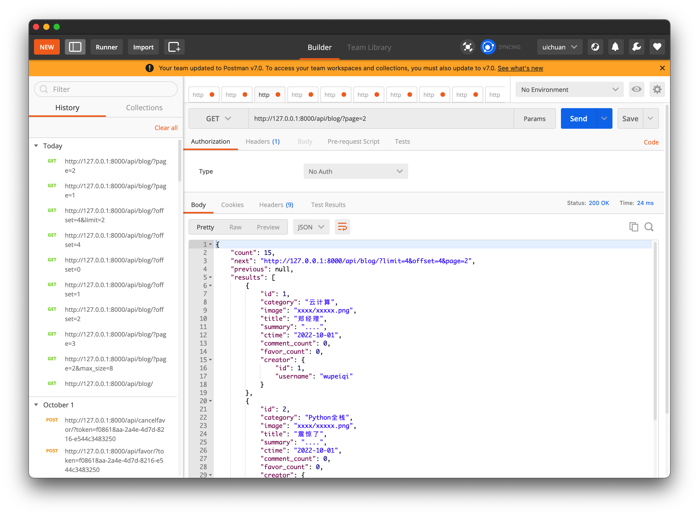

# 10.restframework Pager

**restframework中提供了优秀的分页组件**

在`settings.py`中，填写关于restframework的配置

```python
REST_FRAMEWORK = {
    "UNAUTHENTICATED_USER": None,
    "PAGE_SIZE": 4
}
```


### 1.PageNumberPagination

```python
from rest_framework.pagination import LimitOffsetPagination
```


```python
class BlogView(APIView):
    authentication_classes = [BlogAuthentication, ]

    def get(self, request, *args, **kwargs):
        """ 博客列表 """
        # 1.读取数据库中的博客信息
        queryset = models.Blog.objects.all().order_by("id")
        from rest_framework.pagination import LimitOffsetPagination
        pager = LimitOffsetPagination()
        res = pager.paginate_queryset(queryset, request, self)
        # total_res = pager.get_paginated_response()
        # 2.序列化
        ser = BlogSerializers(instance=res, many=True)
        response = pager.get_paginated_response(ser.data)
        # 3.返回
        return response
```

```python
# 获取到所有queryset对象
queryset = models.Blog.objects.all().order_by("id")
from rest_framework.pagination import PageNumberPagination
# 实例化分页对象&传入参数（数据queryset,request对象,view）
pager = PageNumberPagination()
res = pager.paginate_queryset(queryset, request, self)
ser = BlogSerializers(instance=res, many=True)
response = pager.get_paginated_response(ser.data)
return response  
```

- `return response`

这里的response经过了`get_paginated_response`方法的封装，具体过程：

```python
class LimitOffsetPagination(BasePagination):
    ...
    def get_paginated_response(self, data):
        return Response(OrderedDict([
            ('count', self.count),
            ('next', self.get_next_link()),
            ('previous', self.get_previous_link()),
            ('results', data)
        ]))
```

`get_paginated_response`在返回时调用了`restframework`的response，

并且封装了更多的与分页相关的参数返回给调用它的API，

**如果希望对封装的参数进行自定制**，或者增加一些其他的参数，

可以写一个子类`MyLimitOffsetPagination`并且

**重写`get_paginated_response(self, data)`方法**

```python
class MyLimitOffsetPagination(LimitOffsetPagination):
    ...
    def get_paginated_response(self, data):
        return Response(OrderedDict([
            ('xxx',self.xxx)
            ('count', self.count),
            ('next', self.get_next_link()),
            ('previous', self.get_previous_link()),
            ('results', data)
        ]))
```



```json
{
    "count": 15,
    "next": "http://127.0.0.1:8000/api/blog/?limit=4&offset=4&page=2",
    "previous": null,
    "results": [
        {
            "id": 1,
            "category": "云计算",
            "image": "xxxx/xxxxx.png",
            "title": "郑经理",
            "summary": "....",
            "ctime": "2022-10-01",
            "comment_count": 0,
            "favor_count": 0,
            "creator": {
                "id": 1,
                "username": "wupeiqi"
            }
        },
        {
            "id": 2,
            "category": "Python全栈",
            "image": "xxxx/xxxxx.png",
            "title": "震惊了",
            "summary": "....",
            "ctime": "2022-10-01",
            "comment_count": 0,
            "favor_count": 0,
            "creator": {
                "id": 2,
                "username": "cxr"
            }
        },
        ......
    ]
}
```


### 2.LimitOffsetPagination

```python
from rest_framework.pagination import LimitOffsetPagination
```

```python
class BlogView(APIView):
    authentication_classes = [BlogAuthentication, ]

    def get(self, request, *args, **kwargs):
        """ 博客列表 """
        # 1.读取数据库中的博客信息
        queryset = models.Blog.objects.all().order_by("id")
        from rest_framework.pagination import LimitOffsetPagination
        pager = LimitOffsetPagination()
        res = pager.paginate_queryset(queryset, request, self)
        # total_res = pager.get_paginated_response()

        # 2.序列化

        ser = BlogSerializers(instance=res, many=True)
        response = pager.get_paginated_response(ser.data)
        # 3.返回
        return response
    ......
```

`LimitOffsetPagination`更加适合滚动翻页的情况

```
LimitOffsetPagination，滚动翻页
	/accounts/?offset=2&limit=10
	/accounts/?offset=10&limit=10

	/accounts/?lastid=10&offset=0&limit=10
	/accounts/?lastid=20&offset=0&limit=10
```

