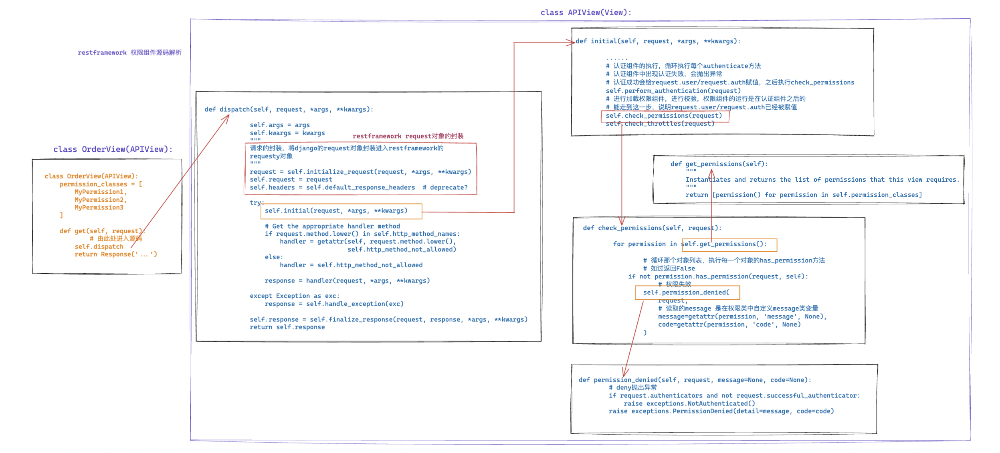

# 4.restframework权限组件

[官方文档🎈](https://www.django-rest-framework.org/community/third-party-packages/#permissions)

### 1.前戏

###### **与认证组件做对比**

```
认证组件 = [认证类,认证类,认证类] -> 执行每个认证类中的authencate方法，
							  		- 返回None 时，才继续执行后续的认证类
```

认证组件之间的关系类似于“或”的关系


###### **权限组件**

```
权限组件 = [权限类,权限类,权限类...] -> 执行所有权限类的has_permission方法
									- 执行所有的权限类，要求所有权限类都通过
```

权限组件要保证权限类中的所有方法都返回`true`

项目中的某一个请求必须通过所有的权限组件中的类

 **如果希望权限组件的逻辑关系变成“或”的关系（类似认证组件）**，

需要对源码进行魔改（**扩展&自定义**）


### 2.权限组件的应用

- 编写一个模块存储权限类

```python
from rest_framework.permissions import BasePermission


class MyPermission(BasePermission):
    def has_permission(self, request, view):
        return ...
```

- 在视图函数中

```python
from ext.per import MyPermission


class OrderView(APIView):
    permission_classes = [MyPermission]

    def get(self, request):
        return Response('...')
```

- 在配置文件中配置全局权限组件

```python
REST_FRAMEWORK = {
    "UNAUTHENTICATED_USER": None,
    # 值：[认证组件所在的路径] 全局所有的类都应用权限组件
    "DEFAULT_AUTHENTICATION_CLASSES": [
        'ext.auth.QueryParamsAuthentication',
        'ext.auth.HeaderAuthentication',
        'ext.auth.NOAuthentication',
    ],
    "DEFAULT_PERMISSION_CLASSES": [
        'ext.per.MyPermission'
    ]
}
```

- 全局配置权限组件后，对于不需要权限验证的视图函数(例如：登陆页面)

```python
class LoginView(APIView):
	permission_classes = []
    ...
```

**权限组件的应用与认证组件都支持全局应用或者局部视图函数的应用**


#### 2.1**权限校验失败后自定义返回错误信息**

在权限类中自定义`message`类变量

`message = {"code": "1001", "msg": "无权访问"}`

```python
from rest_framework.permissions import BasePermission
import random


class MyPermission(BasePermission):
    message = {"code": "1001", "msg": "无权访问"}

    def has_permission(self, request, view):
        v1 = random.randint(1, 3)
        if v1 == 2:
            return True
        return False

```

权限校验失败后，restframework会自动读取权限类中定义的类变量`message`

**源代码调用的分析**

```python
class APIView(View):
    
    def permission_denied(self, request, message=None, code=None):
        # deny抛出异常
        if request.authenticators and not request.successful_authenticator:
            raise exceptions.NotAuthenticated()
        raise exceptions.PermissionDenied(detail=message, code=code)


    def check_permissions(self, request):
   
	    for permission in self.get_permissions():

	    	# 循环那个对象列表，执行每一个对象的has_permission方法
	    	# 如过返回False
	        if not permission.has_permission(request, self):
	        	# 权限失效
	            self.permission_denied(
	                request,
	                # 读取的message 是在权限类中自定义message类变量
	                message=getattr(permission, 'message', None),
	                code=getattr(permission, 'code', None)
	            )
```

关注`permission_denied`方法的变量设置

```
def permission_denied(self, request, message=None, code=None):
```

- message=None
- code=None

`permission_deny`方法在被`check_permissions`方法调用时传入的参数

```python
self.permission_denied(
	                request,
	                # 读取的message 是在权限类中自定义message类变量
	                message=getattr(permission, 'message', None),
	                code=getattr(permission, 'code', None)
	            )
```

通过**反射**读取self中类变量的设置


#### 2.2 权限组件的执行过程

定义三个权限类

```python
from rest_framework.permissions import BasePermission


class MyPermission1(BasePermission):
    message = {"code": "1001", "msg": "无权访问"}

    def has_permission(self, request, view):
        print("MyPermission1")
        return True


class MyPermission2(BasePermission):
    message = {"code": "1001", "msg": "无权访问"}

    def has_permission(self, request, view):
        print("MyPermission2")
        return False


class MyPermission3(BasePermission):
    message = {"code": "1001", "msg": "无权访问"}

    def has_permission(self, request, view):
        print("MyPermission3")
        return True

```

其中第二个类`return False`，其余类都返回`True`

对一个视图函数应用这些类

```python
class OrderView(APIView):
    permission_classes = [MyPermission1, MyPermission2, MyPermission3]

    def get(self, request):
        return Response('...')

```

在终端的输出结果

```
[17/Sep/2022 12:48:18] "GET /order/ HTTP/1.1" 403 36
MyPermission1
MyPermission2
```

如果一个类没有通过（`return True`），后续类将不再执行

**所有类都`return True`，才能到达视图函数**


### 3. 源码分析



```python
# 权限组件源码分析

class APIView(View):


	# 在get_permissions中读取self.permission_classes (settings全局配置)
	# 读取对象列表并且返回给check_permissions
    def get_permissions(self):
        """
        Instantiates and returns the list of permissions that this view requires.
        """
        return [permission() for permission in self.permission_classes]


    def permission_denied(self, request, message=None, code=None):
        # deny抛出异常
        if request.authenticators and not request.successful_authenticator:
            raise exceptions.NotAuthenticated()
        raise exceptions.PermissionDenied(detail=message, code=code)


    def check_permissions(self, request):
   
	    for permission in self.get_permissions():

	    	# 循环那个对象列表，执行每一个对象的has_permission方法
	    	# 如过返回False
	        if not permission.has_permission(request, self):
	        	# 权限失效
	            self.permission_denied(
	                request,
	                # 读取的message 是在权限类中自定义message类变量
	                message=getattr(permission, 'message', None),
	                code=getattr(permission, 'code', None)
	            )

    def initial(self, request, *args, **kwargs):
    
    	......
    	# 认证组件的执行，循环执行每个authenticate方法
    	# 认证组件中出现认证失败，会抛出异常
    	# 认证成功会给request.user/request.auth赋值，之后执行check_permissions
	    self.perform_authentication(request) 
	    # 进行加载权限组件，进行校验，权限组件的运行是在认证组件之后的
	    # 能走到这一步，说明request.user/request.auth已经被赋值
 	    self.check_permissions(request)
	    self.check_throttles(request)


	def dispatch(self, request, *args, **kwargs):
	    
	    self.args = args
	    self.kwargs = kwargs
	    """
	    请求的封装，将django的request对象封装进入restframework的
	    requesty对象
	    """
	    request = self.initialize_request(request, *args, **kwargs)
	    self.request = request
	    self.headers = self.default_response_headers  # deprecate?

	    try:
	        self.initial(request, *args, **kwargs)

	        # Get the appropriate handler method
	        if request.method.lower() in self.http_method_names:
	            handler = getattr(self, request.method.lower(),
	                              self.http_method_not_allowed)
	        else:
	            handler = self.http_method_not_allowed

	        response = handler(request, *args, **kwargs)

	    except Exception as exc:
	        response = self.handle_exception(exc)

	    self.response = self.finalize_response(request, response, *args, **kwargs)
	    return self.response


class OrderView(APIView):
    permission_classes = [MyPermission1, MyPermission2, MyPermission3]

    def get(self, request):
    	# 由此处进入源码
        self.dispatch
        return Response('...')

```


### 4. 权限组件的扩展

通过对源码的扩展，改变判断逻辑

核心是**修改check_permissions方法**的逻辑，在源代码中的check_permissions中，

只要存在不满足权限类的验证的，check_permissions便会调用`permission_denied`方法抛出异常


重写`check_permissions`方法

```python
def check_permissions(self, request):
	"""
    for permission in self.get_permissions():

        # 循环那个对象列表，执行每一个对象的has_permission方法
        # 如过返回False
        if not permission.has_permission(request, self):
            # 权限失效
            self.permission_denied(
                request,
                # 读取的message 是在权限类中自定义message类变量
                message=getattr(permission, 'message', None),
                code=getattr(permission, 'code', None)
            )
    """
    for permission in self.get_permissions():
        # 存在满足一个类的就return通过
        if permission.has_permission(request, self):
            return
            self.permission_denied(
                        request,
                        # 读取的message 是在权限类中自定义message类变量
                        message=getattr(permission, 'message', None),
                        code=getattr(permission, 'code', None)
                   	)
```


#### 4.1 在OrderView 类中重写check_permissions方法

` OrderView`类继承`APIView`类，self是` OrderView`类实例化的对象，所以优先在` OrderView`类中寻找

`check_permissions`方法

```python
class OrderView(APIView):
    permission_classes = [MyPermission1, MyPermission2, MyPermission3]

    def get(self, request):
        return Response('...')

	def check_permissions(self, request):
        no_permission_object = []
        for permission in self.get_permissions():
        # 存在满足一个类的就return通过
            if permission.has_permission(request, self):
                return
            else:
                no_permission_object.append(permission)
        else:
            self.permission_denied(
                            request,
                            # 读取的message 是在权限类中自定义message类变量
                			# 取错误信息的第一个
                            message=getattr(no_permission_object[0], 'message', None),
                        	code=getattr(no_permission_object[0], 'code', None)
                        )
```


