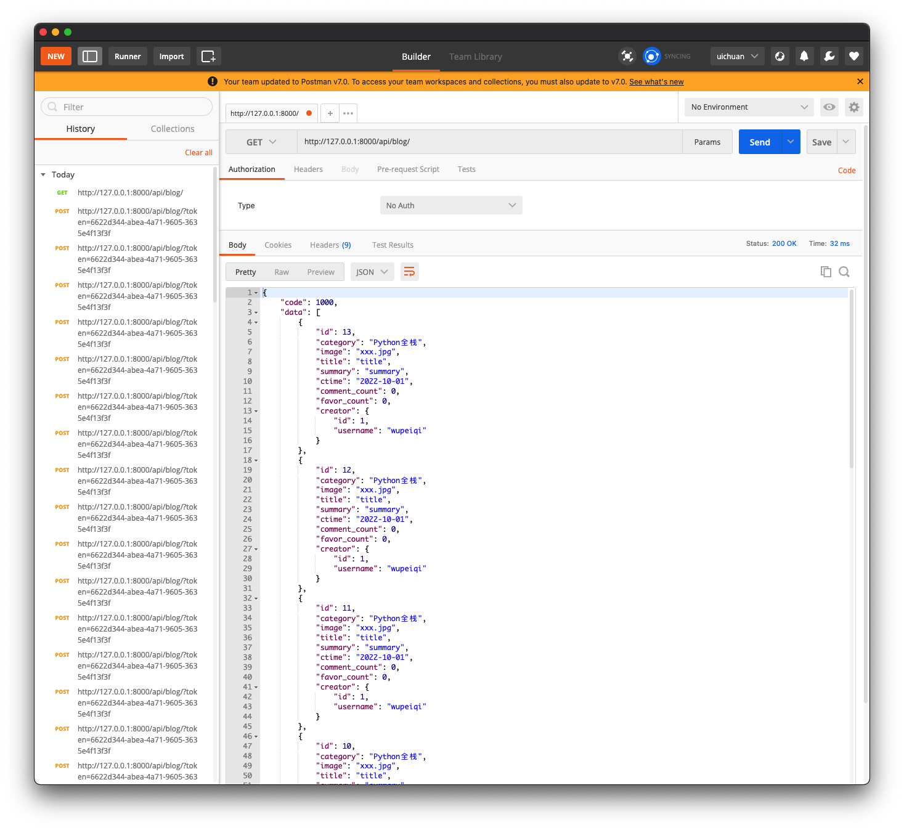
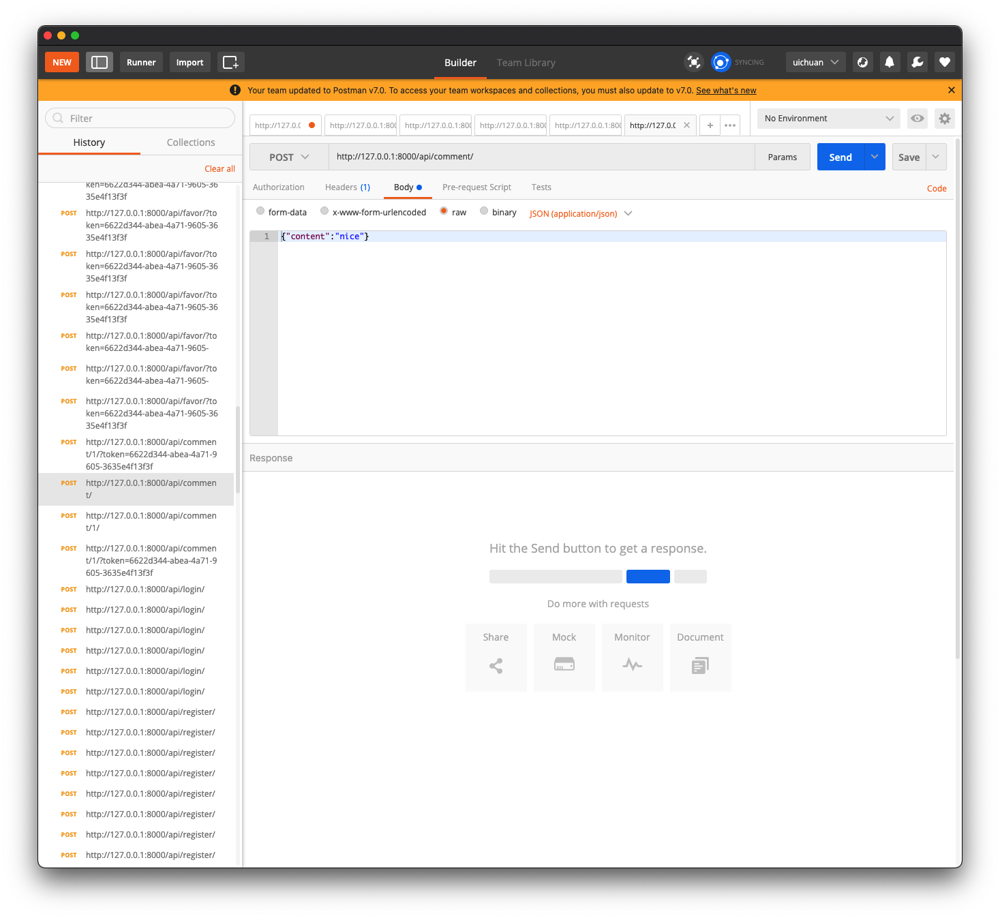

# 6.restframework：blog

### 问题：

```python
class BlogSerializer(NbHookSerializer, serializers.ModelSerializer):
    # category = serializers.CharField(source="get_category_display")
    ctime = serializers.DateTimeField(format="%Y-%m-%d", read_only=True)
    # creator = serializers.CharField(source='creator.username', read_only=True)

    # creator_info = serializers.SerializerMethodField()

    # creator_info_class = BlogInfoSerializer()

    class Meta:
        model = models.Blog
        # fields = ['category', 'image', 'title', 'summary', 'text', 'ctime', 'creator', 'creator_name', 'creator_info']
        fields = ['id', "category", "image", "title", "text", "summary", "ctime", "comment_count", "favor_count",
                  "creator"]
        extra_kwargs = {
            "comment_count": {"read_only": True},
            "favor_count": {"read_only": True},
            'text': {"write_only": True},
            # 'creator':{"read_only":True}
        }

    # 钩子方法
    """
    def get_creator_info(self, obj):
        # obj 此时是Blog Object
        # 与class Meta中首先声明的model相关
        print(obj)  # Blog object (2)
        context = {
            "creator_id": obj.creator.id,
            "creator_name": obj.creator.username
        }
        return context
    """

    def nb_category(self, obj):
        return obj.get_category_display


class BlogView(APIView):
    authentication_classes = [BlogAuthentication, ]

    def get(self, request, *args, **kwargs):
        queryset = models.Blog.objects.all().order_by('-id')
        ser = BlogSerializer(instance=queryset, many=True)
        context = {"status": True, "data": ser.data}
        return Response(context)

    def post(self, request):
        """新建博客"""
        if not request.user:
            return Response({"status": False, "detail": "未登录"})
        ser = BlogSerializer(data=request.data)
        if not ser.is_valid():
            return Response({"status": False, "detail": "校验失败", "errors": ser.errors})
        ser.save(creator=request.user)
        return Response({"status": True, "detail": "新建博客成功", "data": ser.data})
```


应该是中间件拦截

```
[01/Oct/2022 09:05:32] "POST /api/blog/?token=6622d344-abea-4a71-9605-3635e4f13f3f HTTP/1.1" 200 89
```

```
{
    "status": false,
    "detail": "校验失败",
    "errors": {
        "creator": [
            "This field is required."
        ]
    }
}
```


### 1. 前戏

基于djangorestframework编写的一套简单的restAPI，完成了博客系统的核心功能


生成测试数据的`scripts`

```python
def db(request):
    v1 = models.UserInfo.objects.create(username="wupeiqi", password='123')
    v2 = models.UserInfo.objects.create(username="cxr", password='123')

    models.Blog.objects.create(
        category=1,
        image="xxxx/xxxxx.png",
        title="郑经理",
        summary="....",
        text="卡封建时代；if可结案时；了多开几份；埃里克森的机房",
        creator=v1
    )

    models.Blog.objects.create(
        category=2,
        image="xxxx/xxxxx.png",
        title="震惊了",
        summary="....",
        text="卡封成型如居然塌方了房",
        creator=v2
    )
    models.Comment.objects.create(content='x1asdf', blog_id=1, user_id=1)
    models.Comment.objects.create(content='x1ffff', blog_id=1, user_id=2)

    return HttpResponse("成功")
```


### 2.配置信息与表结构

`settings.py`

```python
"""
Django settings for day15 project.

Generated by 'django-admin startproject' using Django 3.2.

For more information on this file, see
https://docs.djangoproject.com/en/3.2/topics/settings/

For the full list of settings and their values, see
https://docs.djangoproject.com/en/3.2/ref/settings/
"""

from pathlib import Path

# Build paths inside the project like this: BASE_DIR / 'subdir'.
BASE_DIR = Path(__file__).resolve().parent.parent


# Quick-start development settings - unsuitable for production
# See https://docs.djangoproject.com/en/3.2/howto/deployment/checklist/

# SECURITY WARNING: keep the secret key used in production secret!
SECRET_KEY = 'django-insecure-2uu-os!i!iapa7fsb-xe#v_1xyv+&(_c_d%nxt0d1l9*%-r60l'

# SECURITY WARNING: don't run with debug turned on in production!
DEBUG = True

ALLOWED_HOSTS = []


# Application definition

INSTALLED_APPS = [
    # 'django.contrib.admin',
    # 'django.contrib.auth',
    # 'django.contrib.contenttypes',
    # 'django.contrib.sessions',
    # 'django.contrib.messages',
    'django.contrib.staticfiles',
    'rest_framework',
    'api.apps.ApiConfig',
]

MIDDLEWARE = [
    'django.middleware.security.SecurityMiddleware',
    # 'django.contrib.sessions.middleware.SessionMiddleware',
    'django.middleware.common.CommonMiddleware',
    # 'django.middleware.csrf.CsrfViewMiddleware',
    # 'django.contrib.auth.middleware.AuthenticationMiddleware',
    # 'django.contrib.messages.middleware.MessageMiddleware',
    'django.middleware.clickjacking.XFrameOptionsMiddleware',
]

ROOT_URLCONF = 'day15.urls'

TEMPLATES = [
    {
        'BACKEND': 'django.template.backends.django.DjangoTemplates',
        'DIRS': [],
        'APP_DIRS': True,
        'OPTIONS': {
            'context_processors': [
                'django.template.context_processors.debug',
                'django.template.context_processors.request',
                # 'django.contrib.auth.context_processors.auth',
                # 'django.contrib.messages.context_processors.messages',
            ],
        },
    },
]

WSGI_APPLICATION = 'day15.wsgi.application'


# Database
# https://docs.djangoproject.com/en/3.2/ref/settings/#databases

DATABASES = {
    'default': {
        'ENGINE': 'django.db.backends.sqlite3',
        'NAME': BASE_DIR / 'db.sqlite3',
    }
}


# Password validation
# https://docs.djangoproject.com/en/3.2/ref/settings/#auth-password-validators

AUTH_PASSWORD_VALIDATORS = [
    {
        'NAME': 'django.contrib.auth.password_validation.UserAttributeSimilarityValidator',
    },
    {
        'NAME': 'django.contrib.auth.password_validation.MinimumLengthValidator',
    },
    {
        'NAME': 'django.contrib.auth.password_validation.CommonPasswordValidator',
    },
    {
        'NAME': 'django.contrib.auth.password_validation.NumericPasswordValidator',
    },
]


# Internationalization
# https://docs.djangoproject.com/en/3.2/topics/i18n/

LANGUAGE_CODE = 'en-us'

TIME_ZONE = 'UTC'

USE_I18N = True

USE_L10N = True

USE_TZ = True


# Static files (CSS, JavaScript, Images)
# https://docs.djangoproject.com/en/3.2/howto/static-files/

STATIC_URL = '/static/'

# Default primary key field type
# https://docs.djangoproject.com/en/3.2/ref/settings/#default-auto-field

DEFAULT_AUTO_FIELD = 'django.db.models.BigAutoField'

from rest_framework.request import Request
REST_FRAMEWORK = {
    "UNAUTHENTICATED_USER": None
}

```

`models.py`

```python
from django.db import models

class UserInfo(models.Model):
    username = models.CharField(verbose_name="用户名", max_length=32, db_index=True)
    password = models.CharField(verbose_name="密码", max_length=64)
    token = models.CharField(verbose_name="TOKEN", max_length=64, null=True, blank=True, db_index=True)


class Blog(models.Model):
    category_choices = ((1, "云计算"), (2, "Python全栈"), (3, "Go开发"))
    category = models.IntegerField(verbose_name="分类", choices=category_choices)

    image = models.CharField(verbose_name="封面", max_length=255)
    title = models.CharField(verbose_name="标题", max_length=32)
    summary = models.CharField(verbose_name="简介", max_length=256)
    text = models.TextField(verbose_name="博文")
    ctime = models.DateTimeField(verbose_name="创建时间", auto_now_add=True)
    creator = models.ForeignKey(verbose_name="创建者", to="UserInfo", on_delete=models.CASCADE)

    comment_count = models.PositiveIntegerField(verbose_name="评论数", default=0)
    favor_count = models.PositiveIntegerField(verbose_name="赞数", default=0)


class Favor(models.Model):
    """ 赞 """
    blog = models.ForeignKey(verbose_name="博客", to="Blog", on_delete=models.CASCADE)
    user = models.ForeignKey(verbose_name="用户", to="UserInfo", on_delete=models.CASCADE)
    create_datetime = models.DateTimeField(verbose_name="创建时间", auto_now_add=True)

    class Meta:
        constraints = [
            models.UniqueConstraint(fields=['blog', 'user'], name='uni_favor_blog_user')
        ]


class Comment(models.Model):
    """ 评论表 """
    blog = models.ForeignKey(verbose_name="博客", to="Blog", on_delete=models.CASCADE)
    user = models.ForeignKey(verbose_name="用户", to="UserInfo", on_delete=models.CASCADE)

    content = models.CharField(verbose_name="内容", max_length=150)
    create_datetime = models.DateTimeField(verbose_name="创建时间", auto_now_add=True)

```


`urls.py`

```python
from django.urls import path
from api import views

urlpatterns = [
    # path('admin/', admin.site.urls),
    # path('db/', views.db),
    path('api/blog/', views.BlogView.as_view()),
    path('api/blog/<int:pk>/', views.BlogDetailView.as_view()),
    path('api/comment/<int:blog_id>/', views.CommentView.as_view()),
    path('api/register/', views.RegisterView.as_view()),
    path('api/login/',views.LoginView.as_view()),
    path('api/favor/',views.FavorView.as_view()),
    path('api/cancelfavor/',views.CancelFavorView.as_view()),
]
```

`views.py`

```python
from django.shortcuts import render, HttpResponse
from api import models
from rest_framework.request import Request
from rest_framework.views import APIView
from rest_framework import serializers
from rest_framework.response import Response
from ext.hook import NbHookSerializer
from rest_framework import exceptions
import uuid
from ext.auth import BlogAuthentication, NoAuthentication
```

`ext.py`

```
├── auth.py   
└── hook.py
```

`auth.py`

```python
from rest_framework.authentication import BaseAuthentication
from api import models
from rest_framework import exceptions


class BlogAuthentication(BaseAuthentication):
    def authenticate(self, request):
        """
        Authenticate the request and return a two-tuple of (user, token).
        """
        token = request.query_params.get('token')
        if not token:
            return

        instance = models.UserInfo.objects.filter(token=token).first()
        if not instance:
            return
        return instance, token

    def authenticate_header(self, request):
        """
        Return a string to be used as the value of the `WWW-Authenticate`
        header in a `401 Unauthenticated` response, or `None` if the
        authentication scheme should return `403 Permission Denied` responses.
        """
        # 认证失败时，响应头不再是403，响应头变成401
        return "API"


class NoAuthentication(BaseAuthentication):
    def authenticate(self, request):
        """
        Authenticate the request and return a two-tuple of (user, token).
        """
        raise exceptions.AuthenticationFailed({"status": False, "detail": "认证失败(NoAuthentication)"})

    def authenticate_header(self, request):
        """
        Return a string to be used as the value of the `WWW-Authenticate`
        header in a `401 Unauthenticated` response, or `None` if the
        authentication scheme should return `403 Permission Denied` responses.
        """
        # 认证失败时，响应头不再是403，响应头变成401
        return "API"

```

`hook.py`

```python
from collections import OrderedDict
from rest_framework.fields import SkipField
from rest_framework.relations import PKOnlyObject


class NbHookSerializer(object):

    def to_representation(self, instance):
        ret = OrderedDict()
        fields = self._readable_fields

        for field in fields:
            if hasattr(self, 'nb_%s' % field.field_name):
                value = getattr(self, 'nb_%s' % field.field_name)(instance)
                ret[field.field_name] = value
            else:
                try:
                    attribute = field.get_attribute(instance)
                except SkipField:
                    continue

                check_for_none = attribute.pk if isinstance(attribute, PKOnlyObject) else attribute
                if check_for_none is None:
                    ret[field.field_name] = None
                else:
                    ret[field.field_name] = field.to_representation(attribute)

        return ret

```


### 4.博客列表展示和新建文章

```python
"""获取博客列表"""
class BlogUserSerializers(serializers.ModelSerializer):
    class Meta:
        model = models.UserInfo
        fields = ["id", "username"]


class BlogSerializers(NbHookSerializer, serializers.ModelSerializer):
    ctime = serializers.DateTimeField(format="%Y-%m-%d", read_only=True)
    creator = BlogUserSerializers(read_only=True)

    class Meta:
        model = models.Blog
        fields = ['id', "category", "image", "title", "text", "summary", "ctime", "comment_count", "favor_count",
                  "creator"]
        extra_kwargs = {
            "comment_count": {"read_only": True},
            "favor_count": {"read_only": True},
            "text": {"write_only": True},
        }

    def nb_category(self, obj):
        return obj.get_category_display()


class BlogView(APIView):
    authentication_classes = [BlogAuthentication, ]

    def get(self, request, *args, **kwargs):
        """ 博客列表 """
        # 1.读取数据库中的博客信息
        queryset = models.Blog.objects.all().order_by("-id")

        # 2.序列化
        ser = BlogSerializers(instance=queryset, many=True)

        # 3.返回
        context = {"code": 1000, 'data': ser.data}
        return Response(context)

    def post(self, request):
        if not request.user:
            return Response({"code": 3000, 'error': "认证失败"})
        ser = BlogSerializers(data=request.data)
        if not ser.is_valid():
            return Response({"code": 1002, 'error': "校验失败", 'detail': ser.errors})

        ser.save(creator=request.user)
        return Response({"code": 1000, "data": ser.data})
```

- 嵌套两个序列化器类
    - 对creator信息的序列化
    - 对博客信息的序列化
- 读取博客列表(get)和新建博客(post)的功能放在一个视图类中

**在postman中测试：**

- 查看博客列表



```json
{
    "code": 1000,
    "data": [
        {
            "id": 13,
            "category": "Python全栈",
            "image": "xxx.jpg",
            "title": "title",
            "summary": "summary",
            "ctime": "2022-10-01",
            "comment_count": 0,
            "favor_count": 0,
            "creator": {
                "id": 1,
                "username": "wupeiqi"
            }
        },
        {
            "id": 12,
            "category": "Python全栈",
            "image": "xxx.jpg",
            "title": "title",
            "summary": "summary",
            "ctime": "2022-10-01",
            "comment_count": 0,
            "favor_count": 0,
            "creator": {
                "id": 1,
                "username": "wupeiqi"
            }
        },
    ]
}
```

- 新建博客


```
http://127.0.0.1:8000/api/blog/?token=6622d344-abea-4a71-9605-3635e4f13f3f
```

```json
{
    "code": 1000,
    "data": {
        "id": 14,
        "category": "Python全栈",
        "image": "xxx.jpg",
        "title": "title",
        "summary": "summary",
        "ctime": "2022-10-01",
        "comment_count": 0,
        "favor_count": 0,
        "creator": {
            "id": 1,
            "username": "wupeiqi"
        }
    }
}
```


### 5.博客详细

```python
class BlogDetailSerializer(serializers.ModelSerializer):
    category = serializers.CharField(source="get_category_display")
    ctime = serializers.DateTimeField(format="%Y-%m-%d")
    creator = serializers.CharField(source='creator.username')

    class Meta:
        model = models.Blog
        fields = "__all__"


class BlogDetailView(APIView):
    def get(self, request, *args, **kwargs):
        # 获取id
        pk = kwargs.get('pk')
        # 根据id获取对象
        instance = models.Blog.objects.filter(id=pk).first()
        if not instance:
            return Response({"status": False, "detail": None})

        ser = BlogDetailSerializer(instance=instance)
        context = {"status": True, "data": ser.data}
        return Response(context)
```

查看哪一片博客的详细信息，博客id的参数在url中传递

```
http://127.0.0.1:8000/api/blog/1/
```

参考路由中参数预留的位置

```
path('api/blog/<int:pk>/', views.BlogDetailView.as_view()),
```

**在postman中测试：**


```
http://127.0.0.1:8000/api/blog/1/
```

```json
{
    "status": true,
    "data": {
        "id": 1,
        "category": "云计算",
        "ctime": "2022-10-01",
        "creator": "wupeiqi",
        "image": "xxxx/xxxxx.png",
        "title": "郑经理",
        "summary": "....",
        "text": "卡封建时代；if可结案时；了多开几份；埃里克森的机房",
        "comment_count": 0,
        "favor_count": 0
    }
}
```


### 6.评论列表与发布评论

同样是将两个功能写在同一个视图类中

- 评论列表(get)
- 发布评论(post)，发布评论要求通过认证组件，（token）

```python
class CommentSerializer(NbHookSerializer, serializers.ModelSerializer):
    class Meta:
        model = models.Comment
        fields = ['id', 'content', 'user']
        extra_kwargs = {
            "id": {"read_only": True},
            "user": {"read_only": True},
        }

    def nb_user(self, obj):
        return obj.user.username


class CommentView(APIView):
    authentication_classes = [BlogAuthentication]

    def get(self, request, *args, **kwargs):
        """ 评论列表"""
        blog_id = kwargs.get('blog_id')
        print(blog_id)
        queryset = models.Comment.objects.filter(blog_id=blog_id)
        # 再次序列化
        ser = CommentSerializer(instance=queryset, many=True)
        context = {
            "status": True,
            "details": ser.data
        }

        return Response(context)

    def post(self, request, *args, **kwargs):

        """
            - 认证成功之后才能登陆，认证组件，验证token
            - 写在哪个位置？
        """

        """
            发布评论，同时携带blog_id
            url中    /api/comment/1/
            请求体中    {"content":"博客正文内容"}
        """
        blog_id = kwargs.get('blog_id')
        # 验证用户是否已登陆
        if not request.user:
            return Response({"status": False, "detail": "请登陆后再评论"})

        blog_obj = models.Blog.objects.filter(id=blog_id).first()
        if not blog_obj:
            return Response({"status": False, "detail": "博客不存在"})
        ser = CommentSerializer(data=request.data)
        if not ser.is_valid():
            return Response({"status": False, "detail": "校验失败", 'errors': ser.errors})
        ser.save(blog=blog_obj, user=request.user)
        return Response({"status": True, "detail": "评论发布成功", 'data': ser.data})
```


**在postman中的测试**

对于查看评论，需要传入博客id，来查询具体是哪一篇博客的评论信息

`url`中的参数预留

```
path('api/comment/<int:blog_id>/', views.CommentView.as_view()),
```

- 查看评论


```
http://127.0.0.1:8000/api/comment/1/
```

```json
{
    "status": true,
    "details": [
        {
            "id": 1,
            "content": "x1asdf",
            "user": "wupeiqi"
        },
        {
            "id": 2,
            "content": "x1ffff",
            "user": "cxr"
        },
        {
            "id": 3,
            "content": "nice",
            "user": "wupeiqi"
        },
        {
            "id": 4,
            "content": "nice",
            "user": "wupeiqi"
        }
    ]
}
```


- 发布评论



```
http://127.0.0.1:8000/api/comment/1/?token=6622d344-abea-4a71-9605-3635e4f13f3f
```

```json
{
    "status": true,
    "detail": "评论发布成功",
    "data": {
        "id": 5,
        "content": "nice",
        "user": "wupeiqi"
    }
}
```


### 7.注册

```python
class RegisterSerializer(serializers.ModelSerializer):
    confirm_password = serializers.CharField(write_only=True)

    class Meta:
        model = models.UserInfo
        fields = ['id', 'username', 'password', 'confirm_password']
        extra_kwargs = {
            'password': {"write_only": True},
            'id': {"read_only": True}
        }

    """
    def validate_password(self, value):
        return value
    """

    def validate_confirm_password(self, value):
        password = self.initial_data.get('password')
        if password != value:
            raise exceptions.ValidationError("密码不一致")

        return value


class RegisterView(APIView):
    def post(self, request):
        """
        提交数据
            - username : xx
            - password : xx
            - confirm_password :xx
        """
        ser = RegisterSerializer(data=request.data)
        if ser.is_valid():
            confirm_password = ser.validated_data.pop("confirm_password")
            ser.save()
            return Response({"status": True, "errors": None, "detail": ser.data})
        else:
            return Response({"status": False, "errors": "注册失败", "detail": ser.errors})
```

**在postman中的测试**


```
http://127.0.0.1:8000/api/register/
```

```json
{"username":"uic","password":"123","confirm_password":"123"}
```

```json
{
    "status": true,
    "errors": null,
    "detail": {
        "id": 9,
        "username": "uic"
    }
}
```


### 8.登陆

```python

class LoginSerializer(serializers.ModelSerializer):
    class Meta:
        model = models.UserInfo
        fields = ['username', 'password']


class LoginView(APIView):
    def post(self, request):
        request.data  # {"username":xx,"password":xxx}
        ser = LoginSerializer(data=request.data)
        if not ser.is_valid():
            return Response({"status": False, "detail": "login unsuccess"})
        instance = models.UserInfo.objects.filter(**ser.validated_data).first()
        if not instance:
            return Response({"status": False, "detail": "用户名或密码错误"})
        token = str(uuid.uuid4())
        instance.token = token
        instance.save()
        return Response({"status": True, "detail": {"login": "登陆成功", "token": token}})
```


**在postman中的测试**


```
http://127.0.0.1:8000/api/login/
```

```json
{
    "status": true,
    "detail": {
        "login": "登陆成功",
        "token": "f08618aa-2a4e-4d7d-8216-e544c3483250"
    }
}
```


### 9.点赞

```python
class FavorSerializer(serializers.ModelSerializer):
    class Meta:
        model = models.Favor
        fields = ['blog']


class FavorView(APIView):
    """
        - 给哪篇博客点赞
        - 点赞的用户
        - 查询->不存在赞的记录->添加
            - 如果已经存在记录，不进行增加赞
    """
    authentication_classes = [BlogAuthentication, NoAuthentication]

    def post(self, request):
        ser = FavorSerializer(data=request.data)

        if not ser.is_valid():
            return Response({"status": False, "detail": "校验失败", "errors": ser.errors})
        # 查询，存在的话就不再点赞
        res = models.Favor.objects.filter(user=request.user, blog=ser.validated_data.get("blog")).exists()
        if res:
            return Response({"status": False, "detail": "已经点赞"})
        # models.Favor.objects.filter(user=request.user, **ser.validated_data)
        ser.save(user=request.user)
        return Response({"status": True, "data": ser.data, "detail": "点赞成功"})
```


**在postman中的测试**


```
http://127.0.0.1:8000/api/favor/?token=f08618aa-2a4e-4d7d-8216-e544c3483250
```

```json
{
    "status": false,
    "detail": "已经点赞"
}
```


### 10.取消赞

```python
class CancelFavorSerializer(serializers.ModelSerializer):
    class Meta:
        model = models.Favor
        fields = ['blog']


class CancelFavorView(APIView):
    authentication_classes = [BlogAuthentication, NoAuthentication]

    def post(self, request):
        ser = CancelFavorSerializer(data=request.data)
        if not ser.is_valid():
            return Response({"status": False, "detail": "校验失败", "errors": ser.errors})
        res = models.Favor.objects.filter(user=request.user, blog=ser.validated_data.get("blog")).exists()
        if not res:
            return Response({"status": False, "detail": "还未点赞"})
        models.Favor.objects.filter(blog=ser.validated_data.get("blog"), user=request.user).delete()
        return Response({"status": True, "detail": "点赞已取消"})

```


**在postman中的测试**


```
http://127.0.0.1:8000/api/cancelfavor/?token=f08618aa-2a4e-4d7d-8216-e544c3483250
```

```json
{
    "status": true,
    "detail": "点赞已取消"
}
```


### 11.整体项目结构

```
.
├── api
│   ├── __init__.py
│   ├── __pycache__
│   │   ├── __init__.cpython-310.pyc
│   │   ├── apps.cpython-310.pyc
│   │   ├── models.cpython-310.pyc
│   │   └── views.cpython-310.pyc
│   ├── admin.py
│   ├── apps.py
│   ├── migrations
│   │   ├── 0001_initial.py
│   │   ├── __init__.py
│   │   └── __pycache__
│   │       ├── 0001_initial.cpython-310.pyc
│   │       └── __init__.cpython-310.pyc
│   ├── models.py
│   ├── tests.py
│   └── views.py
├── day15
│   ├── __init__.py
│   ├── __pycache__
│   │   ├── __init__.cpython-310.pyc
│   │   ├── settings.cpython-310.pyc
│   │   ├── urls.cpython-310.pyc
│   │   └── wsgi.cpython-310.pyc
│   ├── asgi.py
│   ├── settings.py
│   ├── urls.py
│   └── wsgi.py
├── db.sqlite3
├── ext
│   ├── __pycache__
│   │   ├── auth.cpython-310.pyc
│   │   └── hook.cpython-310.pyc
│   ├── auth.py
│   └── hook.py
└── manage.py

```

