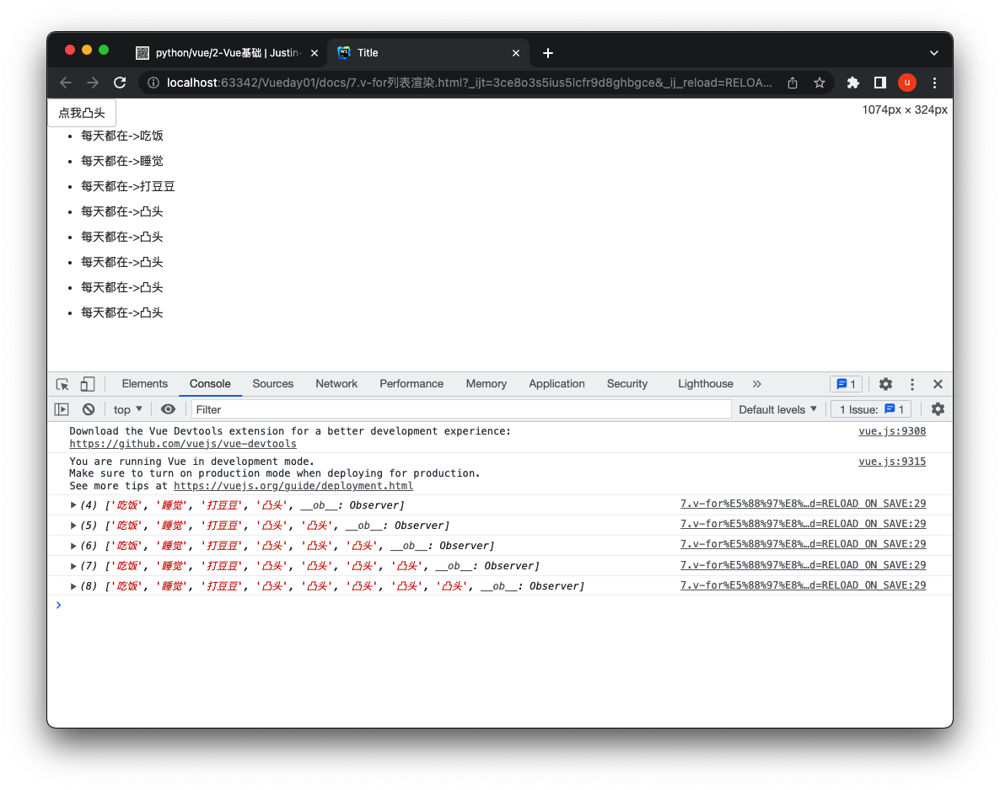
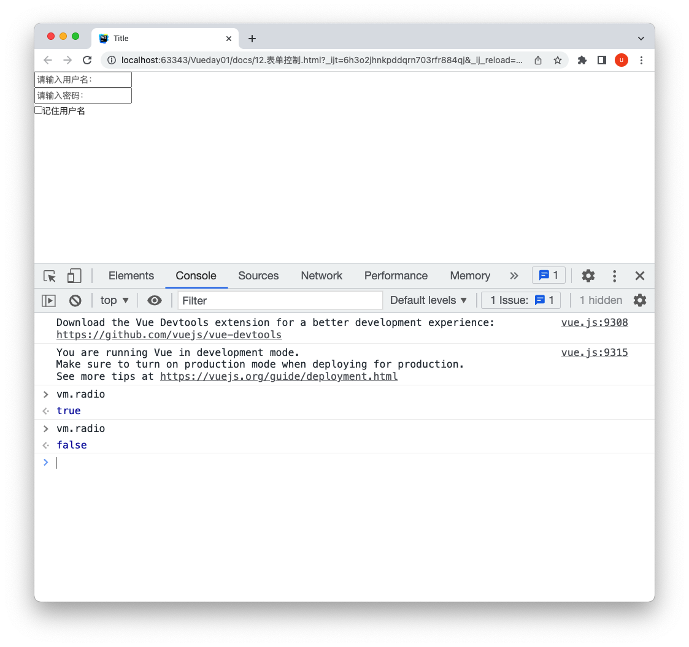
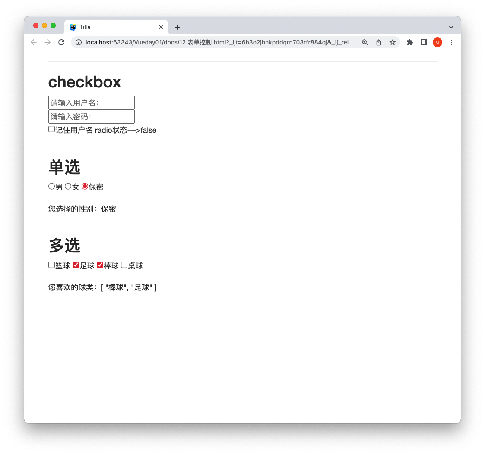
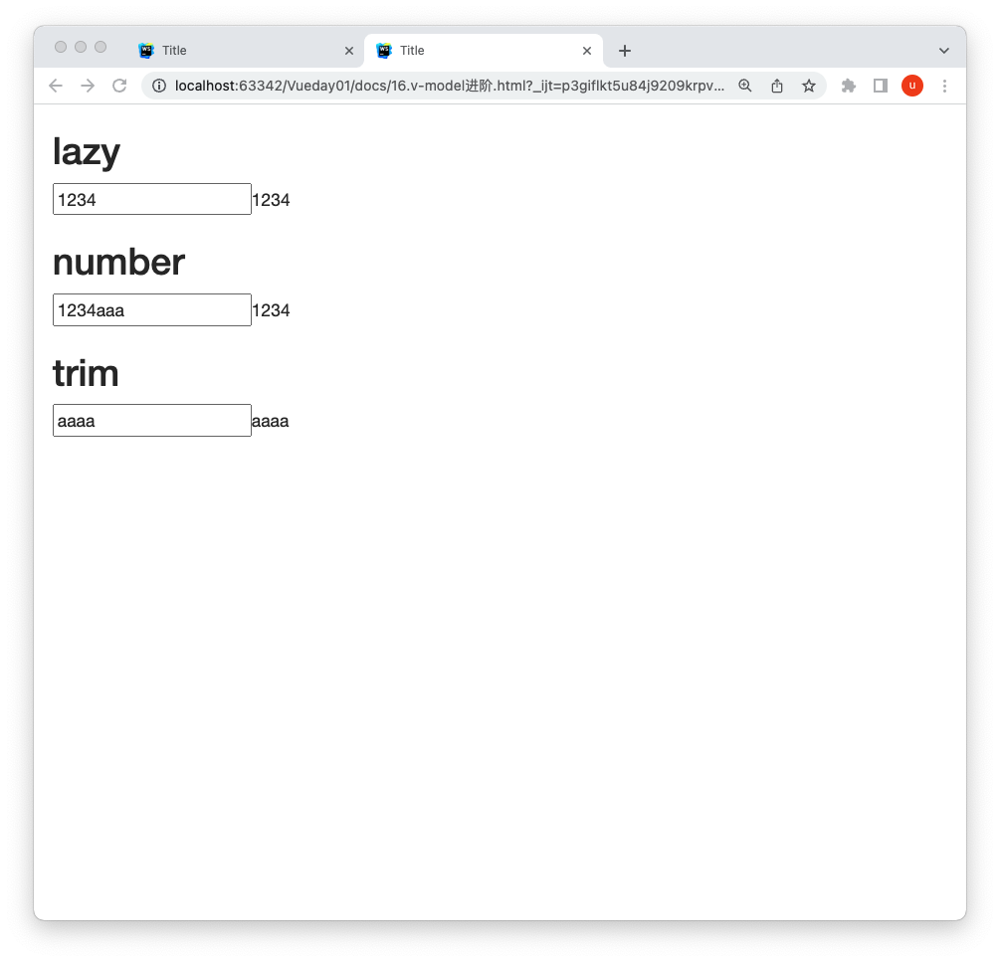

# Vue基础

[官方网站🎈](https://cn.vuejs.org/)

- 组件化开发
- 单页面开发中组件的替换

### 1.插值语法

```html
<!DOCTYPE html>
<html lang="en">
<head>
    <meta charset="UTF-8">
    <title>插值</title>
    <script src="https://cdn.bootcdn.net/ajax/libs/vue/2.6.12/vue.min.js"></script>
</head>
<body>

<div id="box">
    <ul>
        <li>字符串：{{name}}</li>
        <li>数值：{{age}}</li>
        <li>数组：{{list1}}</li>
        <li>对象：{{obj1}}</li>
        <li>字符串：{{link1}}</li>
        <li>运算：{{10+20+30+40}}</li>
        <li>三目运算符：{{10>20?'是':'否'}}</li>
    </ul>
</div>

</body>
<script>
    let vm = new Vue({
        el: '#box', // 在box这个div中可以写 vue的语法
        data: {
            name: 'Darker', // 字符串
            age: 18, // 数值
            list1: [1,2,3,4],   // 数组
            obj1: {name: 'Darker', age: 19}, // 对象
            link1: '<a href="https://www.baidu.com">百度一下 你就知道</a>'
        }
    })
</script>
</html>
```


### 2.文本指令

```
v-html  	让HTML渲染成页面	
v-text		标签内容显示对应的文本
v-show		放入bool类型，控制显示与否 
v-if		放入bool类型，控制显示与否
```


```html
<!DOCTYPE html>
<html lang="en">
<head>
    <meta charset="UTF-8">
    <script src="/js/vue.js"></script>
    <link rel="stylesheet" href="static/plugins/bootstrap/css/bootstrap.css">
    <title>Title</title>
</head>
<body>
<div id="app">
    <div class="container">
        <div>
            <h3>1.v-html</h3>
            <div>div 渲染</div>
            <div v-html="s"></div>
            <div>p标签 渲染</div>
            <p v-html="s"></p>
            <h3>
                把变量的内容当作html标签渲染到页面中
            </h3>
            <hr>

            <h3>2.v-text</h3>
            <div v-text="s"></div>
            <div>当作文本渲染 ，如果原来标签有内容，v-text会覆盖原来标签的内容</div>
        </div>

        <hr>

        <div>
            <h3>
                3. v-show & v-if
            </h3>
            <div>
                只能跟true或者false，运算结果是bool类型，控制标签的显示与否
            </div>
            <div v-show="res1">apple</div>
            <div v-show="res2">apple</div>
            <div v-show="res1">pear</div>
            <div v-show="res2">pear</div>
            <div>v-show 即使结果为false，也会存在该标签，只是不显示</div>
            <div v-text="text"></div>
            <div>对于v-if，如果为false，标签根本不会存在 ，效率比较低</div>
        </div>
    </div>
</div>
</body>
<script>
    new Vue({
        el: '#app',
        data: {
            s: "<input type='text'>",
            res1: true,
            res2: false,
            text: "<div style=\"display: none;\">apple</div>",
        }
    })
</script>
</html>
```


### 3.事件指令

**使用`@`符号触发事件**

 **@click**

```
@click="function"
...
methods: {
	function(){
		...
	}
}
```

```html
<!DOCTYPE html>
<html lang="en">
<head>
    <meta charset="UTF-8">
    <title>Title</title>
    <script src="/js/vue.js"></script>
    <link rel="stylesheet" href="static/plugins/bootstrap/css/bootstrap.css">
</head>
<body>

<div id="app">


    <button type="submit" class="btn btn-default" @click="handleClick">Login</button>
    <div v-show="display">
        <p>hello world</p>
    </div>
</div>

</body>
<script>
    var vm = new Vue({
        el: "#app",
        data: {
            display: false,
        },
        methods: {
            handleClick() {
                console.log("handleClick");
                this.display = !this.display;
            }
        }
    })
</script>
</html>
```


### 4.属性指令

`v-bind:class="js变量"`可以简写为`:class="js变量"`

```html
<!DOCTYPE html>
<html lang="en">
<head>
    <meta charset="UTF-8">
    <title>Title</title>
    <script src="/js/vue.js"></script>
    <link rel="stylesheet" href="static/plugins/bootstrap/css/bootstrap.css">
    <style>
        .red{
            border: solid 1px red;
        }
        .yellow{
            border: solid 1px yellow;
        }
    </style>
</head>
<body>

<div id="app">
    <button type="submit" class="btn btn-default" @click="handlerClick">点我变色</button>
    <div :class="color" style="width: 100px;height: 100px"></div>
</div>

</body>
<script>
    var vm = new Vue({
        el: "#app",
        data: {
            color:'red',
        },
        methods: {
            handlerClick(){
                this.color= "yellow"
            }
        }
    })
</script>
</html>
```


### 5.style & class

```
:属性名=js变量/js语法
		:class="js变量,数组,字符串"
		:style="js变量,数组,字符串"
```

```html
<!DOCTYPE html>
<html lang="en">
<head>
    <meta charset="UTF-8">
    <title>Title</title>
    <script src="/js/vue.js"></script>
    <link rel="stylesheet" href="static/plugins/bootstrap/css/bootstrap.css">
</head>
<body>
<div id="app">
    <button type="submit" class="btn btn-default" @click="handlerClick">点我变大</button>
    <div :style="style_obj">
        <div>hello world</div>
    </div>
</div>

</body>
<script>
    var vm = new Vue({
        el: "#app",
        data: {
            style_obj :{
                height:'200px',
                width:'200px',
                border:"solid 1px red",
                fontSize:"30px",
            }
        },
        methods: {
            handlerClick(){
                this.style_obj.fontSize="40px"
            }
        }
    })
</script>
</html>
```


### 6.条件渲染

- v-if
- v-else
- v-else-if

```html
<!DOCTYPE html>
<html lang="en">
<head>
    <meta charset="UTF-8">
    <title>Title</title>
    <script src="/js/vue.js"></script>
    <link rel="stylesheet" href="static/plugins/bootstrap/css/bootstrap.css">
</head>
<body>
<div id="app">
    <button type="submit" class="btn btn-default" @click="handlerClick">点我变换</button>
    <div>
        <div v-if="score>90">优秀</div>
        <div v-if="score>80 && score <= 90">不优秀</div>
    </div>


</div>

</body>
<script>
    var vm = new Vue({
        el: "#app",
        data: {
            score:91
        },
        methods: {
            handlerClick(){
                this.score=82;
            }
        }
    })
</script>
</html>
```


### 7.列表渲染

**v-for指令**

```
- 循环数组
	v-for="(url,index) in urls"
- 循环对象
	v-for="(value,key) in obj"
- 循环数字，从1开始循环到数字的个数
	v-for="i in num"
```



```html
<!DOCTYPE html>
<html lang="en">
<head>
    <meta charset="UTF-8">
    <title>Title</title>
    <script src="/js/vue.js"></script>
    <link rel="stylesheet" href="static/plugins/bootstrap/css/bootstrap.css">
</head>
<body>
<div id="app">
    <button type="submit" class="btn btn-default" @click="handlClick">点我凸头</button>
    <ul v-for="item in li">
        <li>每天都在->{{item}}</li>
    </ul>


</div>

</body>
<script>
    var vm = new Vue({
        el: "#app",
        data: {
            li:["吃饭","睡觉","打豆豆"]
        },
        methods: {
            handlClick(){
                this.li.push("凸头")
                console.log(this.li)
            }
        }
    })
</script>
</html>
```


### 8.事件处理

- input 当输入框进行输入时触发的事件

```html
<!DOCTYPE html>
<html lang="en">
<head>
    <meta charset="UTF-8">
    <title>Title</title>
    <script src="/js/vue.js"></script>
    <link rel="stylesheet" href="static/plugins/bootstrap/css/bootstrap.css">
</head>
<body>
<div id="app">
    <button type="submit" class="btn btn-default" @click="handleInput">点我change</button>
    <p>输入你的想法<input type="text" v-model="name" @input="Input"></p>---->{{name}}


</div>

</body>
<script>
    var vm = new Vue({
        el: "#app",
        data: {
            name: "wupeiqi"
        },
        methods: {
            handleInput() {
                this.name = "wusir"
            },
            Input(){
                alert("input")
            }
        }
    })
</script>
</html>
```

- change 当元素的值发生改变时触发的事件

```html
<!DOCTYPE html>
<html lang="en">
<head>
    <meta charset="UTF-8">
    <title>Title</title>
    <script src="/js/vue.js"></script>
    <link rel="stylesheet" href="static/plugins/bootstrap/css/bootstrap.css">
</head>
<body>
<div id="app">
    <button type="submit" class="btn btn-default" @click="handleInput">点我change</button>
    <p>change<input type="text" v-model="name" @change="changefunc"></p>---->{{name}}


</div>

</body>
<script>
    var vm = new Vue({
        el: "#app",
        data: {
            name: "wupeiqi"
        },
        methods: {
            handleInput() {
                this.name = "wusir"
            },
            changefunc(){
                alert("change")
            }
        }
    })
</script>
</html>
```

- blur 当输入框失去焦点时触发的事件

```html
<!DOCTYPE html>
<html lang="en">
<head>
    <meta charset="UTF-8">
    <title>Title</title>
    <script src="/js/vue.js"></script>
    <link rel="stylesheet" href="static/plugins/bootstrap/css/bootstrap.css">
</head>
<body>
<div id="app">
    <!--    <button type="submit" class="btn btn-default" @click="handleInput">点我change</button>-->
    <p>change<input type="text" v-model="name" @blur="blurfunc"></p>---->{{name}}

</div>

</body>
<script>
    var vm = new Vue({
        el: "#app",
        data: {
            name: "wupeiqi"
        },
        methods: {
            blurfunc() {
                alert("blur~~~")
            }
        }
    })
</script>
</html>
```

>change和blur最本质的区别是：
>
>如果输入框为空，失去焦点后，change不会出发，但是blur会出发


### 9.过滤案例

监听input事件

**前戏**

```
js数组内置过滤方法filter
var l=['a', 'apple', 'atom', 'b', 'banana', 'csrf', 'cii', 'dd', 'dogge']
var newList = l.filter(function(item){
					return true
				})
```


```html
<!DOCTYPE html>
<html lang="en">
<head>
    <meta charset="UTF-8">
    <title>Title</title>
    <script src="/js/vue.js"></script>
    <link rel="stylesheet" href="static/plugins/bootstrap/css/bootstrap.css">
</head>

<body>
<div id="app">
    <h2 style="margin-left: 20px">过滤案例</h2>
    <div class="container" style="margin-top: 30px">
        <p>查询 <input type="text" v-model="search" @input="handleInput"></p>

        <ul v-for="data in newList">
            <li>{{data}}</li>
        </ul>
    </div>
</div>
</body>


<script>
    var vm = new Vue({
        el: "#app",
        data: {
            search: '',
            dataList: ['a', 'apple', 'atom', 'b', 'banana', 'csrf', 'cii', 'dd', 'dogge'],
            newList: ['a', 'apple', 'atom', 'b', 'banana', 'csrf', 'cii', 'dd', 'dogge']
        },
        methods: {
            handleInput() {
                this.newList = this.dataList.filter(item=>{
                    return item.indexOf(this.search)>-1
                })
            }
        }
    })
</script>
</html>
```


### 10.表单控制

- checkbox选中



```html
<!DOCTYPE html>
<html lang="en">
<head>
    <meta charset="UTF-8">
    <title>Title</title>
    <script src="/js/vue.js"></script>
    <link rel="stylesheet" href="static/plugins/bootstrap/css/bootstrap.css">
</head>
<body>
<div id="box">
    <input type="text" placeholder="请输入用户名："><br>
    <input type="password" placeholder="请输入密码："><br>
    <input type="checkbox" v-model="radio">记住用户名
</div>
</body>
<script>
    var vm = new Vue({
        el: '#box',
        data: {
            myText: '',
            textBig: '',
            radio: false,
        },
    })
</script>
</html>
```


- 单选&多选

```
- 单选
	使用input标签，用v-model，value是提交的数据
	<input type="radio" v-model="sradio" value="男">男
	
- 多选
	使用input标签，v-model="many"，此处必须是many，来绑定多选类型
	<input type="checkbox" v-model="many" value="篮球">篮球
```



```html
<!DOCTYPE html>
<html lang="en">
<head>
    <meta charset="UTF-8">
    <title>Title</title>
    <script src="/js/vue.js"></script>
    <link rel="stylesheet" href="static/plugins/bootstrap/css/bootstrap.css">
</head>
<body>
<div id="box">
    <div class="container">
        <hr>
        <div>
            <h2>checkbox</h2>
            <input type="text" placeholder="请输入用户名："><br>
            <input type="password" placeholder="请输入密码："><br>
            <input type="checkbox" v-model="radio">记住用户名
            radio状态--->{{radio}}
        </div>
        <hr>
        <div>
            <h2>单选</h2>
            <input type="radio" v-model="sradio" value="男">男
            <input type="radio" v-model="sradio" value="女">女
            <input type="radio" v-model="sradio" value="保密">保密
            <br><br>您选择的性别：{{sradio}}
        </div>
        <hr>
        <div>
            <h2>多选</h2>
            <input type="checkbox" v-model="many" value="篮球">篮球
            <input type="checkbox" v-model="many" value="足球">足球
            <input type="checkbox" v-model="many" value="棒球">棒球
            <input type="checkbox" v-model="many" value="桌球">桌球
            <br><br>您喜欢的球类：{{many}}
        </div>
    </div>
</div>
</body>
<script>
    var vm = new Vue({
        el: '#box',
        data: {
            myText: '',
            textBig: '',
            radio: false,
            sradio: '',
            many:[],
        },
    })
</script>
</html>
```


### 11.购物车案例

**前戏：js循环的实现**

- 基础版本

```javascript
for(let i=0;i>3;i++){
    console.log(i);
}
```

- in 循环 es5语法

```js
for(let member in obj){
    ...
}
```

- for ... of... 循环 es6语法

```js
for(item of arr){
    console.log("item-->",item);
}
```

- 对于数组的for each循环

```js
$.each(可迭代对象,function(ket,val){
    ...;
})
```

```js
var a=[11,22,33]
var obj = {
    name:"wupeiqi",
    age:19,
}
$.each(a,function(key,val){
    console.log(key);
    console.log(val);
})
```


#### **基础版本**

只做购物车的选择，展示选择的商品&总价

```html
<!DOCTYPE html>
<html lang="en">
<head>
    <meta charset="UTF-8">
    <title>Title</title>
    <script src="/js/vue.js"></script>
    <link rel="stylesheet" href="static/plugins/bootstrap/css/bootstrap.css">
</head>
<body>
<div class="app">
    <div class="container-fluid">
        <div class="row">
            <div class="col-md-6 col-md-offset-3">
                <div style="margin-top: 30px">
                    <h1>购物车案例</h1>
                    <table class="table table-bordered">
                        <thead>
                        <tr>
                            <th>商品id</th>
                            <th>商品名字</th>
                            <th>商品价格</th>
                            <th>商品数量</th>
                        </tr>
                        </thead>
                        <tbody>
                        <tr v-for="good in goodList">
                            <th>{{good.id}}</th>
                            <td>{{good.name}}</td>
                            <td>{{good.price}}</td>
                            <td>{{good.count}}</td>
                            <td><input type="checkbox" v-model="buyGoods" :value="good"></td>
                        </tr>
                        </tbody>
                    </table>
                    <hr>
                    选中的商品:{{buyGoods}}
                    <hr>
                    总价格是：{{getPrice()}}
                </div>
            </div>
        </div>
    </div>
</div>

</body>
<script>
    var vm = new Vue({
        el: '.app',
        data: {
            goodList: [
                {id: '1', name: '小汽车', price: 150000, count: 2},
                {id: '2', name: '鸡蛋', price: 2, count: 1},
                {id: '3', name: '饼干', price: 10, count: 6},
                {id: '4', name: '钢笔', price: 15, count: 5},
                {id: '5', name: '脸盆', price: 30, count: 3},
            ],
            buyGoods:[],
        },
        methods:{
            getPrice(){
                var total=0
                for (item of this.buyGoods){
                    total+=item.price*item.count
                }
                return total
            }
        }
    })

</script>
</html>
```


#### **购物车拓展全选功能**

- 通过判断商品列表和已选择的列表长度是否一致

```js
handleCheckAll(){
    if(this.checkAll){
        this.buyGoods = this.goodList;
    }else{
        this.buyGoods = [];
    }
},
handleCheckOne(){
    if(this.buyGoods.length == this.goodList.length){
        this.checkAll=true;
    }else{
        this.checkAll=false;
    }
}
```

```html
<!DOCTYPE html>
<html lang="en">
<head>
    <meta charset="UTF-8">
    <title>Title</title>
    <script src="/js/vue.js"></script>
    <link rel="stylesheet" href="static/plugins/bootstrap/css/bootstrap.css">
    <style>
        .Mycontainer{

            height: 2000px;
            margin-top: 50px;
        }
    </style>
</head>
<body>
<div class="app">
    <div class="container-fluid">
        <div class="col-md-6 col-md-offset-3 Mycontainer">
            <table class="table table-bordered">
                <thead>
                <tr>
                    <th>商品id</th>
                    <th>Name</th>
                    <th>Price</th>
                    <th>count</th>
                    <th><input type="checkbox" v-model="checkAll" @change="handleCheckAll"></th>
                </tr>
                </thead>
                <tbody>
                <tr v-for="good in goodList">
                    <td>{{good.id}}</td>
                    <td>{{good.name}}</td>
                    <td>{{good.price}}</td>
                    <td>{{good.count}}</td>
                    <td><input type="checkbox" v-model="buyGoods" :value="good" @change="handleCheckOne"></td>
                </tr>
                </tbody>
            </table>
            <hr>
            <p>加入购物车的商品有-->{{buyGoods}}</p>
            <hr>
            <p>总价格是--->{{getPrice()}}</p>
        </div>
    </div>

</div>

</body>
<script>
    var vm = new Vue({
        el: '.app',
        data: {
            goodList: [
                {id: '1', name: '小汽车', price: 150000, count: 2},
                {id: '2', name: '鸡蛋', price: 2, count: 1},
                {id: '3', name: '饼干', price: 10, count: 6},
                {id: '4', name: '钢笔', price: 15, count: 5},
                {id: '5', name: '脸盆', price: 30, count: 3},
            ],
            buyGoods:[],
            checkAll:false,

        },
        methods:{
            getPrice(){
                var total_money = 0;
                for(item of this.buyGoods){
                    total_money += item.price * item.count;
                }
                return total_money
            },
            handleCheckAll(){
                if(this.checkAll){
                    this.buyGoods = this.goodList;
                }else{
                    this.buyGoods = [];
                }
            },
            handleCheckOne(){
                if(this.buyGoods.length == this.goodList.length){
                    this.checkAll=true;
                }else{
                    this.checkAll=false;
                }
            }
        }
    })

</script>
</html>
```


#### **购物车拓展加减功能**

- 在表格的数量左右增加两个`button`按钮，分别绑定两个点击事件
- 绑定点击事件的同时，要传入当前商品`good`这个参数
- 然后在`methods`中分别实现两个处理数量的函数 ，来实现加减功能

```js
handlePlus(item){
    item.count++;
},
handleMinus(item){
    if(item.count<=1){
        alert("太少了");
    }else{
        item.count--;
    }
}
```

实现代码

```html
<!DOCTYPE html>
<html lang="en">
<head>
    <meta charset="UTF-8">
    <title>Title</title>
    <script src="/js/vue.js"></script>
    <link rel="stylesheet" href="static/plugins/bootstrap/css/bootstrap.css">
    <style>
        .Mycontainer{

            height: 2000px;
            margin-top: 50px;
        }
    </style>
</head>
<body>
<div class="app">
    <div class="container-fluid">
        <div class="col-md-6 col-md-offset-3 Mycontainer">
            <table class="table table-bordered">
                <thead>
                <tr>
                    <th>商品id</th>
                    <th>Name</th>
                    <th>Price</th>
                    <th>count</th>
                    <th><input type="checkbox" v-model="checkAll" @change="handleCheckAll"></th>
                </tr>
                </thead>
                <tbody>
                <tr v-for="good in goodList">
                    <td>{{good.id}}</td>
                    <td>{{good.name}}</td>
                    <td>{{good.price}}</td>
                    <td><button @click="handleMinus(good)">-</button>{{good.count}}<button @click="handlePlus(good)">+</button></td>
                    <td><input type="checkbox" v-model="buyGoods" :value="good" @change="handleCheckOne"></td>
                </tr>
                </tbody>
            </table>
            <hr>
            <p>加入购物车的商品有-->{{buyGoods}}</p>
            <hr>
            <p>总价格是--->{{getPrice()}}</p>
        </div>
    </div>

</div>

</body>
<script>
    var vm = new Vue({
        el: '.app',
        data: {
            goodList: [
                {id: '1', name: '小汽车', price: 150000, count: 2},
                {id: '2', name: '鸡蛋', price: 2, count: 1},
                {id: '3', name: '饼干', price: 10, count: 6},
                {id: '4', name: '钢笔', price: 15, count: 5},
                {id: '5', name: '脸盆', price: 30, count: 3},
            ],
            buyGoods:[],
            checkAll:false,

        },
        methods:{
            getPrice(){
                var total_money = 0;
                for(item of this.buyGoods){
                    total_money += item.price * item.count;
                }
                return total_money
            },
            handleCheckAll(){
                if(this.checkAll){
                    this.buyGoods = this.goodList;
                }else{
                    this.buyGoods = [];
                }
            },
            handleCheckOne(){
                if(this.buyGoods.length == this.goodList.length){
                    this.checkAll=true;
                }else{
                    this.checkAll=false;
                }
            },
            handlePlus(item){
                item.count++;
            },
            handleMinus(item){
                if(item.count<=1){
                    alert("太少了");
                }else{
                    item.count--;
                }
            }
        }
    })

</script>
</html>
```


### 12.v-model 拓展

- lazy 等待input框的数据绑定失去焦点之后再变化
- number 数组开头，只保留数字，后面的字母不保留 ；字母开头的话，全部保留
- trim 去除首位的空格

```html
<!DOCTYPE html>
<html lang="en">
<head>
    <meta charset="UTF-8">
    <title>Title</title>
    <script src="/js/vue.js"></script>
    <link rel="stylesheet" href="static/plugins/bootstrap/css/bootstrap.css">
</head>
<body>
<div id="app">
    <div class="container">
        <h2>lazy</h2>
        <p><input type="text" v-model.lazy="a">{{a}}</p>
        <h2>number</h2>
        <p><input type="text" v-model.number="b">{{b}}</p>
        <h2>trim</h2>
        <p><input type="text" v-model.trim="c">{{c}}</p>

    </div>
</div>

</body>
<script>
    new Vue({
        el: '#app',
        data: {
            a: '',
            b: '',
            c: '',
        },
        methods: {},

    })
</script>
</html>
```





